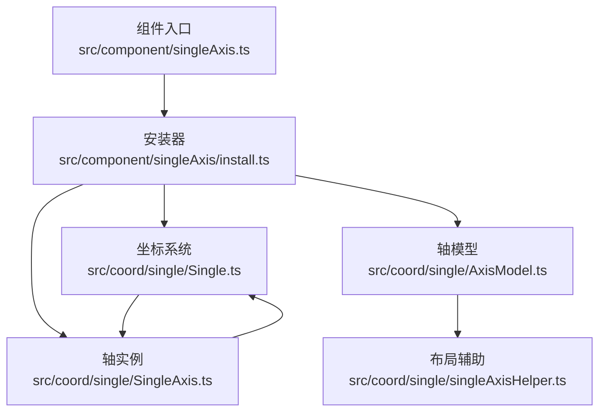
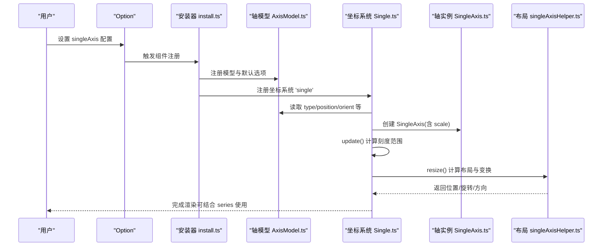
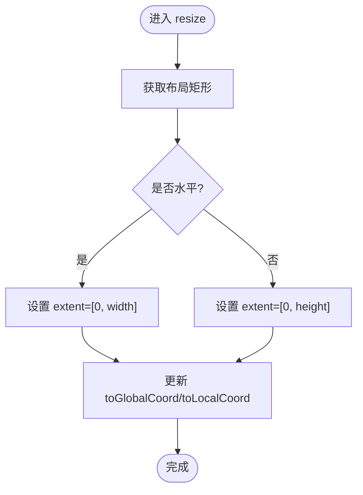
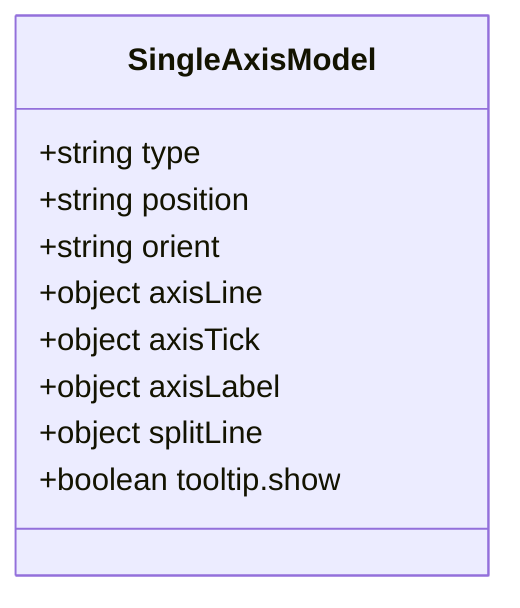
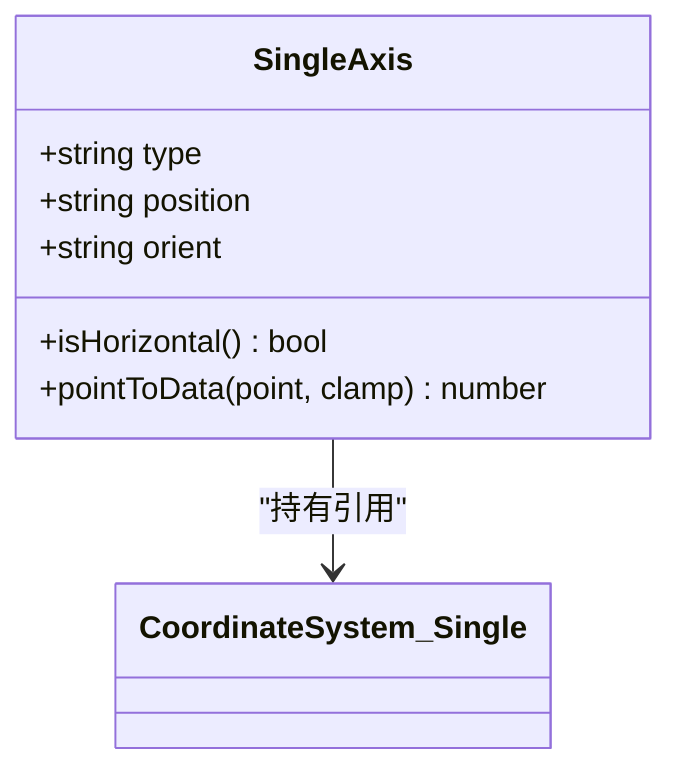
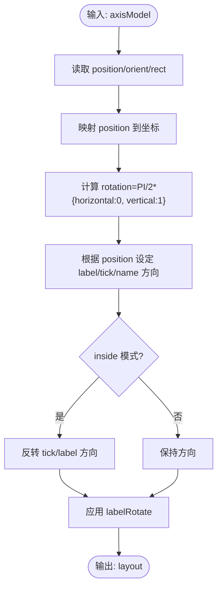
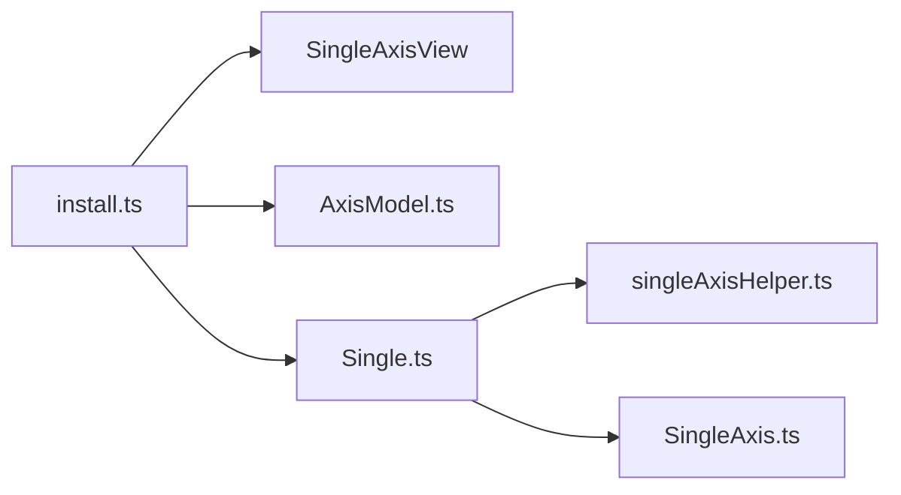

# 单轴组件 (SingleAxis)

<cite>
**本文引用的文件**
- [src/component/singleAxis.ts](file://src/component/singleAxis.ts)
- [src/component/singleAxis/install.ts](file://src/component/singleAxis/install.ts)
- [src/coord/single/AxisModel.ts](file://src/coord/single/AxisModel.ts)
- [src/coord/single/SingleAxis.ts](file://src/coord/single/SingleAxis.ts)
- [src/coord/single/Single.ts](file://src/coord/single/Single.ts)
- [src/coord/single/singleAxisHelper.ts](file://src/coord/single/singleAxisHelper.ts)
- [test/scatter-single-axis.html](file://test/scatter-single-axis.html)
- [test/singleAxisScales.html](file://test/singleAxisScales.html)
</cite>

## 目录
1. [简介](#简介)
2. [项目结构](#项目结构)
3. [核心组件](#核心组件)
4. [架构总览](#架构总览)
5. [详细组件分析](#详细组件分析)
6. [依赖关系分析](#依赖关系分析)
7. [性能考量](#性能考量)
8. [故障排查指南](#故障排查指南)
9. [结论](#结论)
10. [附录：实战案例与配置要点](#附录：实战案例与配置要点)

## 简介
单轴组件（SingleAxis）是 ECharts 中用于“只有一个坐标轴”的图表布局能力。它通过一个维度来组织数据，适合进度条、评分条、单向指标展示等场景。配合 scatter、line、bar 等系列类型，可以构建简洁直观的单向可视化视图，并支持数值型、对数型、时间型和类目型等多种轴类型。

## 项目结构
单轴能力由“组件注册 + 坐标系统 + 轴模型 + 布局工具”共同构成：
- 组件入口与安装：负责注册视图、模型、坐标系统与轴指针。
- 坐标系统：实现单维坐标系、尺寸计算、点与数据的相互转换。
- 轴模型：定义默认配置项（如 type、position、orient、刻度标签、分割线等）。
- 布局辅助：根据 orient 与 position 计算轴线位置、旋转角度与方向。

图示来源
- [src/component/singleAxis.ts:20-23](file://src/component/singleAxis.ts#L20-L23)
- [src/component/singleAxis/install.ts:35-48](file://src/component/singleAxis/install.ts#L35-L48)
- [src/coord/single/Single.ts:63-94](file://src/coord/single/Single.ts#L63-L94)
- [src/coord/single/AxisModel.ts:53-120](file://src/coord/single/AxisModel.ts#L53-L120)
- [src/coord/single/SingleAxis.ts:40-74](file://src/coord/single/SingleAxis.ts#L40-L74)
- [src/coord/single/singleAxisHelper.ts:34-83](file://src/coord/single/singleAxisHelper.ts#L34-L83)

章节来源
- [src/component/singleAxis.ts:20-23](file://src/component/singleAxis.ts#L20-L23)
- [src/component/singleAxis/install.ts:35-48](file://src/component/singleAxis/install.ts#L35-L48)

## 核心组件
- 组件安装器：注册单轴视图、轴视图、轴模型，并创建名为 single 的坐标系统；同时启用 axisPointer 能力。
- 坐标系统 Single：维护唯一轴、矩形区域、点与数据的转换、包含性判断、tooltip 基轴信息。
- 轴模型 AxisModel：提供单轴的默认配置项（type、position、orient、axisLine、axisTick、axisLabel、splitLine 等）。
- 轴实例 SingleAxis：继承通用轴，提供水平/垂直判定、点转数据等方法。
- 布局辅助 singleAxisHelper：根据 orient 与 position 计算轴线位置、旋转、标签与刻度方向等。

章节来源
- [src/component/singleAxis/install.ts:35-48](file://src/component/singleAxis/install.ts#L35-L48)
- [src/coord/single/Single.ts:43-117](file://src/coord/single/Single.ts#L43-L117)
- [src/coord/single/AxisModel.ts:53-120](file://src/coord/single/AxisModel.ts#L53-L120)
- [src/coord/single/SingleAxis.ts:40-74](file://src/coord/single/SingleAxis.ts#L40-L74)
- [src/coord/single/singleAxisHelper.ts:34-83](file://src/coord/single/singleAxisHelper.ts#L34-L83)

## 架构总览
下图展示了从选项到渲染的关键流程：用户配置 singleAxis → 模型解析 → 坐标系统初始化与更新 → 轴实例生成 → 布局计算 → 系列绘制。

图示来源
- [src/component/singleAxis/install.ts:35-48](file://src/component/singleAxis/install.ts#L35-L48)
- [src/coord/single/Single.ts:63-117](file://src/coord/single/Single.ts#L63-L117)
- [src/coord/single/SingleAxis.ts:40-74](file://src/coord/single/SingleAxis.ts#L40-L74)
- [src/coord/single/singleAxisHelper.ts:34-83](file://src/coord/single/singleAxisHelper.ts#L34-L83)

## 详细组件分析

### 坐标系统 Single
- 职责：维护单一维度坐标、矩形区域、点与数据的双向转换、包含性判断、tooltip 基轴信息。
- 关键点：
  - 初始化时根据模型确定轴类型、刻度、方向与位置。
  - update 阶段进行刻度美化与范围计算。
  - resize 阶段基于 boxLayout 计算矩形，并根据 isHorizontal 设置 extent 与 toGlobalCoord/toLocalCoord 变换。
  - dataToPoint/pointToData 将一维数据映射到二维像素坐标（另一维取中心）。

图示来源
- [src/coord/single/Single.ts:108-156](file://src/coord/single/Single.ts#L108-L156)

章节来源
- [src/coord/single/Single.ts:43-117](file://src/coord/single/Single.ts#L43-L117)
- [src/coord/single/Single.ts:119-156](file://src/coord/single/Single.ts#L119-L156)
- [src/coord/single/Single.ts:187-241](file://src/coord/single/Single.ts#L187-L241)

### 轴模型 AxisModel
- 职责：定义 singleAxis 的配置项与默认值，包括 type、position、orient、轴线和刻度样式、分割线、抖动等。
- 关键配置项说明：
  - type：轴类型，支持 value、category、log、time 等。
  - position：轴线位置，top/bottom/left/right。
  - orient：主轴方向，horizontal/vertical。
  - axisLine/axisTick/axisLabel/splitLine：外观控制。
  - tooltip：默认开启，便于交互提示。

图示来源
- [src/coord/single/AxisModel.ts:53-120](file://src/coord/single/AxisModel.ts#L53-L120)

章节来源
- [src/coord/single/AxisModel.ts:53-120](file://src/coord/single/AxisModel.ts#L53-L120)

### 轴实例 SingleAxis
- 职责：承载具体轴对象，提供 isHorizontal 判断、pointToData 转换等。
- 关键点：
  - 构造时传入 dim、scale、extent、axisType、position。
  - isHorizontal 依据 position 判断 top/bottom 为水平。
  - pointToData 委托坐标系统进行转换。

图示来源
- [src/coord/single/SingleAxis.ts:40-74](file://src/coord/single/SingleAxis.ts#L40-L74)
- [src/coord/single/Single.ts:43-94](file://src/coord/single/Single.ts#L43-L94)

章节来源
- [src/coord/single/SingleAxis.ts:40-74](file://src/coord/single/SingleAxis.ts#L40-L74)

### 布局辅助 singleAxisHelper
- 职责：根据 orient 与 position 计算轴线位置、旋转角度、标签与刻度方向、名称方向以及层级 z2。
- 关键点：
  - 根据 horizontal/vertical 选择对应边界。
  - 根据 position 决定 label/tick/name 的方向。
  - 支持 inside 模式反转 tick/label 方向。
  - 处理 labelRotate 的正负方向。

图示来源
- [src/coord/single/singleAxisHelper.ts:34-83](file://src/coord/single/singleAxisHelper.ts#L34-L83)

章节来源
- [src/coord/single/singleAxisHelper.ts:34-83](file://src/coord/single/singleAxisHelper.ts#L34-L83)

## 依赖关系分析
- 组件安装器依赖：
  - 注册单轴视图与轴视图。
  - 注册轴模型与坐标系统。
  - 启用 axisPointer。
- 坐标系统依赖：
  - 轴模型（读取配置）。
  - 布局工具（计算位置与变换）。
  - 通用轴工具（创建 scale、判断 band 等）。
- 轴实例依赖：
  - 坐标系统（提供点与数据转换）。
  - 轴模型（读取 position/orient/inverse 等）。

图示来源
- [src/component/singleAxis/install.ts:35-48](file://src/component/singleAxis/install.ts#L35-L48)
- [src/coord/single/Single.ts:63-117](file://src/coord/single/Single.ts#L63-L117)
- [src/coord/single/SingleAxis.ts:40-74](file://src/coord/single/SingleAxis.ts#L40-L74)
- [src/coord/single/singleAxisHelper.ts:34-83](file://src/coord/single/singleAxisHelper.ts#L34-L83)

章节来源
- [src/component/singleAxis/install.ts:35-48](file://src/component/singleAxis/install.ts#L35-L48)
- [src/coord/single/Single.ts:63-117](file://src/coord/single/Single.ts#L63-L117)

## 性能考量
- 刻度计算与美化在 update 阶段集中执行，避免重复计算。
- 布局计算仅在 resize 时进行，减少频繁重排开销。
- 对于大量散点或动态数据，建议结合 dataZoom 提升交互性能。
- 合理设置 symbolSize、splitLine 透明度等视觉属性，降低渲染压力。

## 故障排查指南
- 现象：单轴不显示或位置异常
  - 检查 position 与 orient 的组合是否合理（horizontal 通常搭配 top/bottom，vertical 搭配 left/right）。
  - 确认容器尺寸已正确设置，resize 能正常计算矩形。
- 现象：数据无法映射到坐标
  - 核对 series.data 格式与轴类型匹配（value/category/log/time）。
  - 若使用数组数据，确保第一个维度与单轴维度一致。
- 现象：刻度标签重叠或方向错误
  - 调整 axisLabel.rotate 与 interval。
  - 检查 inside 模式是否导致方向反转。
- 现象：tooltip 不生效
  - 确认 singleAxis.tooltip.show 默认开启，且未覆盖为 false。
  - 检查 series 是否正确关联 coordinateSystem 与 singleAxisId（多轴场景）。

章节来源
- [src/coord/single/AxisModel.ts:68-120](file://src/coord/single/AxisModel.ts#L68-L120)
- [src/coord/single/Single.ts:108-156](file://src/coord/single/Single.ts#L108-L156)
- [src/coord/single/singleAxisHelper.ts:34-83](file://src/coord/single/singleAxisHelper.ts#L34-L83)

## 结论
单轴组件以极简的坐标体系支撑进度条、评分条与单向指标展示等场景。通过灵活的 type、position、orient 配置以及与 scatter/line/bar 等系列的组合，能够快速构建高可读性的单向可视化视图。其内部通过清晰的模型—坐标系统—布局分层，保证了可扩展性与高性能。

## 附录：实战案例与配置要点

### 使用场景与集成方式
- 进度条：使用 value 轴，series 用 bar 或自定义图形，沿单轴方向展示完成度。
- 评分条：使用 category 轴，每个类别对应一个评分值，横向或纵向排列。
- 单向数据分析：使用 log/time/value 轴，展示随时间或对数变化的单项指标。

章节来源
- [test/scatter-single-axis.html:83-122](file://test/scatter-single-axis.html#L83-L122)
- [test/scatter-single-axis.html:155-179](file://test/scatter-single-axis.html#L155-L179)
- [test/scatter-single-axis.html:212-241](file://test/scatter-single-axis.html#L212-L241)
- [test/singleAxisScales.html:80-174](file://test/singleAxisScales.html#L80-L174)

### 关键配置项速查
- type：value | category | log | time
- data：类目型轴的数据数组（category）
- position：top | bottom | left | right
- orient：horizontal | vertical
- axisLine/axisTick/axisLabel/splitLine：外观控制
- tooltip：默认 show=true，便于交互

章节来源
- [src/coord/single/AxisModel.ts:68-120](file://src/coord/single/AxisModel.ts#L68-L120)

### 示例参考路径
- 水平/垂直散点与类目轴演示：[scatter-single-axis.html](file://test/scatter-single-axis.html)
- 多单轴与不同尺度演示（value/category/log/time）：[singleAxisScales.html](file://test/singleAxisScales.html)