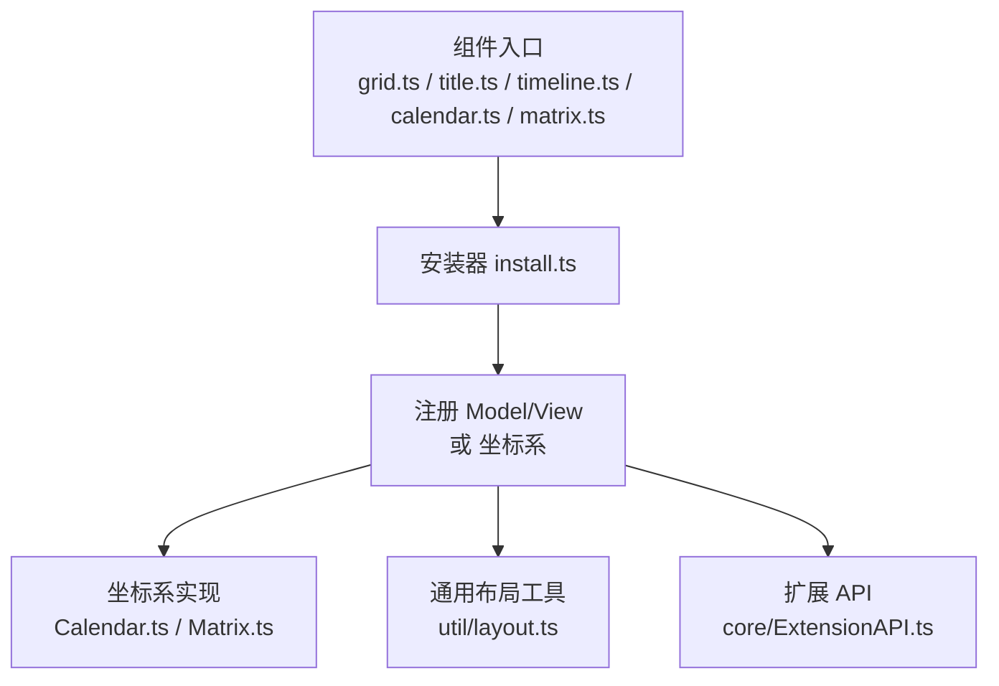
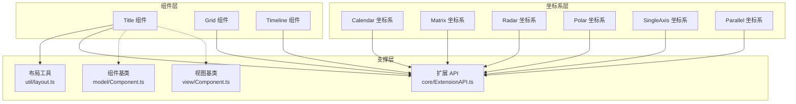
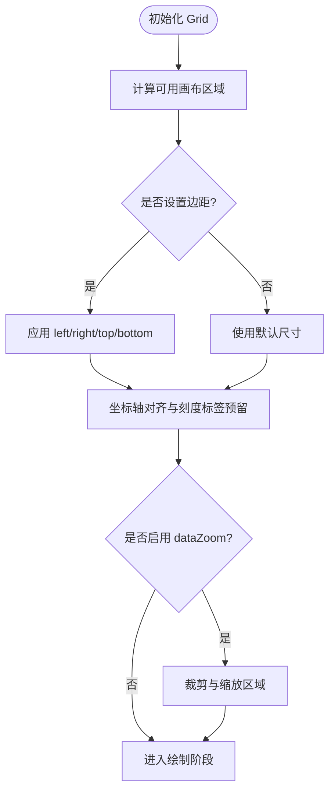
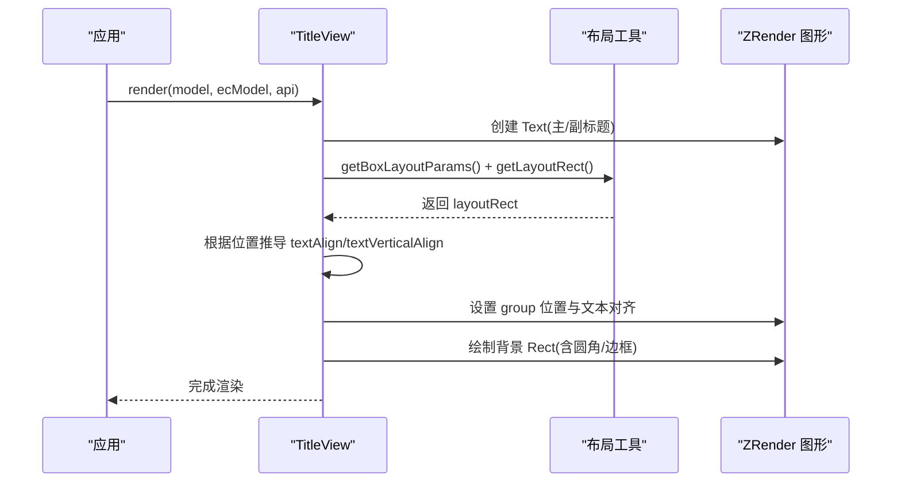
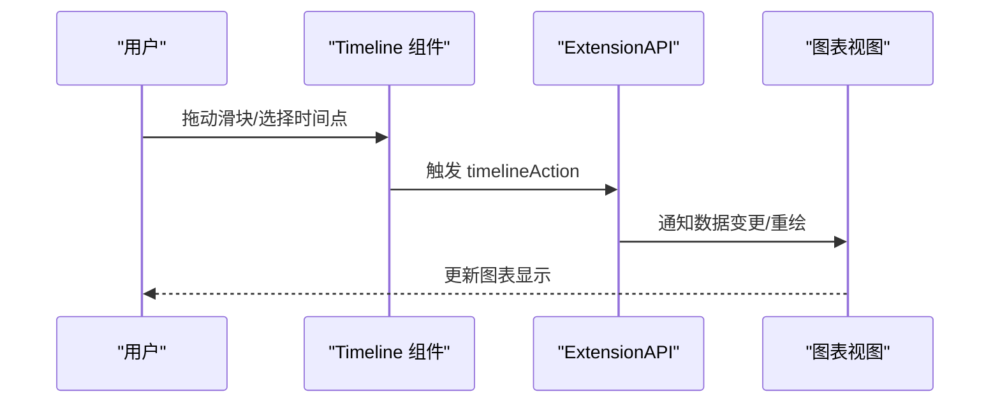
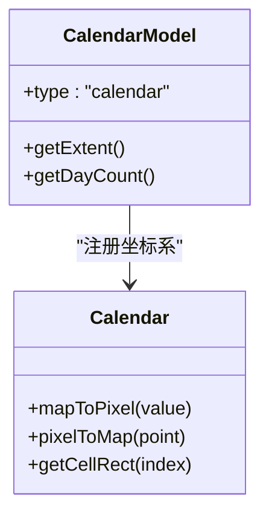
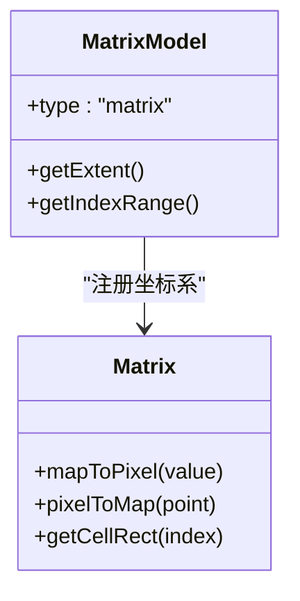
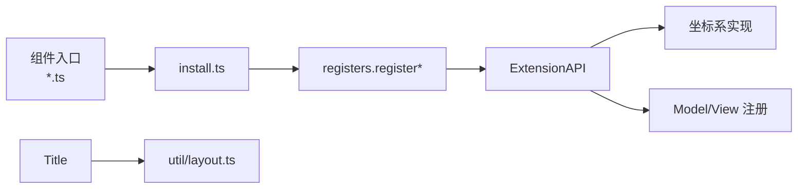

# 布局组件

<cite>
**本文引用的文件**
- [src/component/grid.ts](file://src/component/grid.ts)
- [src/component/grid/install.ts](file://src/component/grid/install.ts)
- [src/component/title.ts](file://src/component/title.ts)
- [src/component/title/install.ts](file://src/component/title/install.ts)
- [src/component/timeline.ts](file://src/component/timeline.ts)
- [src/component/timeline/install.ts](file://src/component/timeline/install.ts)
- [src/component/calendar.ts](file://src/component/calendar.ts)
- [src/component/calendar/install.ts](file://src/component/calendar/install.ts)
- [src/component/matrix.ts](file://src/component/matrix.ts)
- [src/component/matrix/install.ts](file://src/component/matrix/install.ts)
- [src/coord/calendar/CalendarModel.ts](file://src/coord/calendar/CalendarModel.ts)
- [src/coord/calendar/Calendar.ts](file://src/coord/calendar/Calendar.ts)
- [src/coord/matrix/MatrixModel.ts](file://src/coord/matrix/MatrixModel.ts)
- [src/coord/matrix/Matrix.ts](file://src/coord/matrix/Matrix.ts)
- [src/util/layout.ts](file://src/util/layout.ts)
- [src/model/Component.ts](file://src/model/Component.ts)
- [src/view/Component.ts](file://src/view/Component.ts)
- [src/core/ExtensionAPI.ts](file://src/core/ExtensionAPI.ts)
</cite>

## 目录
1. [简介](#简介)
2. [项目结构](#项目结构)
3. [核心组件](#核心组件)
4. [架构总览](#架构总览)
5. [详细组件分析](#详细组件分析)
6. [依赖关系分析](#依赖关系分析)
7. [性能考虑](#性能考虑)
8. [故障排查指南](#故障排查指南)
9. [结论](#结论)
10. [附录](#附录)

## 简介
本章节聚焦 ECharts 的布局与坐标系统相关组件，涵盖网格（Grid）、标题（Title）、时间轴（Timeline）、日历（Calendar）、矩阵（Matrix）、雷达（Radar）、极坐标（Polar）、单轴（SingleAxis）和平行坐标（Parallel）。重点说明这些组件如何参与图表布局、空间分配、响应式计算与自适应渲染，并给出配置要点、定位策略与样式定制方法。文末提供组合多图表页面与动态布局的实践建议，以及移动端适配与性能优化要点。

## 项目结构
ECharts 将“组件”与“坐标系”解耦：组件负责 UI 与交互，坐标系负责数据到画布的映射。布局相关的入口文件通常通过扩展机制注册 Model/View 或坐标系。例如：
- Grid、Title、Timeline 等以组件形式注册；
- Calendar、Matrix 等同时注册为坐标系，供系列使用；
- Title 使用通用盒布局工具进行位置与尺寸计算；
- Timeline 提供预处理器与动作，驱动数据与视图更新。

**图示来源**
- [src/component/grid.ts:20-24](file://src/component/grid.ts#L20-L24)
- [src/component/title.ts:20-23](file://src/component/title.ts#L20-L23)
- [src/component/timeline.ts:20-27](file://src/component/timeline.ts#L20-L27)
- [src/component/calendar.ts:20-23](file://src/component/calendar.ts#L20-L23)
- [src/component/matrix.ts:20-24](file://src/component/matrix.ts#L20-L24)
- [src/component/grid/install.ts:20-27](file://src/component/grid/install.ts#L20-L27)
- [src/component/title/install.ts:20-42](file://src/component/title/install.ts#L20-L42)
- [src/component/timeline/install.ts:19-37](file://src/component/timeline/install.ts#L19-L37)
- [src/component/calendar/install.ts:20-29](file://src/component/calendar/install.ts#L20-L29)
- [src/component/matrix/install.ts:20-29](file://src/component/matrix/install.ts#L20-L29)

**章节来源**
- [src/component/grid.ts:20-24](file://src/component/grid.ts#L20-L24)
- [src/component/title.ts:20-23](file://src/component/title.ts#L20-L23)
- [src/component/timeline.ts:20-27](file://src/component/timeline.ts#L20-L27)
- [src/component/calendar.ts:20-23](file://src/component/calendar.ts#L20-L23)
- [src/component/matrix.ts:20-24](file://src/component/matrix.ts#L20-L24)
- [src/component/grid/install.ts:20-27](file://src/component/grid/install.ts#L20-L27)
- [src/component/title/install.ts:20-42](file://src/component/title/install.ts#L20-L42)
- [src/component/timeline/install.ts:19-37](file://src/component/timeline/install.ts#L19-L37)
- [src/component/calendar/install.ts:20-29](file://src/component/calendar/install.ts#L20-L29)
- [src/component/matrix/install.ts:20-29](file://src/component/matrix/install.ts#L20-L29)

## 核心组件
- 网格（Grid）：二维直角坐标系的基础容器，控制绘图区边距、留白与坐标轴对齐，配合 dataZoom 等组件完成区域缩放与平移。
- 标题（Title）：基于盒布局（Box Layout）进行定位与尺寸计算，支持主副标题、背景、边框、圆角、文本对齐与垂直对齐，自动根据位置调整文本对齐方式。
- 时间轴（Timeline）：提供时间维度的滑动条控件，驱动数据与视图更新，内置预处理逻辑与动作注册。
- 日历（Calendar）：作为坐标系存在，用于按日期维度组织数据，支持年/月/周粒度与方向控制。
- 矩阵（Matrix）：作为坐标系存在，用于多维数据的矩阵展示与交互。
- 雷达（Radar）、极坐标（Polar）、单轴（SingleAxis）、平行坐标（Parallel）：均为坐标系型组件，定义各自的数据映射规则与视觉呈现，配合相应系列使用。

**章节来源**
- [src/component/title/install.ts:100-139](file://src/component/title/install.ts#L100-L139)
- [src/component/timeline/install.ts:25-37](file://src/component/timeline/install.ts#L25-L37)
- [src/component/calendar/install.ts:25-29](file://src/component/calendar/install.ts#L25-L29)
- [src/component/matrix/install.ts:25-29](file://src/component/matrix/install.ts#L25-L29)

## 架构总览
下图展示了布局组件在 ECharts 中的角色与协作关系：组件入口通过 install 注册 Model/View 或坐标系；坐标系由 coord 层实现；标题等组件借助通用布局工具计算最终矩形；扩展 API 贯穿生命周期。

**图示来源**
- [src/component/title/install.ts:20-42](file://src/component/title/install.ts#L20-L42)
- [src/component/calendar/install.ts:20-29](file://src/component/calendar/install.ts#L20-L29)
- [src/component/matrix/install.ts:20-29](file://src/component/matrix/install.ts#L20-L29)
- [src/util/layout.ts](file://src/util/layout.ts)
- [src/core/ExtensionAPI.ts](file://src/core/ExtensionAPI.ts)
- [src/model/Component.ts](file://src/model/Component.ts)
- [src/view/Component.ts](file://src/view/Component.ts)

## 详细组件分析

### 网格（Grid）
- 职责：定义直角坐标系下的绘图区域，管理边距、留白、坐标轴对齐与与 dataZoom 的协同。
- 布局策略：通过坐标系统与 axis 组件共同决定绘图区大小与位置；配合 gridSimple 等简化布局模式可快速设置。
- 典型用法：与 line/bar/scatter 等笛卡尔系列搭配，设置 left/right/top/bottom 控制边距，配合 dataZoom 实现局部放大。

**图示来源**
- [src/component/grid/install.ts:20-27](file://src/component/grid/install.ts#L20-L27)

**章节来源**
- [src/component/grid/install.ts:20-27](file://src/component/grid/install.ts#L20-L27)

### 标题（Title）
- 职责：显示主/副标题，支持链接、点击事件、背景与边框、圆角、文本对齐与垂直对齐。
- 布局策略：采用盒布局（Box Layout），根据 left/top/right/bottom 与 textAlign/textVerticalAlign 计算最终位置；当未显式指定对齐时，会根据位置自动推导对齐方式。
- 样式定制：支持 backgroundColor、borderColor、borderWidth、borderRadius、padding、itemGap、textStyle/subtextStyle 等。

**图示来源**
- [src/component/title/install.ts:148-286](file://src/component/title/install.ts#L148-L286)
- [src/util/layout.ts](file://src/util/layout.ts)

**章节来源**
- [src/component/title/install.ts:100-139](file://src/component/title/install.ts#L100-L139)
- [src/component/title/install.ts:148-286](file://src/component/title/install.ts#L148-L286)

### 时间轴（Timeline）
- 职责：提供时间维度的滑动条控件，驱动数据与视图更新；内置预处理逻辑与动作注册。
- 布局策略：作为独立组件，通常置于图表底部或顶部，占用固定高度；可通过 position、orient 等选项控制布局。
- 联动：与 series 的 data 或 dataset 结合，切换不同时间点的数据展示。

**图示来源**
- [src/component/timeline/install.ts:25-37](file://src/component/timeline/install.ts#L25-L37)

**章节来源**
- [src/component/timeline/install.ts:25-37](file://src/component/timeline/install.ts#L25-L37)

### 日历（Calendar）
- 职责：作为坐标系，按日期维度组织数据，支持年/月/周粒度与方向控制。
- 布局策略：由 Calendar 坐标系计算单元格大小与排列，配合 series 的 calendar 系列类型使用。
- 典型用法：热力图、散点图等按天/周/年聚合展示。

**图示来源**
- [src/component/calendar/install.ts:25-29](file://src/component/calendar/install.ts#L25-L29)
- [src/coord/calendar/CalendarModel.ts](file://src/coord/calendar/CalendarModel.ts)
- [src/coord/calendar/Calendar.ts](file://src/coord/calendar/Calendar.ts)

**章节来源**
- [src/component/calendar/install.ts:25-29](file://src/component/calendar/install.ts#L25-L29)
- [src/coord/calendar/CalendarModel.ts](file://src/coord/calendar/CalendarModel.ts)
- [src/coord/calendar/Calendar.ts](file://src/coord/calendar/Calendar.ts)

### 矩阵（Matrix）
- 职责：作为坐标系，用于多维数据的矩阵展示与交互。
- 布局策略：由 Matrix 坐标系计算行列索引到像素的映射，配合 matrix 系列类型使用。
- 典型用法：相关性矩阵、混淆矩阵等可视化。

**图示来源**
- [src/component/matrix/install.ts:25-29](file://src/component/matrix/install.ts#L25-L29)
- [src/coord/matrix/MatrixModel.ts](file://src/coord/matrix/MatrixModel.ts)
- [src/coord/matrix/Matrix.ts](file://src/coord/matrix/Matrix.ts)

**章节来源**
- [src/component/matrix/install.ts:25-29](file://src/component/matrix/install.ts#L25-L29)
- [src/coord/matrix/MatrixModel.ts](file://src/coord/matrix/MatrixModel.ts)
- [src/coord/matrix/Matrix.ts](file://src/coord/matrix/Matrix.ts)

### 雷达（Radar）、极坐标（Polar）、单轴（SingleAxis）、平行坐标（Parallel）
- 雷达（Radar）：极坐标变体，适合多维指标对比；通过 radar 坐标系与 radar 系列配合。
- 极坐标（Polar）：适用于角度与半径维度的数据，如饼图、雷达图、极坐标柱状图等。
- 单轴（SingleAxis）：一维坐标轴，常用于条形图、散点图的一维场景。
- 平行坐标（Parallel）：高维数据的多轴平行展示，适合探索性数据分析。

上述组件均通过各自的坐标系实现数据到像素的映射，并在布局阶段与网格/标题/时间轴等协调空间分配。

**章节来源**
- [src/coord/polar/Polar.ts](file://src/coord/polar/Polar.ts)
- [src/coord/single/SingleAxis.ts](file://src/coord/single/SingleAxis.ts)
- [src/coord/parallel/Parallel.ts](file://src/coord/parallel/Parallel.ts)
- [src/coord/radar/Radar.ts](file://src/coord/radar/Radar.ts)

## 依赖关系分析
- 组件入口统一通过扩展机制注册，install.ts 中集中完成 Model/View 或坐标系的注册。
- Title 依赖通用布局工具进行盒布局计算，确保在不同屏幕尺寸下自适应。
- Calendar/Matrix 等坐标系组件在 install 中向扩展 API 注册自身，供系列查询与使用。
- Timeline 提供动作与预处理器，驱动数据流与视图更新。

**图示来源**
- [src/component/title/install.ts:20-42](file://src/component/title/install.ts#L20-L42)
- [src/component/calendar/install.ts:20-29](file://src/component/calendar/install.ts#L20-L29)
- [src/component/matrix/install.ts:20-29](file://src/component/matrix/install.ts#L20-L29)
- [src/component/timeline/install.ts:19-37](file://src/component/timeline/install.ts#L19-L37)
- [src/util/layout.ts](file://src/util/layout.ts)
- [src/core/ExtensionAPI.ts](file://src/core/ExtensionAPI.ts)

**章节来源**
- [src/component/title/install.ts:20-42](file://src/component/title/install.ts#L20-L42)
- [src/component/calendar/install.ts:20-29](file://src/component/calendar/install.ts#L20-L29)
- [src/component/matrix/install.ts:20-29](file://src/component/matrix/install.ts#L20-L29)
- [src/component/timeline/install.ts:19-37](file://src/component/timeline/install.ts#L19-L37)
- [src/util/layout.ts](file://src/util/layout.ts)
- [src/core/ExtensionAPI.ts](file://src/core/ExtensionAPI.ts)

## 性能考虑
- 合理设置边距与留白：避免过大的 padding 导致不必要的重绘与内存占用。
- 减少频繁 setOption：批量更新配置，合并多次变更，降低调度开销。
- 大数据量场景：优先使用 dataZoom 限制可视范围；对热力图/矩阵等密集数据启用采样或聚合。
- 动画与过渡：关闭不必要的动画以提升首屏性能；复杂交互场景按需开启。
- 移动端适配：减小字号与图标尺寸；使用更紧凑的布局；避免过多嵌套组件。

[本节为通用指导，不直接分析具体文件]

## 故障排查指南
- 标题位置异常：检查 left/top/right/bottom 与 textAlign/textVerticalAlign 的组合；确认是否启用了盒布局参数。
- 时间轴无响应：确认已正确注册 timeline 动作与预处理器；检查与 series 的数据绑定是否正确。
- 日历/矩阵坐标系未生效：确认已在 install 中注册对应坐标系；系列类型需匹配坐标系。
- 网格与坐标轴重叠：调整 grid 的边距与 axis 的 label 预留；必要时启用 containLabel。

**章节来源**
- [src/component/title/install.ts:148-286](file://src/component/title/install.ts#L148-L286)
- [src/component/timeline/install.ts:25-37](file://src/component/timeline/install.ts#L25-L37)
- [src/component/calendar/install.ts:25-29](file://src/component/calendar/install.ts#L25-L29)
- [src/component/matrix/install.ts:25-29](file://src/component/matrix/install.ts#L25-L29)

## 结论
ECharts 的布局组件体系通过“组件 + 坐标系 + 通用布局工具”的分层设计，实现了灵活的布局与自适应能力。标题基于盒布局精确控制位置与样式；网格与各类坐标系负责数据到画布的映射；时间轴提供时间维度的交互驱动。通过合理配置与组合，可以构建复杂的多图表页面与动态布局，并在移动端与大数据场景下保持良好性能。

[本节为总结，不直接分析具体文件]

## 附录
- 组合多图表页面建议：
  - 使用多个 grid 划分区域，配合 title 统一标题；
  - 使用 timeline 驱动多组数据切换；
  - 对日历/矩阵等复杂坐标系，单独占位并设置合适的宽高比。
- 移动端适配建议：
  - 缩小字号与间距；
  - 减少组件数量与层级；
  - 使用更简洁的配色与样式。
- 性能优化建议：
  - 合理使用 dataZoom；
  - 避免频繁 setOption；
  - 对密集数据启用采样与聚合。

[本节为补充建议，不直接分析具体文件]