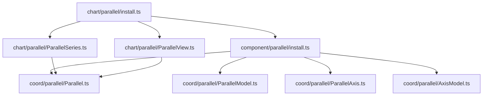
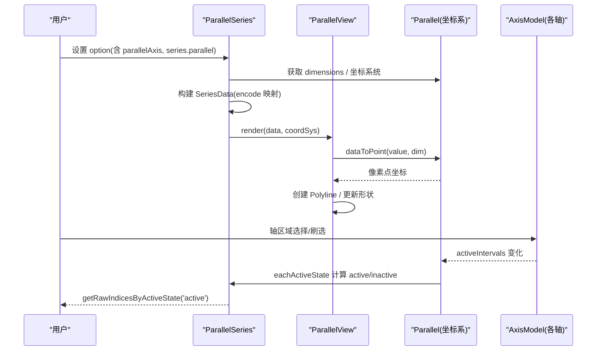
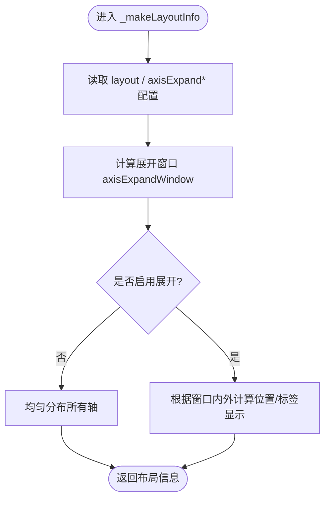
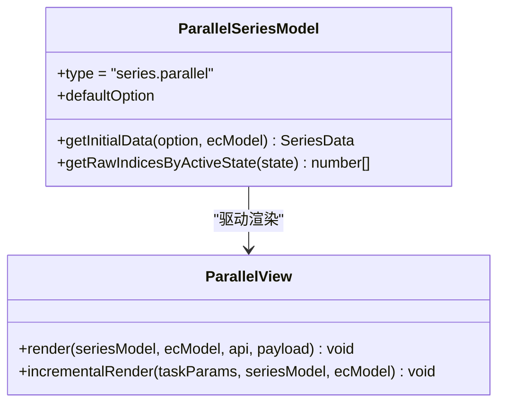
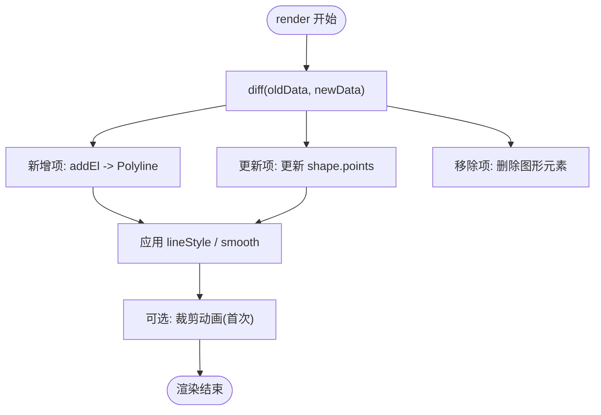
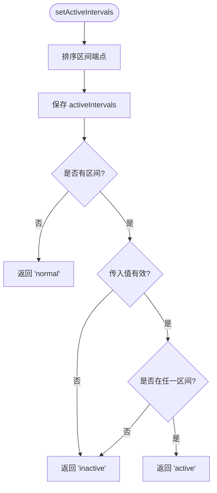
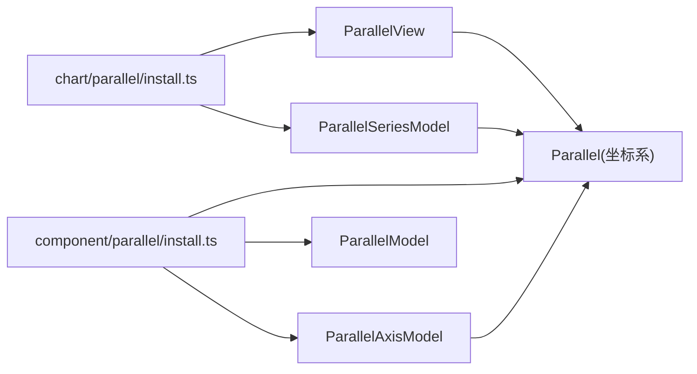

# 平行坐标组件 (Parallel)

<cite>
**本文引用的文件**
- [src/chart/parallel.ts](file://src/chart/parallel.ts)
- [src/component/parallel.ts](file://src/component/parallel.ts)
- [src/chart/parallel/install.ts](file://src/chart/parallel/install.ts)
- [src/component/parallel/install.ts](file://src/component/parallel/install.ts)
- [src/coord/parallel/Parallel.ts](file://src/coord/parallel/Parallel.ts)
- [src/coord/parallel/ParallelModel.ts](file://src/coord/parallel/ParallelModel.ts)
- [src/coord/parallel/ParallelAxis.ts](file://src/coord/parallel/ParallelAxis.ts)
- [src/coord/parallel/AxisModel.ts](file://src/coord/parallel/AxisModel.ts)
- [src/chart/parallel/ParallelSeries.ts](file://src/chart/parallel/ParallelSeries.ts)
- [src/chart/parallel/ParallelView.ts](file://src/chart/parallel/ParallelView.ts)
- [test/parallel-aqi.html](file://test/parallel-aqi.html)
- [test/parallel-feature.html](file://test/parallel-feature.html)
- [test/parallel-large.html](file://test/parallel-large.html)
</cite>

## 目录
1. [简介](#简介)
2. [项目结构](#项目结构)
3. [核心组件](#核心组件)
4. [架构总览](#架构总览)
5. [详细组件分析](#详细组件分析)
6. [依赖关系分析](#依赖关系分析)
7. [性能与大数据优化](#性能与大数据优化)
8. [故障排查指南](#故障排查指南)
9. [结论](#结论)
10. [附录：配置项速查](#附录：配置项速查)

## 简介
平行坐标（Parallel）用于在多个维度上可视化高维数据，每条折线代表一个样本在各维度上的取值。通过轴筛选、视觉映射、平滑渲染、渐进式绘制等能力，可高效进行多维对比、交互式探索与数据挖掘。本文基于源码与示例，系统讲解维度定义、数据映射、交互筛选、样式与提示框配置，并给出大数据量场景下的性能优化策略与实战案例。

## 项目结构
ECharts 的平行坐标由“坐标系 + 系列 + 视图”三部分构成，并通过扩展安装机制注册到 ECharts 中：
- 坐标系与模型：Parallel、ParallelModel、ParallelAxis、AxisModel
- 系列与视图：ParallelSeries、ParallelView
- 安装入口：chart/parallel/install.ts、component/parallel/install.ts
- 示例：AQI 多城市对比、特性演示、大数据量展示

图表来源
- [src/chart/parallel/install.ts:20-33](file://src/chart/parallel/install.ts#L20-L33)
- [src/component/parallel/install.ts:20-59](file://src/component/parallel/install.ts#L20-L59)
- [src/coord/parallel/Parallel.ts:76-110](file://src/coord/parallel/Parallel.ts#L76-L110)
- [src/coord/parallel/ParallelModel.ts:69-116](file://src/coord/parallel/ParallelModel.ts#L69-L116)
- [src/coord/parallel/ParallelAxis.ts:29-57](file://src/coord/parallel/ParallelAxis.ts#L29-L57)
- [src/coord/parallel/AxisModel.ts:60-148](file://src/coord/parallel/AxisModel.ts#L60-L148)
- [src/chart/parallel/ParallelSeries.ts:89-158](file://src/chart/parallel/ParallelSeries.ts#L89-L158)
- [src/chart/parallel/ParallelView.ts:41-149](file://src/chart/parallel/ParallelView.ts#L41-L149)

章节来源
- [src/chart/parallel/install.ts:20-33](file://src/chart/parallel/install.ts#L20-L33)
- [src/component/parallel/install.ts:20-59](file://src/component/parallel/install.ts#L20-L59)

## 核心组件
- 坐标系 Parallel：负责维度集合、布局计算、坐标转换、轴展开窗口、激活状态判定等
- 系列 ParallelSeries：定义数据、编码映射、默认样式、激活态索引查询
- 视图 ParallelView：增量渲染、折线生成、平滑处理、裁剪动画
- 轴 AxisModel：区间选择、实时反馈、激活状态判断、区域选择样式
- 模型 ParallelModel：维度解析、布局方向、轴展开参数、默认轴配置

章节来源
- [src/coord/parallel/Parallel.ts:76-110](file://src/coord/parallel/Parallel.ts#L76-L110)
- [src/chart/parallel/ParallelSeries.ts:89-158](file://src/chart/parallel/ParallelSeries.ts#L89-L158)
- [src/chart/parallel/ParallelView.ts:41-149](file://src/chart/parallel/ParallelView.ts#L41-L149)
- [src/coord/parallel/AxisModel.ts:60-148](file://src/coord/parallel/AxisModel.ts#L60-L148)
- [src/coord/parallel/ParallelModel.ts:69-116](file://src/coord/parallel/ParallelModel.ts#L69-L116)

## 架构总览
平行坐标的数据流从“选项解析 → 维度构建 → 坐标布局 → 数据编码 → 视图渲染 → 交互反馈”形成闭环。

图表来源
- [src/chart/parallel/ParallelSeries.ts:102-125](file://src/chart/parallel/ParallelSeries.ts#L102-L125)
- [src/chart/parallel/ParallelView.ts:60-124](file://src/chart/parallel/ParallelView.ts#L60-L124)
- [src/coord/parallel/Parallel.ts:320-377](file://src/coord/parallel/Parallel.ts#L320-L377)
- [src/coord/parallel/AxisModel.ts:97-139](file://src/coord/parallel/AxisModel.ts#L97-L139)

## 详细组件分析

### 坐标系 Parallel：维度、布局与交互
- 维度管理：dimensions 由 ParallelModel 解析得到，按顺序维护每个轴的维度名
- 布局计算：支持 horizontal/vertical 两种布局；支持轴展开（axisExpandable）以在宽屏下聚焦部分轴，其余折叠
- 坐标转换：dataToPoint 将维度值转为像素点；axisCoordToPoint 将轴坐标转屏幕坐标
- 激活状态：eachActiveState 遍历数据，结合各轴 activeIntervals 判定 active/inactive/normal
- 展开窗口滑动：getSlidedAxisExpandWindow 支持点击或鼠标移动触发，提供 slide/jump/none 行为

图表来源
- [src/coord/parallel/Parallel.ts:185-249](file://src/coord/parallel/Parallel.ts#L185-L249)
- [src/coord/parallel/Parallel.ts:251-311](file://src/coord/parallel/Parallel.ts#L251-L311)
- [src/coord/parallel/Parallel.ts:415-475](file://src/coord/parallel/Parallel.ts#L415-L475)

章节来源
- [src/coord/parallel/Parallel.ts:76-110](file://src/coord/parallel/Parallel.ts#L76-L110)
- [src/coord/parallel/Parallel.ts:145-179](file://src/coord/parallel/Parallel.ts#L145-L179)
- [src/coord/parallel/Parallel.ts:320-377](file://src/coord/parallel/Parallel.ts#L320-L377)
- [src/coord/parallel/Parallel.ts:415-475](file://src/coord/parallel/Parallel.ts#L415-L475)

### 系列 ParallelSeries：数据与编码
- 数据格式：value 为数组，长度等于维度数；也可使用对象形式逐项配置
- 编码映射：默认将 parallelAxis 的 dim 映射到数据对应列；可通过 encode 覆盖
- 默认样式：lineStyle 默认宽度 1、透明度 0.45、实线；inactiveOpacity/activeOpacity 控制筛选后不透明度
- 激活索引：getRawIndicesByActiveState 返回当前处于 active 状态的原始数据索引

图表来源
- [src/chart/parallel/ParallelSeries.ts:89-158](file://src/chart/parallel/ParallelSeries.ts#L89-L158)
- [src/chart/parallel/ParallelSeries.ts:160-182](file://src/chart/parallel/ParallelSeries.ts#L160-L182)
- [src/chart/parallel/ParallelView.ts:41-149](file://src/chart/parallel/ParallelView.ts#L41-L149)

章节来源
- [src/chart/parallel/ParallelSeries.ts:89-158](file://src/chart/parallel/ParallelSeries.ts#L89-L158)
- [src/chart/parallel/ParallelSeries.ts:160-182](file://src/chart/parallel/ParallelSeries.ts#L160-L182)

### 视图 ParallelView：渲染与渐进式绘制
- 增量渲染：incrementalPrepareRender/incrementalRender 支持分片绘制，提升大数据吞吐
- 折线生成：createLinePoints 将维度值转换为像素点序列，空值/无效值跳过
- 平滑：smooth 支持布尔或数值，默认 0.3；updateElCommon 应用平滑与样式
- 裁剪动画：首次渲染时添加矩形裁剪路径，实现从左到右的展开效果

图表来源
- [src/chart/parallel/ParallelView.ts:60-124](file://src/chart/parallel/ParallelView.ts#L60-L124)
- [src/chart/parallel/ParallelView.ts:174-198](file://src/chart/parallel/ParallelView.ts#L174-L198)
- [src/chart/parallel/ParallelView.ts:209-226](file://src/chart/parallel/ParallelView.ts#L209-L226)

章节来源
- [src/chart/parallel/ParallelView.ts:60-149](file://src/chart/parallel/ParallelView.ts#L60-L149)
- [src/chart/parallel/ParallelView.ts:174-226](file://src/chart/parallel/ParallelView.ts#L174-L226)

### 轴 AxisModel：区间选择与激活状态
- 区间选择：setActiveIntervals 设置选中区间；areaSelectStyle 控制选中区域样式
- 实时反馈：realtime 控制选择时是否实时更新视图
- 激活判定：getActiveState 依据 activeIntervals 判断值是否在区间内，返回 normal/active/inactive

图表来源
- [src/coord/parallel/AxisModel.ts:75-139](file://src/coord/parallel/AxisModel.ts#L75-L139)

章节来源
- [src/coord/parallel/AxisModel.ts:60-148](file://src/coord/parallel/AxisModel.ts#L60-L148)

### 维度定义、数据映射与交互筛选
- 维度定义：通过 parallelAxis[].dim 声明维度；ParallelModel._initDimensions 收集维度名与轴索引
- 数据映射：ParallelSeries.makeDefaultEncode 将 dimN 映射到数据第 N 列；encode 优先级更高
- 交互筛选：在轴上刷选区间 → AxisModel.activeIntervals 更新 → Parallel.eachActiveState 计算激活态 → 系列根据 inactiveOpacity/activeOpacity 呈现

章节来源
- [src/coord/parallel/ParallelModel.ts:165-183](file://src/coord/parallel/ParallelModel.ts#L165-L183)
- [src/chart/parallel/ParallelSeries.ts:160-182](file://src/chart/parallel/ParallelSeries.ts#L160-L182)
- [src/coord/parallel/Parallel.ts:331-377](file://src/coord/parallel/Parallel.ts#L331-L377)
- [src/coord/parallel/AxisModel.ts:97-139](file://src/coord/parallel/AxisModel.ts#L97-L139)

## 依赖关系分析
- 安装依赖：chart 与 component 的安装器分别注册视图、系列模型、坐标系、轴模型与动作
- 运行时依赖：ParallelSeries 依赖 Parallel 坐标系进行坐标转换；ParallelView 依赖 SeriesData 与 ZRender 图形元素
- 轴依赖：AxisModel 持有 activeIntervals，影响 Parallel 的激活态计算

图表来源
- [src/chart/parallel/install.ts:20-33](file://src/chart/parallel/install.ts#L20-L33)
- [src/component/parallel/install.ts:20-59](file://src/component/parallel/install.ts#L20-L59)

章节来源
- [src/chart/parallel/install.ts:20-33](file://src/chart/parallel/install.ts#L20-L33)
- [src/component/parallel/install.ts:20-59](file://src/component/parallel/install.ts#L20-L59)

## 性能与大数据优化
- 渐进式绘制：使用 incrementalPrepareRender/incrementalRender 分批渲染，降低首帧压力
- 平滑与透明度：合理设置 smooth 与 inactiveOpacity，减少视觉拥挤
- 轴展开：启用 axisExpandable 并在宽屏下聚焦关键维度，隐藏冗余轴
- 视觉映射：配合 visualMap 对维度着色，快速识别异常与趋势
- 示例参考：
  - AQI 多城市对比与 tooltip 自定义：[test/parallel-aqi.html](file://test/parallel-aqi.html)
  - 特性演示（smooth、分类轴）：[test/parallel-feature.html](file://test/parallel-feature.html)
  - 大数据量（数千至数万条）：[test/parallel-large.html](file://test/parallel-large.html)

章节来源
- [src/chart/parallel/ParallelView.ts:126-143](file://src/chart/parallel/ParallelView.ts#L126-L143)
- [src/chart/parallel/ParallelSeries.ts:127-158](file://src/chart/parallel/ParallelSeries.ts#L127-L158)
- [test/parallel-large.html:231-304](file://test/parallel-large.html#L231-L304)

## 故障排查指南
- 维度未生效：检查 parallelAxis 的 dim 是否与数据列一致；确认 ParallelModel 已正确解析 dimensions
- 折线缺失：确保数据无空值/NaN；视图 isEmptyValue 会过滤无效值
- 交互无响应：确认轴开启 realtime；检查 areaSelectStyle 与 brush 相关配置
- 性能卡顿：关闭不必要的 splitLine/axisTick；启用 axisExpandable；使用 incremental 渲染
- 提示框异常：tooltip 需在 parallelAxisDefault 或 series.tooltip 中正确配置

章节来源
- [src/coord/parallel/ParallelModel.ts:165-183](file://src/coord/parallel/ParallelModel.ts#L165-L183)
- [src/chart/parallel/ParallelView.ts:249-254](file://src/chart/parallel/ParallelView.ts#L249-L254)
- [src/coord/parallel/AxisModel.ts:43-58](file://src/coord/parallel/AxisModel.ts#L43-L58)

## 结论
平行坐标通过清晰的维度定义、灵活的数据映射与强大的交互筛选，成为高维数据分析的有效工具。结合渐进式渲染、轴展开、视觉映射等手段，可在海量数据下保持流畅体验。建议在实际项目中优先采用增量渲染与轴展开，配合 tooltip 与 visualMap 增强可读性。

## 附录：配置项速查
- parallel 坐标系
  - layout：horizontal | vertical
  - axisExpandable：是否允许轴展开
  - axisExpandCenter / axisExpandCount / axisExpandWidth：展开中心、数量、宽度
  - axisExpandTriggerOn：click | mousemove
  - parallelAxisDefault：轴默认配置（类型、名称、刻度、分割线、tooltip 等）
- parallelAxis
  - dim：维度编号或数组
  - type：value | category
  - name / nameLocation / nameTextStyle / splitLine / axisLine / axisTick / tooltip
  - areaSelectStyle：刷选区域样式
  - realtime：选择时是否实时更新
- series.parallel
  - data：二维数组或对象数组
  - lineStyle：颜色、宽度、透明度、虚线类型
  - smooth：平滑开关或系数
  - inactiveOpacity / activeOpacity：筛选后不透明度
  - tooltip：系列级提示框
  - progressive：渐进式阈值
- 交互事件
  - axisAreaSelected：轴区域选择事件
  - getRawIndicesByActiveState：获取当前激活态的原始数据索引

章节来源
- [src/coord/parallel/ParallelModel.ts:90-116](file://src/coord/parallel/ParallelModel.ts#L90-L116)
- [src/coord/parallel/AxisModel.ts:43-58](file://src/coord/parallel/AxisModel.ts#L43-L58)
- [src/chart/parallel/ParallelSeries.ts:127-158](file://src/chart/parallel/ParallelSeries.ts#L127-L158)
- [test/parallel-aqi.html:100-185](file://test/parallel-aqi.html#L100-L185)
- [test/parallel-large.html:231-304](file://test/parallel-large.html#L231-L304)