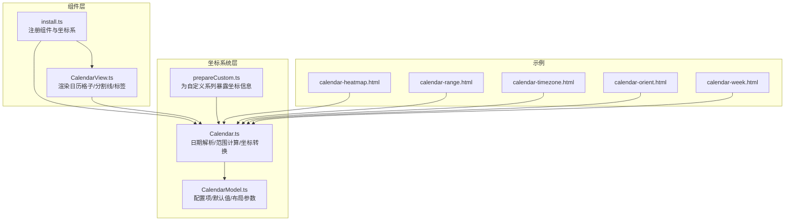
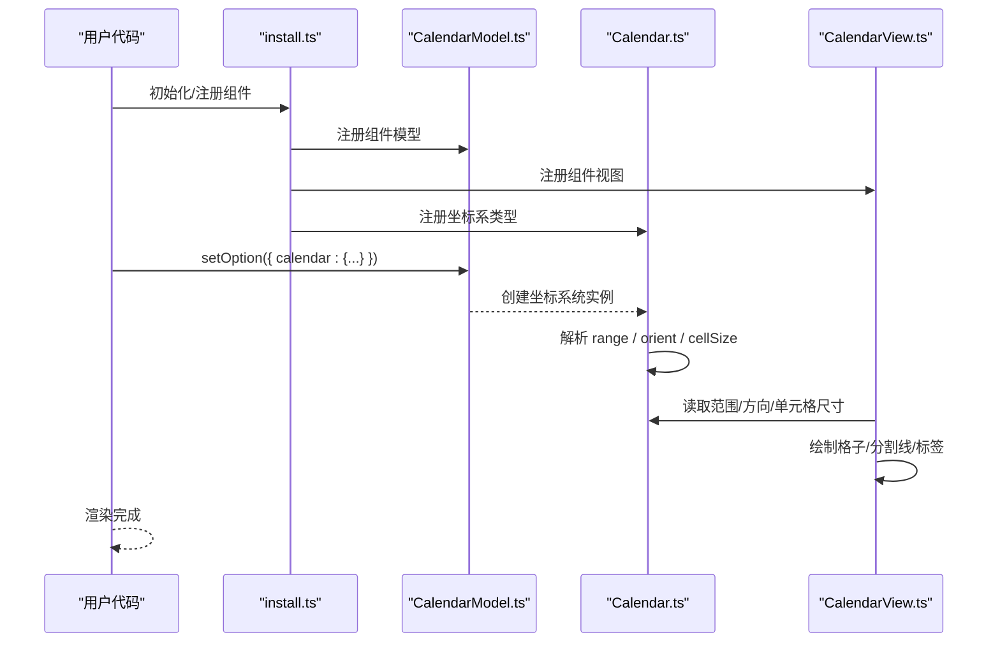
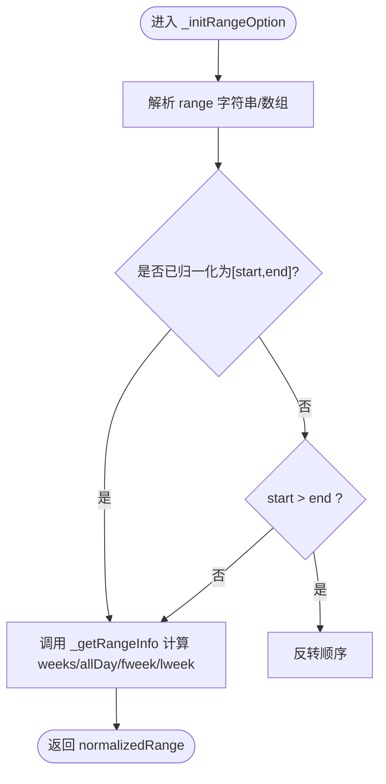
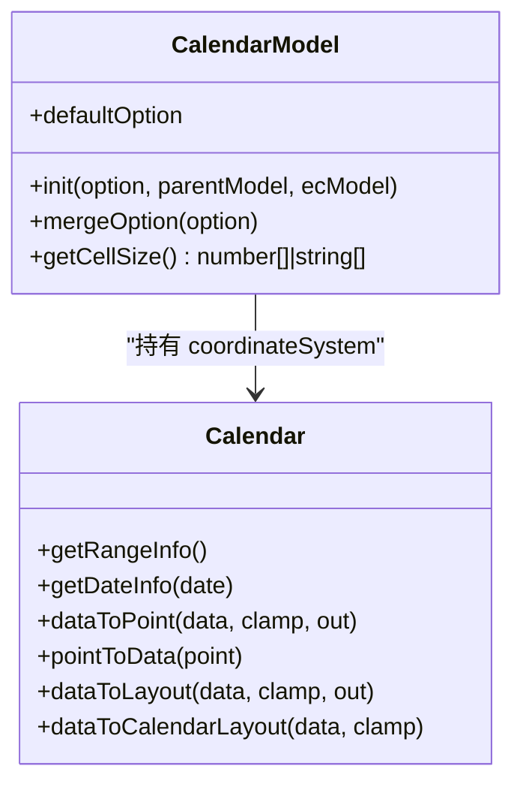
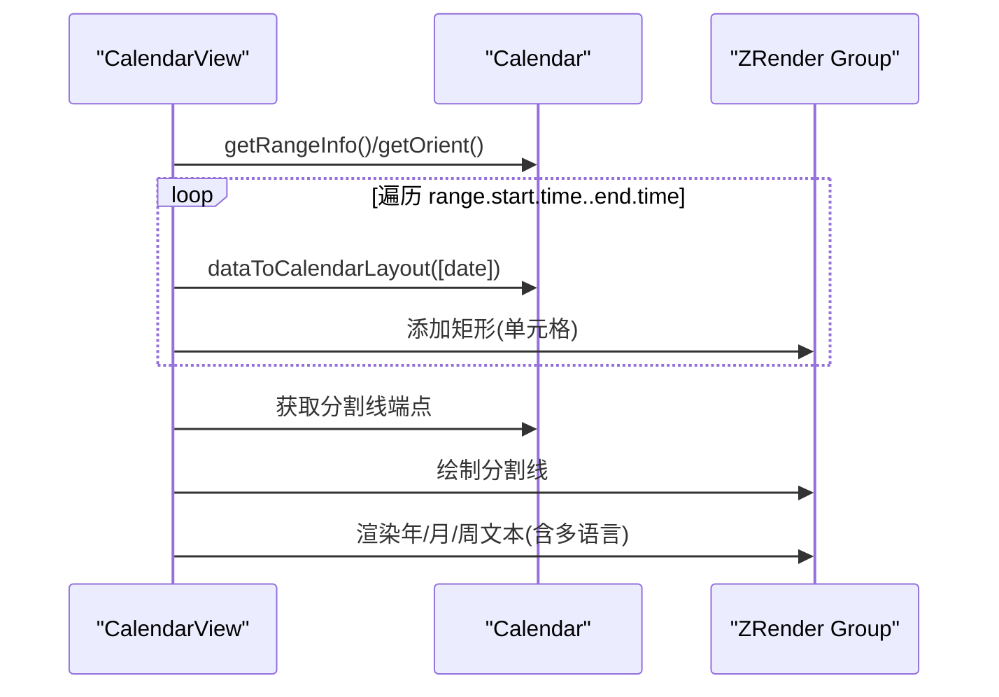
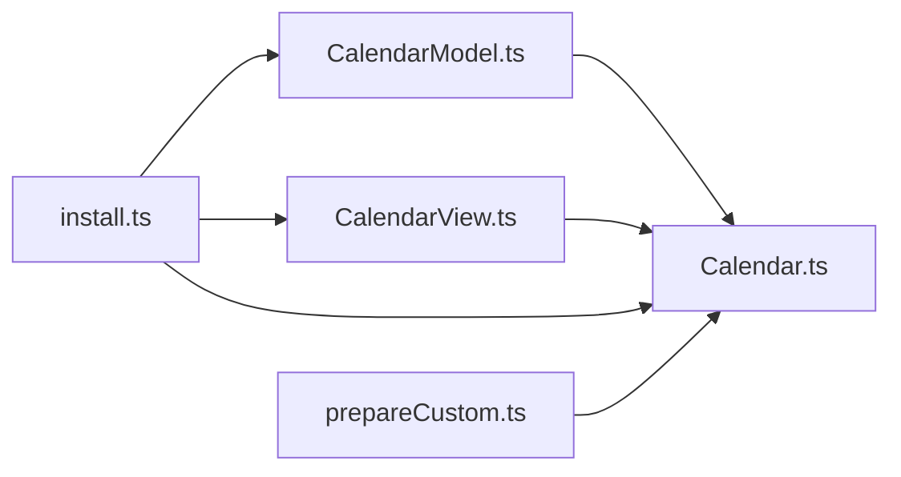

# 日历组件（Calendar）

<cite>
**本文引用的文件**
- [src/coord/calendar/Calendar.ts](file://src/coord/calendar/Calendar.ts)
- [src/coord/calendar/CalendarModel.ts](file://src/coord/calendar/CalendarModel.ts)
- [src/component/calendar/CalendarView.ts](file://src/component/calendar/CalendarView.ts)
- [src/component/calendar/install.ts](file://src/component/calendar/install.ts)
- [src/coord/calendar/prepareCustom.ts](file://src/coord/calendar/prepareCustom.ts)
- [test/calendar-heatmap.html](file://test/calendar-heatmap.html)
- [test/calendar-range.html](file://test/calendar-range.html)
- [test/calendar-timezone.html](file://test/calendar-timezone.html)
- [test/calendar-orient.html](file://test/calendar-orient.html)
- [test/calendar-week.html](file://test/calendar-week.html)
</cite>

## 目录
1. [简介](#简介)
2. [项目结构](#项目结构)
3. [核心组件](#核心组件)
4. [架构总览](#架构总览)
5. [详细组件分析](#详细组件分析)
6. [依赖关系分析](#依赖关系分析)
7. [性能考量](#性能考量)
8. [故障排查指南](#故障排查指南)
9. [结论](#结论)
10. [附录：配置项速查与示例](#附录配置项速查与示例)

## 简介
ECharts 的日历组件（Calendar）提供基于“年/月/周/日”网格的可视化能力，常用于热力图、日程安排、时间趋势等场景。它支持：
- 日期范围设置：支持单年、单月、单日或起止区间
- 周起始日配置：可自定义每周从星期几开始
- 自定义日期格式：通过 monthLabel/yearLabel/dayLabel 的 formatter/nameMap 实现多语言与自定义显示
- 方向与布局：支持水平/垂直方向、单元格大小自适应或固定
- 时区处理：对跨时区与夏令时的边界情况做了兼容修正
- 多语言支持：内置多种 locale，可按需切换或覆盖

## 项目结构
日历组件由“坐标系统 + 模型 + 视图 + 安装器”构成，并通过测试用例展示典型用法。

图表来源
- [src/component/calendar/install.ts:20-29](file://src/component/calendar/install.ts#L20-L29)
- [src/coord/calendar/Calendar.ts:94-124](file://src/coord/calendar/Calendar.ts#L94-L124)
- [src/coord/calendar/CalendarModel.ts:157-183](file://src/coord/calendar/CalendarModel.ts#L157-L183)
- [src/component/calendar/CalendarView.ts:61-86](file://src/component/calendar/CalendarView.ts#L61-L86)
- [src/coord/calendar/prepareCustom.ts:22-37](file://src/coord/calendar/prepareCustom.ts#L22-L37)

章节来源
- [src/component/calendar/install.ts:20-29](file://src/component/calendar/install.ts#L20-L29)
- [src/coord/calendar/Calendar.ts:94-124](file://src/coord/calendar/Calendar.ts#L94-L124)
- [src/coord/calendar/CalendarModel.ts:157-183](file://src/coord/calendar/CalendarModel.ts#L157-L183)
- [src/component/calendar/CalendarView.ts:61-86](file://src/component/calendar/CalendarView.ts#L61-L86)
- [src/coord/calendar/prepareCustom.ts:22-37](file://src/coord/calendar/prepareCustom.ts#L22-L37)

## 核心组件
- Calendar（坐标系统）
  - 负责日期解析、范围计算、行列到像素坐标的转换、获取周起始日、计算单元格宽高、处理时区边界等
- CalendarModel（模型）
  - 管理 calendar 配置项（range、cellSize、orient、dayLabel/monthLabel/yearLabel、splitLine、itemStyle 等），合并并归一化布局参数
- CalendarView（视图）
  - 绘制日历格子、分割线、年/月/周标签，支持多语言 nameMap 与格式化器
- install（安装器）
  - 注册组件模型、视图与坐标系类型

章节来源
- [src/coord/calendar/Calendar.ts:94-124](file://src/coord/calendar/Calendar.ts#L94-L124)
- [src/coord/calendar/CalendarModel.ts:157-183](file://src/coord/calendar/CalendarModel.ts#L157-L183)
- [src/component/calendar/CalendarView.ts:61-86](file://src/component/calendar/CalendarView.ts#L61-L86)
- [src/component/calendar/install.ts:20-29](file://src/component/calendar/install.ts#L20-L29)

## 架构总览
日历组件采用“模型-视图-坐标系统”分离的设计：
- Model 负责配置与默认值
- CoordinateSystem 负责数据与像素之间的转换、范围与布局计算
- View 负责具体图形绘制与文本渲染
- install 将三者注册到 ECharts 框架中

图表来源
- [src/component/calendar/install.ts:20-29](file://src/component/calendar/install.ts#L20-L29)
- [src/coord/calendar/Calendar.ts:208-247](file://src/coord/calendar/Calendar.ts#L208-L247)
- [src/component/calendar/CalendarView.ts:61-86](file://src/component/calendar/CalendarView.ts#L61-L86)

## 详细组件分析

### 坐标系统：Calendar
- 维度定义：time/value
- 关键方法
  - getRangeInfo：返回起止日期、总天数、周数、首尾周信息等
  - getDateInfo：将任意日期解析为本地化的 y/m/d/day/time/formatedDate
  - dataToPoint/pointToData：数据与像素坐标互转
  - dataToLayout/dataToCalendarLayout：返回单元格的矩形布局信息
  - _initRangeOption/_getRangeInfo：规范化 range 并计算周数、对齐首尾周
  - getFirstDayOfWeek：读取 dayLabel.firstDay 决定周起始日
- 时区处理
  - 在计算 allDay 时考虑了 DST 与跨时区导致的偏移，确保按“本地日”计数

图表来源
- [src/coord/calendar/Calendar.ts:398-447](file://src/coord/calendar/Calendar.ts#L398-L447)
- [src/coord/calendar/Calendar.ts:457-516](file://src/coord/calendar/Calendar.ts#L457-L516)

章节来源
- [src/coord/calendar/Calendar.ts:94-124](file://src/coord/calendar/Calendar.ts#L94-L124)
- [src/coord/calendar/Calendar.ts:169-206](file://src/coord/calendar/Calendar.ts#L169-L206)
- [src/coord/calendar/Calendar.ts:255-300](file://src/coord/calendar/Calendar.ts#L255-L300)
- [src/coord/calendar/Calendar.ts:302-350](file://src/coord/calendar/Calendar.ts#L302-L350)
- [src/coord/calendar/Calendar.ts:398-516](file://src/coord/calendar/Calendar.ts#L398-L516)

### 模型：CalendarModel
- 配置项
  - range：支持年份、月份、单日或起止区间
  - cellSize：单元格宽高，可为数字或 'auto'，支持二维数组
  - orient：'horizontal' | 'vertical'
  - splitLine：分割线样式与显隐
  - itemStyle：单元格样式
  - dayLabel：firstDay、position、margin、nameMap
  - monthLabel：position、margin、align、formatter、nameMap
  - yearLabel：position、margin、formatter
- 布局归一化
  - 根据 width/left/right/top/bottom 与 cellSize 自动推导实际布局，避免冲突

图表来源
- [src/coord/calendar/CalendarModel.ts:157-183](file://src/coord/calendar/CalendarModel.ts#L157-L183)
- [src/coord/calendar/CalendarModel.ts:190-263](file://src/coord/calendar/CalendarModel.ts#L190-L263)
- [src/coord/calendar/CalendarModel.ts:267-296](file://src/coord/calendar/CalendarModel.ts#L267-L296)
- [src/coord/calendar/Calendar.ts:94-124](file://src/coord/calendar/Calendar.ts#L94-L124)

章节来源
- [src/coord/calendar/CalendarModel.ts:157-183](file://src/coord/calendar/CalendarModel.ts#L157-L183)
- [src/coord/calendar/CalendarModel.ts:190-263](file://src/coord/calendar/CalendarModel.ts#L190-L263)
- [src/coord/calendar/CalendarModel.ts:267-296](file://src/coord/calendar/CalendarModel.ts#L267-L296)

### 视图：CalendarView
- 渲染流程
  - 清空组 -> 绘制每日格子 -> 绘制分割线 -> 渲染年/月/周标签
- 标签与多语言
  - 使用 locale 的 time.month/dayOfWeekShort 等作为 nameMap
  - 支持通过 nameMap 指定特定语言或自定义数组
  - 支持 formatter 函数或模板字符串进行自定义显示
- 位置控制
  - 年标签支持 top/bottom/left/right
  - 月标签支持 start/end 与居中
  - 周标签支持 start/end 与 margin（百分比）

图表来源
- [src/component/calendar/CalendarView.ts:61-86](file://src/component/calendar/CalendarView.ts#L61-L86)
- [src/component/calendar/CalendarView.ts:88-117](file://src/component/calendar/CalendarView.ts#L88-L117)
- [src/component/calendar/CalendarView.ts:119-177](file://src/component/calendar/CalendarView.ts#L119-L177)
- [src/component/calendar/CalendarView.ts:287-346](file://src/component/calendar/CalendarView.ts#L287-L346)
- [src/component/calendar/CalendarView.ts:391-461](file://src/component/calendar/CalendarView.ts#L391-L461)
- [src/component/calendar/CalendarView.ts:493-559](file://src/component/calendar/CalendarView.ts#L493-L559)

章节来源
- [src/component/calendar/CalendarView.ts:61-86](file://src/component/calendar/CalendarView.ts#L61-L86)
- [src/component/calendar/CalendarView.ts:88-117](file://src/component/calendar/CalendarView.ts#L88-L117)
- [src/component/calendar/CalendarView.ts:119-177](file://src/component/calendar/CalendarView.ts#L119-L177)
- [src/component/calendar/CalendarView.ts:287-346](file://src/component/calendar/CalendarView.ts#L287-L346)
- [src/component/calendar/CalendarView.ts:391-461](file://src/component/calendar/CalendarView.ts#L391-L461)
- [src/component/calendar/CalendarView.ts:493-559](file://src/component/calendar/CalendarView.ts#L493-L559)

### 安装器与自定义系列注入
- install 将 CalendarModel、CalendarView 与坐标系类型 'calendar' 注册到框架
- prepareCustom 为自定义系列暴露坐标系的 rect、cellWidth/cellHeight、rangeInfo 等信息，便于扩展

章节来源
- [src/component/calendar/install.ts:20-29](file://src/component/calendar/install.ts#L20-L29)
- [src/coord/calendar/prepareCustom.ts:22-37](file://src/coord/calendar/prepareCustom.ts#L22-L37)

## 依赖关系分析
- Calendar 依赖 CalendarModel 获取配置与布局参数
- CalendarView 依赖 Calendar 获取范围、方向、单元格尺寸与坐标转换
- install 将三者装配到 ECharts 运行时
- 测试用例展示了不同 range/orient/locale/timezone 的组合用法

图表来源
- [src/component/calendar/install.ts:20-29](file://src/component/calendar/install.ts#L20-L29)
- [src/coord/calendar/Calendar.ts:94-124](file://src/coord/calendar/Calendar.ts#L94-L124)
- [src/coord/calendar/CalendarModel.ts:157-183](file://src/coord/calendar/CalendarModel.ts#L157-L183)
- [src/component/calendar/CalendarView.ts:61-86](file://src/component/calendar/CalendarView.ts#L61-L86)
- [src/coord/calendar/prepareCustom.ts:22-37](file://src/coord/calendar/prepareCustom.ts#L22-L37)

章节来源
- [src/component/calendar/install.ts:20-29](file://src/component/calendar/install.ts#L20-L29)
- [src/coord/calendar/Calendar.ts:94-124](file://src/coord/calendar/Calendar.ts#L94-L124)
- [src/coord/calendar/CalendarModel.ts:157-183](file://src/coord/calendar/CalendarModel.ts#L157-L183)
- [src/component/calendar/CalendarView.ts:61-86](file://src/component/calendar/CalendarView.ts#L61-L86)
- [src/coord/calendar/prepareCustom.ts:22-37](file://src/coord/calendar/prepareCustom.ts#L22-L37)

## 性能考量
- 单元格数量与渲染开销
  - 一年约 366 个单元格，若每个都创建独立图形对象，内存与绘制成本较高；建议合理设置 cellSize 与可视区域，必要时结合 dataZoom 或按需加载
- 时区与边界计算
  - 计算 allDay 与 weeks 时考虑了 DST 与跨时区偏移，逻辑复杂度 O(1)，但频繁更新时需避免重复构造 Date 对象
- 标签与分割线
  - 分割线仅在 show=true 时绘制；year/month/day 标签可根据业务需要关闭以提升性能

[本节为通用指导，不直接分析具体文件]

## 故障排查指南
- 日期范围无效
  - 现象：控制台报错或无渲染
  - 原因：range 无法被识别为年/月/日/区间
  - 解决：检查传入格式或使用标准 'YYYY'/'YYYY-MM'/'YYYY-MM-DD' 或数组形式
  - 参考路径
    - [src/coord/calendar/Calendar.ts:398-447](file://src/coord/calendar/Calendar.ts#L398-L447)
- 时区导致日期错位
  - 现象：跨时区或夏令时切换后，某日显示偏移一天
  - 原因：以毫秒计算的日期差受 DST 影响
  - 解决：内部已通过“按本地日推进”的方式修正；如仍异常，确认浏览器时区设置与数据时间戳一致性
  - 参考路径
    - [src/coord/calendar/Calendar.ts:457-516](file://src/coord/calendar/Calendar.ts#L457-L516)
- 单元格大小与布局冲突
  - 现象：设置了 width/left/right 后 cellSize 不生效
  - 原因：当 width/left/right 可计算时，cellSize 会被置为 'auto'
  - 解决：明确 cellSize 或调整布局参数
  - 参考路径
    - [src/coord/calendar/CalendarModel.ts:267-296](file://src/coord/calendar/CalendarModel.ts#L267-L296)
- 多语言未生效
  - 现象：month/day 名称未按预期显示
  - 原因：nameMap 未正确指定或未注册对应 locale
  - 解决：通过 nameMap 指定语言名或数组；或通过 echarts.init 的 locale 全局设置
  - 参考路径
    - [src/component/calendar/CalendarView.ts:391-461](file://src/component/calendar/CalendarView.ts#L391-L461)
    - [src/component/calendar/CalendarView.ts:493-559](file://src/component/calendar/CalendarView.ts#L493-L559)

章节来源
- [src/coord/calendar/Calendar.ts:398-447](file://src/coord/calendar/Calendar.ts#L398-L447)
- [src/coord/calendar/Calendar.ts:457-516](file://src/coord/calendar/Calendar.ts#L457-L516)
- [src/coord/calendar/CalendarModel.ts:267-296](file://src/coord/calendar/CalendarModel.ts#L267-L296)
- [src/component/calendar/CalendarView.ts:391-461](file://src/component/calendar/CalendarView.ts#L391-L461)
- [src/component/calendar/CalendarView.ts:493-559](file://src/component/calendar/CalendarView.ts#L493-L559)

## 结论
ECharts 日历组件通过清晰的模型-视图-坐标系统分层，提供了强大的日期网格可视化能力。其灵活的 range 与 cellSize、完善的周起始日与多语言支持、以及稳健的时区处理，使其适用于销售日历、用户活跃度分析与项目进度跟踪等多种业务场景。配合 heatmap 等系列，可快速构建直观的时间维度可视化看板。

[本节为总结性内容，不直接分析具体文件]

## 附录：配置项速查与示例

### 常用配置项
- calendar.range
  - 支持：'YYYY' | 'YYYY-MM' | 'YYYY-MM-DD' | ['start','end']
  - 作用：定义日历显示的日期范围
  - 参考路径
    - [src/coord/calendar/CalendarModel.ts:68-90](file://src/coord/calendar/CalendarModel.ts#L68-L90)
    - [src/coord/calendar/Calendar.ts:398-447](file://src/coord/calendar/Calendar.ts#L398-L447)
- calendar.cellSize
  - 支持：number | 'auto' | [w,h]
  - 作用：单元格宽高；当 width/left/right/top/bottom 可计算时会自动设为 'auto'
  - 参考路径
    - [src/coord/calendar/CalendarModel.ts:68-72](file://src/coord/calendar/CalendarModel.ts#L68-L72)
    - [src/coord/calendar/CalendarModel.ts:267-296](file://src/coord/calendar/CalendarModel.ts#L267-L296)
- calendar.orient
  - 支持：'horizontal' | 'vertical'
  - 作用：日历主轴方向
  - 参考路径
    - [src/coord/calendar/CalendarModel.ts:72-72](file://src/coord/calendar/CalendarModel.ts#L72-L72)
    - [src/coord/calendar/Calendar.ts:208-247](file://src/coord/calendar/Calendar.ts#L208-L247)
- calendar.dayLabel
  - firstDay：0=周日，1=周一，...
  - position：'start' | 'end'
  - margin：数字或百分比
  - nameMap：语言名或自定义数组
  - 参考路径
    - [src/coord/calendar/CalendarModel.ts:92-117](file://src/coord/calendar/CalendarModel.ts#L92-L117)
    - [src/component/calendar/CalendarView.ts:493-559](file://src/component/calendar/CalendarView.ts#L493-L559)
- calendar.monthLabel
  - position：'start' | 'end'
  - align：'left' | 'center' | 'right'
  - formatter/nameMap：自定义或语言映射
  - 参考路径
    - [src/coord/calendar/CalendarModel.ts:119-140](file://src/coord/calendar/CalendarModel.ts#L119-L140)
    - [src/component/calendar/CalendarView.ts:391-461](file://src/component/calendar/CalendarView.ts#L391-L461)
- calendar.yearLabel
  - position：'top' | 'bottom' | 'left' | 'right'
  - formatter：自定义标题
  - 参考路径
    - [src/coord/calendar/CalendarModel.ts:142-154](file://src/coord/calendar/CalendarModel.ts#L142-L154)
    - [src/component/calendar/CalendarView.ts:287-346](file://src/component/calendar/CalendarView.ts#L287-L346)
- calendar.splitLine
  - show：是否显示分割线
  - lineStyle：线条样式
  - 参考路径
    - [src/coord/calendar/CalendarModel.ts:74-77](file://src/coord/calendar/CalendarModel.ts#L74-L77)
    - [src/component/calendar/CalendarView.ts:119-177](file://src/component/calendar/CalendarView.ts#L119-L177)

### 典型应用场景与示例文件
- 热力图日历（年度步数统计）
  - 示例：[test/calendar-heatmap.html](file://test/calendar-heatmap.html)
  - 要点：series.type='heatmap'，coordinateSystem='calendar'，visualMap 映射数值到颜色
- 多日历对比（年/月/区间）
  - 示例：[test/calendar-range.html](file://test/calendar-range.html)
  - 要点：多个 calendar 实例，分别设置 range；series 通过 calendarIndex 关联
- 方向与布局（水平/垂直）
  - 示例：[test/calendar-orient.html](file://test/calendar-orient.html)
  - 要点：orient 切换方向；cellSize 与布局参数组合
- 多语言与周起始日
  - 示例：[test/calendar-week.html](file://test/calendar-week.html)
  - 要点：dayLabel.nameMap 指定语言；firstDay 控制周起始；monthLabel 也可指定语言
- 时区与边界处理
  - 示例：[test/calendar-timezone.html](file://test/calendar-timezone.html)
  - 要点：在不同系统时区下验证日历坐标与日期对齐

章节来源
- [test/calendar-heatmap.html:69-98](file://test/calendar-heatmap.html#L69-L98)
- [test/calendar-range.html:69-123](file://test/calendar-range.html#L69-L123)
- [test/calendar-orient.html:69-137](file://test/calendar-orient.html#L69-L137)
- [test/calendar-week.html:81-260](file://test/calendar-week.html#L81-L260)
- [test/calendar-timezone.html:81-166](file://test/calendar-timezone.html#L81-L166)