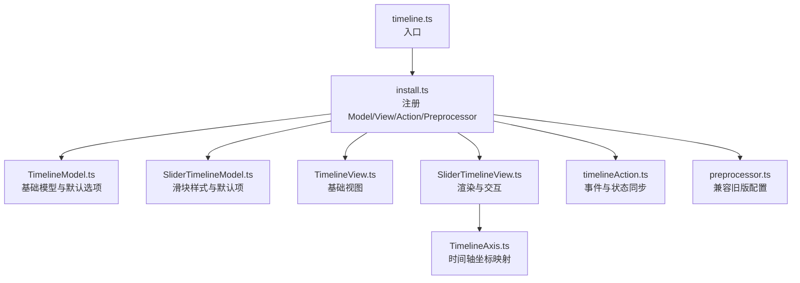
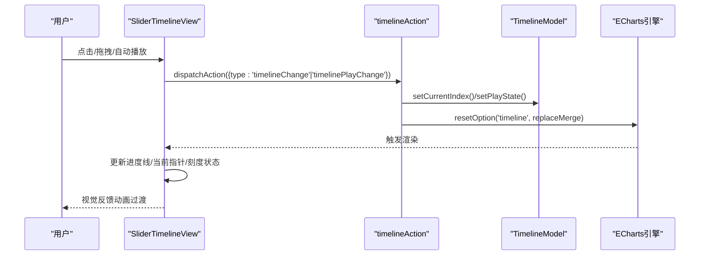
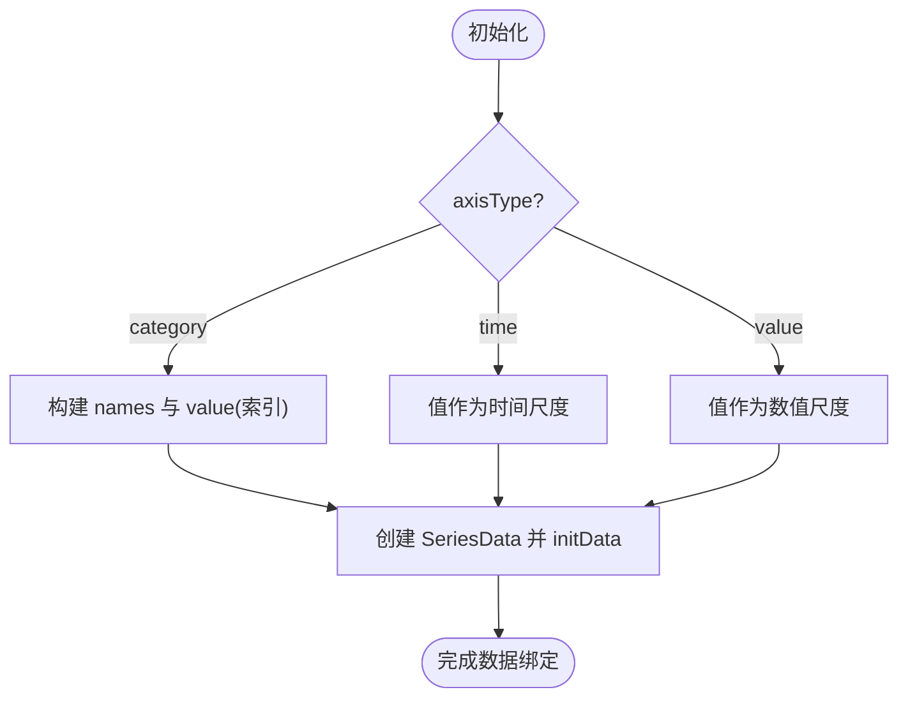
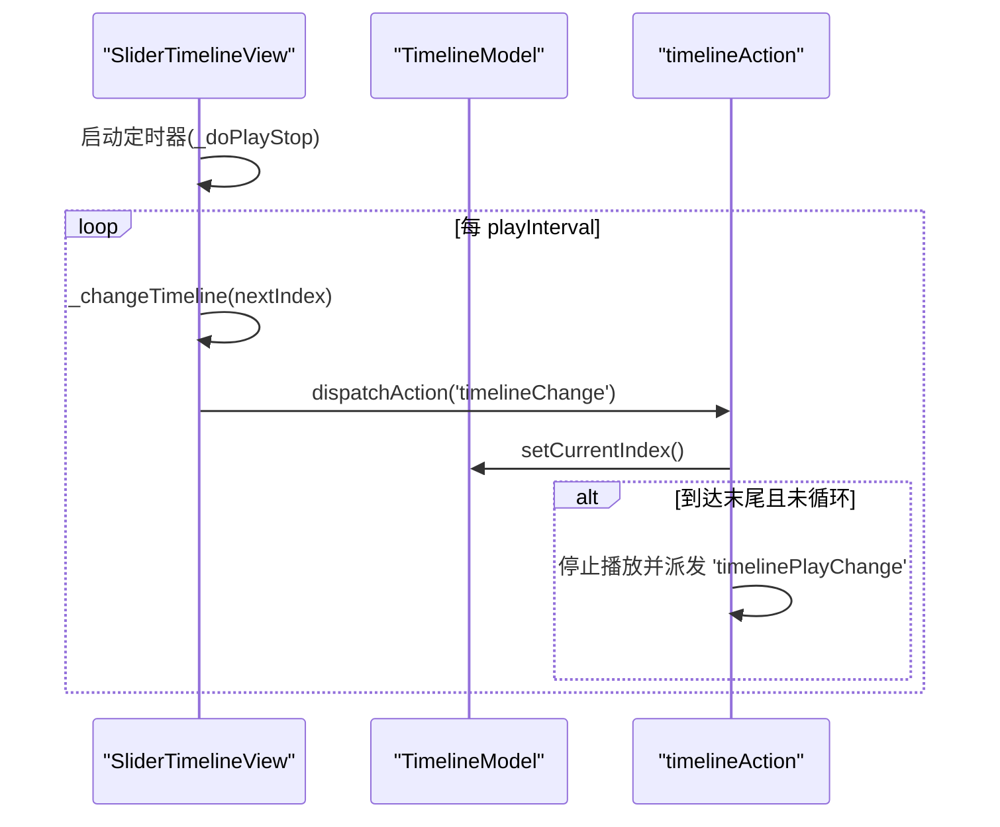
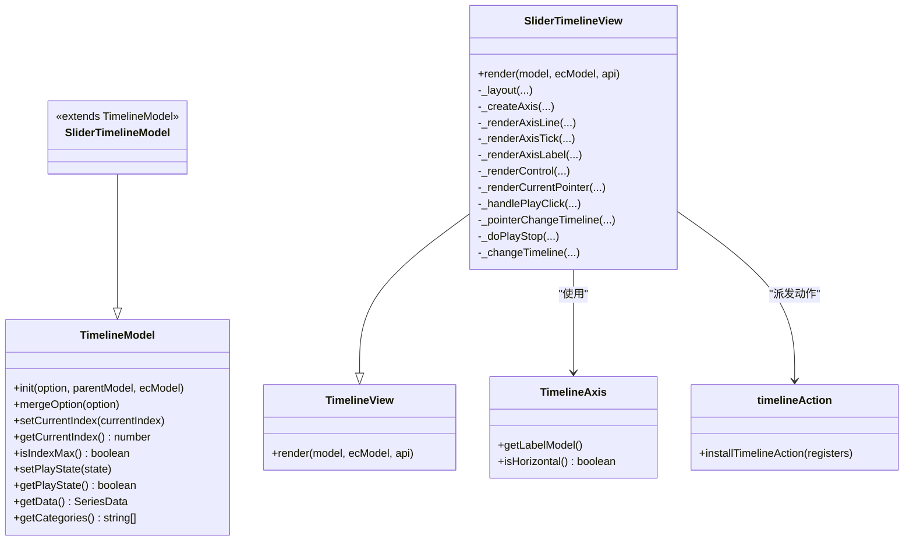
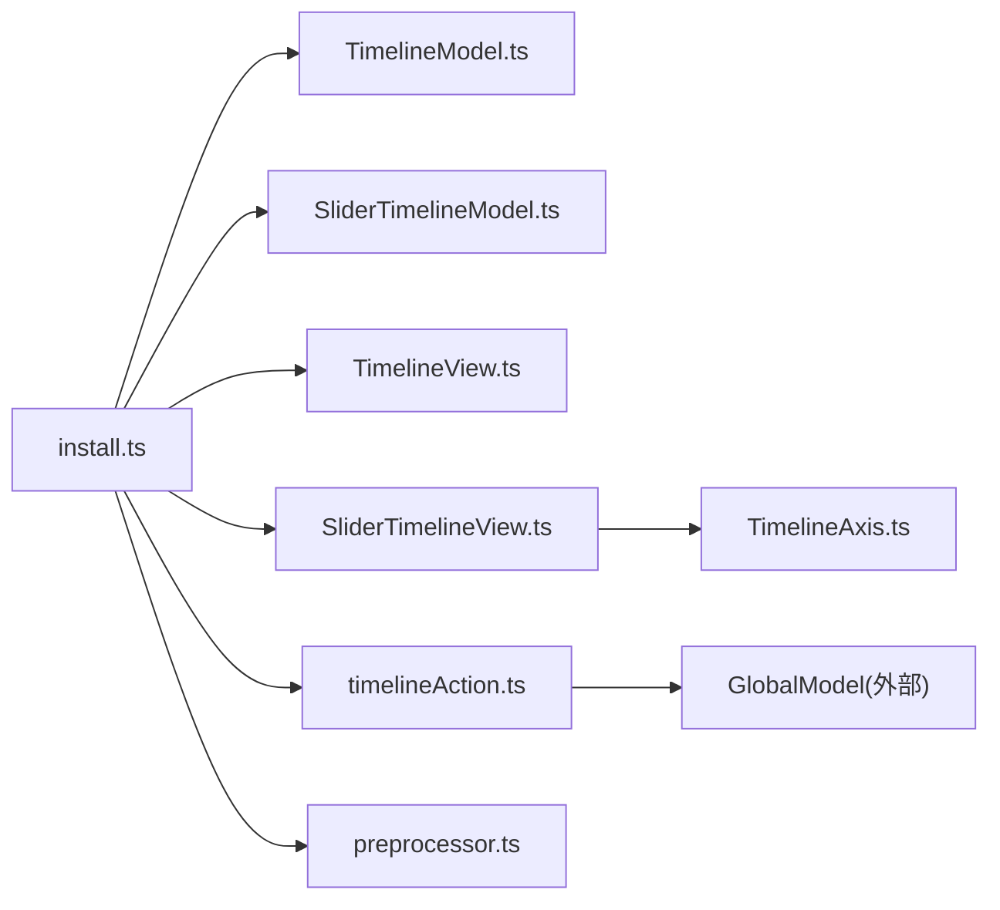

# 时间轴组件 (Timeline)

<cite>
**本文引用的文件**
- [src/component/timeline.ts](file://src/component/timeline.ts)
- [src/component/timeline/install.ts](file://src/component/timeline/install.ts)
- [src/component/timeline/preprocessor.ts](file://src/component/timeline/preprocessor.ts)
- [src/component/timeline/TimelineModel.ts](file://src/component/timeline/TimelineModel.ts)
- [src/component/timeline/SliderTimelineModel.ts](file://src/component/timeline/SliderTimelineModel.ts)
- [src/component/timeline/TimelineView.ts](file://src/component/timeline/TimelineView.ts)
- [src/component/timeline/SliderTimelineView.ts](file://src/component/timeline/SliderTimelineView.ts)
- [src/component/timeline/TimelineAxis.ts](file://src/component/timeline/TimelineAxis.ts)
- [src/component/timeline/timelineAction.ts](file://src/component/timeline/timelineAction.ts)
- [test/timeline-case.html](file://test/timeline-case.html)
- [test/timeline-finance.html](file://test/timeline-finance.html)
</cite>

## 目录
1. [简介](#简介)
2. [项目结构](#项目结构)
3. [核心组件](#核心组件)
4. [架构总览](#架构总览)
5. [详细组件分析](#详细组件分析)
6. [依赖关系分析](#依赖关系分析)
7. [性能考虑](#性能考虑)
8. [故障排查指南](#故障排查指南)
9. [结论](#结论)
10. [附录](#附录)

## 简介
ECharts 的时间轴（Timeline）组件用于基于时间维度的动态图表展示，支持数据绑定、自动播放、手动控制与动画过渡。通过配置 data、axisType、autoPlay、playInterval 等属性，可实现多系列时间序列数据的交互式切换与可视化，适用于金融时间序列分析与业务指标监控等场景。

## 项目结构
时间轴组件由模型（Model）、视图（View）、坐标轴（Axis）、动作（Action）和预处理（Preprocessor）组成，并通过安装器注册到 ECharts 扩展系统。

**图示来源**
- [src/component/timeline.ts:20-27](file://src/component/timeline.ts#L20-L27)
- [src/component/timeline/install.ts:25-36](file://src/component/timeline/install.ts#L25-L36)
- [src/component/timeline/TimelineModel.ts:173-336](file://src/component/timeline/TimelineModel.ts#L173-L336)
- [src/component/timeline/SliderTimelineModel.ts:30-145](file://src/component/timeline/SliderTimelineModel.ts#L30-L145)
- [src/component/timeline/TimelineView.ts:20-27](file://src/component/timeline/TimelineView.ts#L20-L27)
- [src/component/timeline/SliderTimelineView.ts:81-149](file://src/component/timeline/SliderTimelineView.ts#L81-L149)
- [src/component/timeline/TimelineAxis.ts:28-61](file://src/component/timeline/TimelineAxis.ts#L28-L61)
- [src/component/timeline/timelineAction.ts:37-83](file://src/component/timeline/timelineAction.ts#L37-L83)
- [src/component/timeline/preprocessor.ts:24-38](file://src/component/timeline/preprocessor.ts#L24-L38)

**章节来源**
- [src/component/timeline.ts:20-27](file://src/component/timeline.ts#L20-L27)
- [src/component/timeline/install.ts:25-36](file://src/component/timeline/install.ts#L25-L36)

## 核心组件
- TimelineModel：定义时间轴的基础能力（数据初始化、当前索引、播放状态、默认选项）。
- SliderTimelineModel：在基础模型之上提供滑块样式的默认配置（线条、刻度、标签、控件图标等）。
- SliderTimelineView：负责布局、绘制轴线/刻度/标签/控件/当前指针，处理拖拽、点击、自动播放与进度线更新。
- TimelineAxis：封装时间轴坐标映射，支持 category/time/value 类型。
- timelineAction：定义并处理 timelineChange 与 timelinePlayChange 动作，驱动全局状态同步与重绘。
- preprocessor：兼容旧版配置（如 type→axisType、controlPosition→controlStyle.position 等）。

**章节来源**
- [src/component/timeline/TimelineModel.ts:173-336](file://src/component/timeline/TimelineModel.ts#L173-L336)
- [src/component/timeline/SliderTimelineModel.ts:30-145](file://src/component/timeline/SliderTimelineModel.ts#L30-L145)
- [src/component/timeline/SliderTimelineView.ts:81-149](file://src/component/timeline/SliderTimelineView.ts#L81-L149)
- [src/component/timeline/TimelineAxis.ts:28-61](file://src/component/timeline/TimelineAxis.ts#L28-L61)
- [src/component/timeline/timelineAction.ts:37-83](file://src/component/timeline/timelineAction.ts#L37-L83)
- [src/component/timeline/preprocessor.ts:24-38](file://src/component/timeline/preprocessor.ts#L24-L38)

## 架构总览
时间轴组件采用“模型-视图-动作”的协作模式：
- 用户交互（点击/拖拽/自动播放）触发 View 派发 Action。
- Action 修改 Model 状态（currentIndex、autoPlay），并触发全局 option 重置以联动图表更新。
- View 根据 Model 的最新状态重新布局与渲染，包括进度线与当前指针位置。

**图示来源**
- [src/component/timeline/SliderTimelineView.ts:603-713](file://src/component/timeline/SliderTimelineView.ts#L603-L713)
- [src/component/timeline/timelineAction.ts:37-83](file://src/component/timeline/timelineAction.ts#L37-L83)
- [src/component/timeline/TimelineModel.ts:200-243](file://src/component/timeline/TimelineModel.ts#L200-L243)

## 详细组件分析

### 数据绑定与时间轴类型
- axisType 支持 'category' | 'time' | 'value'，决定刻度与标签的解析方式。
- data 可为字符串数组或对象数组；当 axisType='category' 时，会生成对应的 value 与名称列表。
- 内部使用 SeriesData 存储维度类型为 ordinal/time/number 的值，便于后续坐标映射与缩放。

**图示来源**
- [src/component/timeline/TimelineModel.ts:248-289](file://src/component/timeline/TimelineModel.ts#L248-L289)

**章节来源**
- [src/component/timeline/TimelineModel.ts:248-289](file://src/component/timeline/TimelineModel.ts#L248-L289)

### 播放控制与动画过渡
- autoPlay：是否自动播放。
- playInterval：自动播放间隔（毫秒）。
- rewind：反向播放开关。
- loop：循环播放开关。
- realtime：拖拽时是否实时触发切换。
- 播放流程：View 维护定时器，按 playInterval 调用 _changeTimeline，派发 timelineChange；若到达末尾且未开启 loop，则停止播放。

**图示来源**
- [src/component/timeline/SliderTimelineView.ts:650-713](file://src/component/timeline/SliderTimelineView.ts#L650-L713)
- [src/component/timeline/timelineAction.ts:37-70](file://src/component/timeline/timelineAction.ts#L37-L70)

**章节来源**
- [src/component/timeline/SliderTimelineView.ts:650-713](file://src/component/timeline/SliderTimelineView.ts#L650-L713)
- [src/component/timeline/timelineAction.ts:37-70](file://src/component/timeline/timelineAction.ts#L37-L70)

### 关键配置项说明
- data：时间轴刻度数据源，支持字符串或对象（可含 value、itemStyle、label、checkpointStyle、tooltip 等）。
- axisType：'category' | 'time' | 'value'。
- currentIndex：初始索引。
- autoPlay：是否自动播放。
- playInterval：自动播放间隔（ms）。
- rewind：是否反向播放。
- loop：是否循环播放。
- realtime：拖拽时是否实时更新。
- controlPosition / controlStyle：控件位置与样式（播放/上一帧/下一帧按钮）。
- lineStyle / itemStyle / label / checkpointStyle / progress / emphasis：轴线、刻度、标签、当前指针、进度条与强调态样式。
- orient / inverse：方向与反转。
- replaceMerge：设置合并策略（normalMerge 或 replaceMerge）。

**章节来源**
- [src/component/timeline/TimelineModel.ts:107-172](file://src/component/timeline/TimelineModel.ts#L107-L172)
- [src/component/timeline/SliderTimelineModel.ts:38-145](file://src/component/timeline/SliderTimelineModel.ts#L38-L145)

### 复杂时间序列与交互筛选
- 多系列时间数据：通过 options 数组为每个时间刻度定义不同的 series 配置，配合 timeline.data 实现切换。
- 交互式时间筛选：结合 dataZoom 可在时间轴上进一步筛选区间；也可利用 tooltip 与 legend 进行辅助筛选。
- 示例参考：
  - 基础案例：[test/timeline-case.html](file://test/timeline-case.html)
  - 金融时间序列：[test/timeline-finance.html](file://test/timeline-finance.html)

**章节来源**
- [test/timeline-case.html:47-98](file://test/timeline-case.html#L47-L98)
- [test/timeline-finance.html:72-119](file://test/timeline-finance.html#L72-L119)

### 类图（代码级）

**图示来源**
- [src/component/timeline/TimelineModel.ts:173-336](file://src/component/timeline/TimelineModel.ts#L173-L336)
- [src/component/timeline/SliderTimelineModel.ts:30-145](file://src/component/timeline/SliderTimelineModel.ts#L30-L145)
- [src/component/timeline/TimelineView.ts:20-27](file://src/component/timeline/TimelineView.ts#L20-L27)
- [src/component/timeline/SliderTimelineView.ts:81-149](file://src/component/timeline/SliderTimelineView.ts#L81-L149)
- [src/component/timeline/TimelineAxis.ts:28-61](file://src/component/timeline/TimelineAxis.ts#L28-L61)
- [src/component/timeline/timelineAction.ts:37-83](file://src/component/timeline/timelineAction.ts#L37-L83)

## 依赖关系分析
- install.ts 将 SliderTimelineModel、SliderTimelineView、timelineAction 与 preprocessor 注册到 ECharts。
- SliderTimelineView 依赖 TimelineAxis 进行坐标映射，依赖 zrender 图形库进行绘制。
- timelineAction 依赖 GlobalModel 获取组件实例并更新状态。
- preprocessor 对历史配置进行迁移，确保向后兼容。

**图示来源**
- [src/component/timeline/install.ts:25-36](file://src/component/timeline/install.ts#L25-L36)
- [src/component/timeline/SliderTimelineView.ts:32-46](file://src/component/timeline/SliderTimelineView.ts#L32-L46)
- [src/component/timeline/timelineAction.ts:20-25](file://src/component/timeline/timelineAction.ts#L20-L25)
- [src/component/timeline/preprocessor.ts:24-38](file://src/component/timeline/preprocessor.ts#L24-L38)

**章节来源**
- [src/component/timeline/install.ts:25-36](file://src/component/timeline/install.ts#L25-L36)

## 性能考虑
- 大数据量时间序列：
  - 合理设置 axisType 与 scale，避免过多刻度渲染。
  - 使用 label.interval 控制标签密度，减少文本绘制开销。
  - 关闭不必要的动画（checkpointStyle.animation 或全局动画）以提升交互流畅度。
- 自动播放：
  - 增大 playInterval 降低刷新频率。
  - 在大数据场景下，建议关闭 realtime 或在拖拽结束时再触发切换，减少频繁 setOption。
- 内存与重绘：
  - 复用当前指针与进度线元素，避免重复创建。
  - 使用 replaceMerge 控制选项合并策略，减少不必要的全量重算。
- 与 dataZoom 协同：
  - 在时间轴基础上叠加 dataZoom，可先缩小可视范围再渲染，提升大数据体验。

[本节为通用性能建议，不直接分析具体文件]

## 故障排查指南
- 配置兼容问题：
  - 旧版 type 字段需转换为 axisType；controlPosition 迁移至 controlStyle.position。
  - 检查 preprocessor 是否正确执行。
- 播放异常：
  - 确认 autoPlay、playInterval、rewind、loop 组合是否符合预期。
  - 到达末尾时若未开启 loop，会自动停止播放；如需继续循环请设置 loop=true。
- 拖拽无响应：
  - 检查 realtime 配置；若为 false，需在拖拽结束才触发切换。
  - 确认控件按钮可见性（controlStyle.show 及子按钮 showXxxBtn）。
- 样式不生效：
  - 检查 itemStyle、label、checkpointStyle、progress、emphasis 层级是否正确。
  - 注意 slider 视图中的 ensureState 与 toggleState 机制，确保状态切换正确。

**章节来源**
- [src/component/timeline/preprocessor.ts:40-74](file://src/component/timeline/preprocessor.ts#L40-L74)
- [src/component/timeline/timelineAction.ts:44-66](file://src/component/timeline/timelineAction.ts#L44-L66)
- [src/component/timeline/SliderTimelineView.ts:512-571](file://src/component/timeline/SliderTimelineView.ts#L512-L571)
- [src/component/timeline/SliderTimelineView.ts:715-734](file://src/component/timeline/SliderTimelineView.ts#L715-L734)

## 结论
ECharts 的时间轴组件提供了完善的数据绑定、播放控制与动画过渡能力，适合构建时间维度的动态可视化。通过合理配置 axisType、data、autoPlay、playInterval 等核心属性，并结合 dataZoom、legend、tooltip 等组件，可实现金融时间序列分析与业务指标监控等多种场景。在大屏与大数据场景下，建议关注刻度密度、动画开关与合并策略，以获得更优的性能体验。

[本节为总结性内容，不直接分析具体文件]

## 附录
- 示例参考：
  - 基础用法与边界情况：[test/timeline-case.html](file://test/timeline-case.html)
  - 金融时间序列案例：[test/timeline-finance.html](file://test/timeline-finance.html)

[本节为资源指引，不直接分析具体文件]