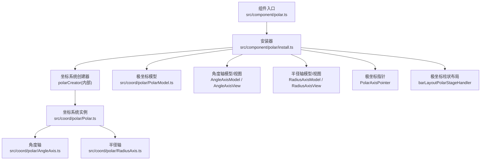
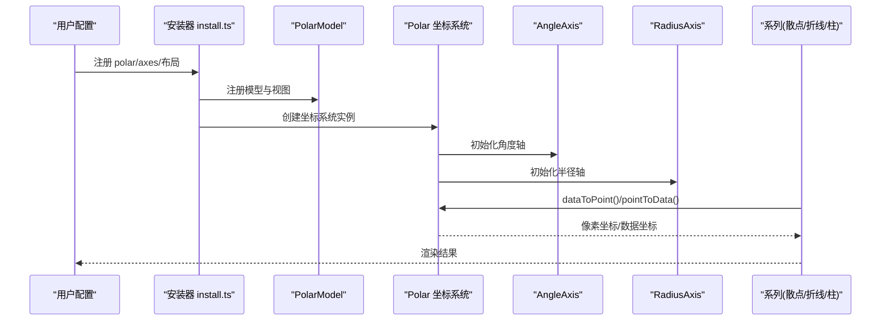
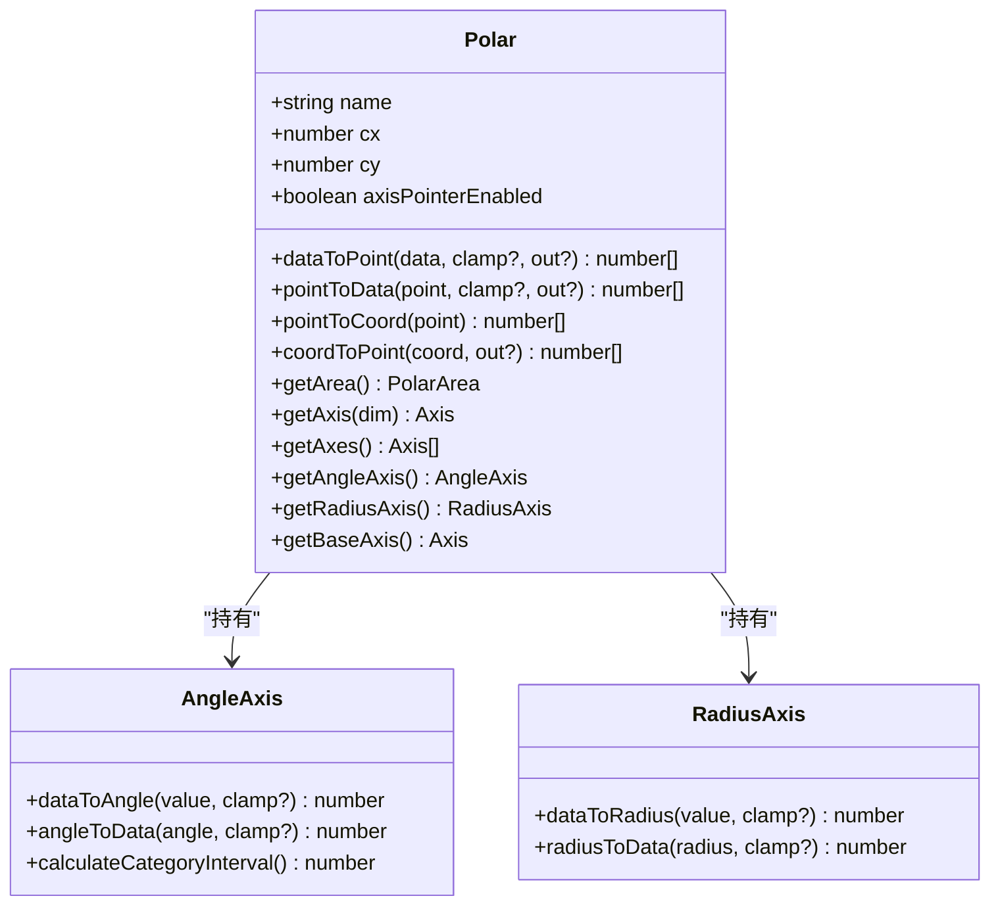
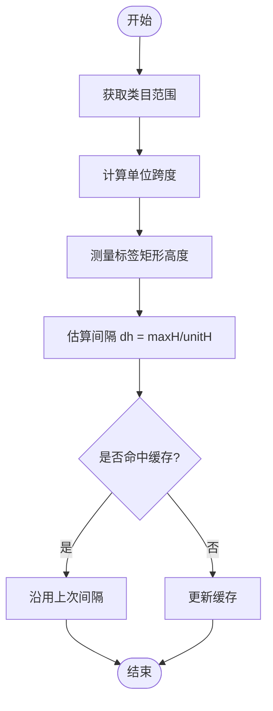
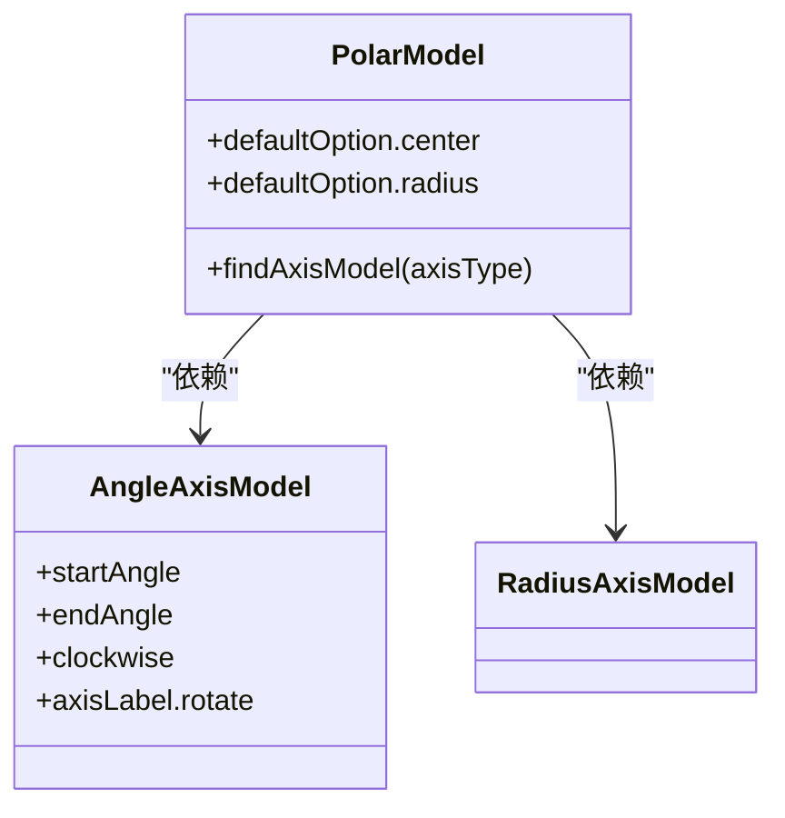
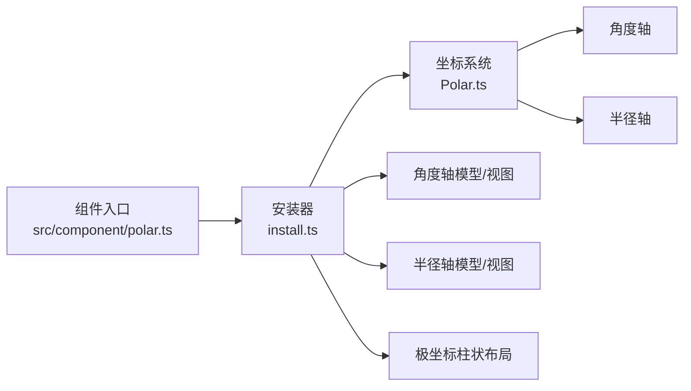

# 极坐标组件 (Polar)

<cite>
**本文引用的文件**
- [src/component/polar.ts](file://src/component/polar.ts)
- [src/coord/polar/Polar.ts](file://src/coord/polar/Polar.ts)
- [src/coord/polar/AngleAxis.ts](file://src/coord/polar/AngleAxis.ts)
- [src/coord/polar/RadiusAxis.ts](file://src/coord/polar/RadiusAxis.ts)
- [src/coord/polar/PolarModel.ts](file://src/coord/polar/PolarModel.ts)
- [src/coord/polar/AxisModel.ts](file://src/coord/polar/AxisModel.ts)
- [src/component/polar/install.ts](file://src/component/polar/install.ts)
- [test/bar-polar-basic-radial.html](file://test/bar-polar-basic-radial.html)
- [test/bar-polar-multi-series.html](file://test/bar-polar-multi-series.html)
- [test/bar-polar-stack.html](file://test/bar-polar-stack.html)
- [test/polarScatter.html](file://test/polarScatter.html)
- [test/polarLine.html](file://test/polarLine.html)
- [test/polar-end-angle.html](file://test/polar-end-angle.html)
- [test/radar.html](file://test/radar.html)
</cite>

## 目录
1. [简介](#简介)
2. [项目结构](#项目结构)
3. [核心组件](#核心组件)
4. [架构总览](#架构总览)
5. [详细组件分析](#详细组件分析)
6. [依赖关系分析](#依赖关系分析)
7. [性能考量](#性能考量)
8. [故障排查指南](#故障排查指南)
9. [结论](#结论)
10. [附录：示例与场景](#附录示例与场景)

## 简介
本章节介绍 ECharts 的极坐标组件（Polar），用于在极坐标系下进行数据可视化。极坐标由角度轴（angle）和半径轴（radius）构成，支持散点、折线、柱状等图表类型，并可结合雷达图实现多维数据的环形展示。文档将系统讲解 polar 配置项（如 center、radius、startAngle、endAngle、clockwise 等）、与直角坐标系的转换关系、典型图表的实现方式，以及性能优化与常见应用场景。

## 项目结构
ECharts 的极坐标能力由“组件注册 + 坐标系统 + 轴模型/视图 + 布局”共同组成：
- 组件入口：负责安装极坐标系统与相关轴、指针、布局等能力
- 坐标系统：定义极坐标中心、范围、坐标转换、包含性判断等
- 轴：角度轴与半径轴分别管理角度与半径的刻度、标签、范围
- 模型：提供 polar、angleAxis、radiusAxis 的配置与默认值
- 布局：为极坐标柱状图等提供专用布局逻辑

**图示来源**
- [src/component/polar.ts:20-23](file://src/component/polar.ts#L20-L23)
- [src/component/polar/install.ts:64-85](file://src/component/polar/install.ts#L64-L85)
- [src/coord/polar/Polar.ts:34-64](file://src/coord/polar/Polar.ts#L34-L64)
- [src/coord/polar/AngleAxis.ts:37-45](file://src/coord/polar/AngleAxis.ts#L37-L45)
- [src/coord/polar/RadiusAxis.ts:30-38](file://src/coord/polar/RadiusAxis.ts#L30-L38)

**章节来源**
- [src/component/polar.ts:20-23](file://src/component/polar.ts#L20-L23)
- [src/component/polar/install.ts:64-85](file://src/component/polar/install.ts#L64-L85)

## 核心组件
- 极坐标系统 Polar：维护中心位置、角度/半径轴、坐标转换、包含性判断、裁剪区域等
- 角度轴 AngleAxis：管理角度范围、刻度、标签、自动间隔计算等
- 半径轴 RadiusAxis：管理半径范围、刻度、标签等
- 模型 PolarModel/AngleAxisModel/RadiusAxisModel：承载配置项与默认值，关联坐标系统
- 安装器 install.ts：注册坐标系统、轴模型/视图、指针、布局处理器

关键职责与交互：
- Polar 持有 AngleAxis 与 RadiusAxis，并提供 dataToPoint、pointToData、pointToCoord、coordToPoint 等转换方法
- 角度轴与半径轴通过 Axis 基类提供 dataToCoord/coordToData 能力，并在极坐标下映射为 angle/radius
- PolarModel 提供 polar 的默认配置（如 center、radius），并依赖 angleAxis 与 radiusAxis

**章节来源**
- [src/coord/polar/Polar.ts:34-125](file://src/coord/polar/Polar.ts#L34-L125)
- [src/coord/polar/AngleAxis.ts:37-125](file://src/coord/polar/AngleAxis.ts#L37-L125)
- [src/coord/polar/RadiusAxis.ts:30-49](file://src/coord/polar/RadiusAxis.ts#L30-L49)
- [src/coord/polar/PolarModel.ts:38-72](file://src/coord/polar/PolarModel.ts#L38-L72)
- [src/coord/polar/AxisModel.ts:62-89](file://src/coord/polar/AxisModel.ts#L62-L89)
- [src/component/polar/install.ts:64-85](file://src/component/polar/install.ts#L64-L85)

## 架构总览
下图展示了从配置到渲染的关键流程：用户配置 polar、angleAxis、radiusAxis；安装器注册坐标系统与轴；坐标系统实例化后提供坐标转换；系列通过坐标系统进行数据到像素点的映射与绘制。

**图示来源**
- [src/component/polar/install.ts:64-85](file://src/component/polar/install.ts#L64-L85)
- [src/coord/polar/Polar.ts:140-203](file://src/coord/polar/Polar.ts#L140-L203)
- [src/coord/polar/PolarModel.ts:60-72](file://src/coord/polar/PolarModel.ts#L60-L72)

## 详细组件分析

### 极坐标系统 Polar
- 维度与类型：暴露 dimensions=['radius','angle']，type='polar'
- 中心与范围：cx/cy 表示中心像素坐标；getArea() 返回环状裁剪区域（含 r0、r、startAngle、endAngle、clockwise）
- 坐标转换：
  - dataToPoint(data, clamp?)：将 [radius, angle] 数据转为像素点
  - pointToData(point, clamp?)：将像素点转回 [radius, angle] 数据
  - pointToCoord(point)：像素点转 [radius, angle] 坐标
  - coordToPoint(coord)：[radius, angle] 坐标转像素点
- 包含性判断：containPoint/containData 基于两轴的 contain 方法
- 轴访问：getAxis/getAxes/getAngleAxis/getRadiusAxis/getBaseAxis

**图示来源**
- [src/coord/polar/Polar.ts:34-125](file://src/coord/polar/Polar.ts#L34-L125)
- [src/coord/polar/Polar.ts:140-203](file://src/coord/polar/Polar.ts#L140-L203)
- [src/coord/polar/Polar.ts:209-248](file://src/coord/polar/Polar.ts#L209-L248)
- [src/coord/polar/AngleAxis.ts:37-125](file://src/coord/polar/AngleAxis.ts#L37-L125)
- [src/coord/polar/RadiusAxis.ts:30-49](file://src/coord/polar/RadiusAxis.ts#L30-L49)

**章节来源**
- [src/coord/polar/Polar.ts:34-125](file://src/coord/polar/Polar.ts#L34-L125)
- [src/coord/polar/Polar.ts:140-203](file://src/coord/polar/Polar.ts#L140-L203)
- [src/coord/polar/Polar.ts:209-248](file://src/coord/polar/Polar.ts#L209-L248)

### 角度轴 AngleAxis
- 默认范围：[0, 360]
- 类别轴自动间隔：根据标签高度与单位跨度估算 tick 间隔，使用缓存避免缩放抖动
- 坐标映射：dataToAngle/angleToData 复用 Axis 的 dataToCoord/coordToData

**图示来源**
- [src/coord/polar/AngleAxis.ts:58-117](file://src/coord/polar/AngleAxis.ts#L58-L117)

**章节来源**
- [src/coord/polar/AngleAxis.ts:37-125](file://src/coord/polar/AngleAxis.ts#L37-L125)

### 半径轴 RadiusAxis
- 默认范围：由外部传入或计算得到
- 坐标映射：dataToRadius/radiusToData 复用 Axis 的 dataToCoord/coordToData

**章节来源**
- [src/coord/polar/RadiusAxis.ts:30-49](file://src/coord/polar/RadiusAxis.ts#L30-L49)

### 模型与配置 PolarModel/AngleAxisModel/RadiusAxisModel
- PolarModel 默认配置：center=['50%','50%']，radius='80%'
- AngleAxisModel 额外配置：startAngle、endAngle、clockwise、axisLabel.rotate 等
- RadiusAxisModel：继承通用轴模型能力
- 安装时注入额外默认选项：角度轴 startAngle=90、clockwise=true、splitNumber=12；半径轴 splitNumber=5

**图示来源**
- [src/coord/polar/PolarModel.ts:38-72](file://src/coord/polar/PolarModel.ts#L38-L72)
- [src/coord/polar/AxisModel.ts:30-58](file://src/coord/polar/AxisModel.ts#L30-L58)
- [src/component/polar/install.ts:40-57](file://src/component/polar/install.ts#L40-L57)

**章节来源**
- [src/coord/polar/PolarModel.ts:38-72](file://src/coord/polar/PolarModel.ts#L38-L72)
- [src/coord/polar/AxisModel.ts:30-89](file://src/coord/polar/AxisModel.ts#L30-L89)
- [src/component/polar/install.ts:40-57](file://src/component/polar/install.ts#L40-L57)

### 安装与集成 install.ts
- 注册坐标系统 polar
- 注册 polar 模型与视图
- 注册 angleAxis 与 radiusAxis 的模型与视图
- 注册极坐标指针 PolarAxisPointer
- 注册极坐标柱状布局处理器 barLayoutPolarStageHandler

**章节来源**
- [src/component/polar/install.ts:64-85](file://src/component/polar/install.ts#L64-L85)

## 依赖关系分析
- 组件入口依赖安装器，安装器依赖坐标系统创建器与各类模型/视图
- Polar 依赖 AngleAxis 与 RadiusAxis，提供统一的坐标转换接口
- 布局模块为极坐标柱状图提供专用布局策略
- 测试用例覆盖极坐标柱状、多系列、堆叠、散点、折线、端角控制等场景

**图示来源**
- [src/component/polar.ts:20-23](file://src/component/polar.ts#L20-L23)
- [src/component/polar/install.ts:64-85](file://src/component/polar/install.ts#L64-L85)
- [src/coord/polar/Polar.ts:34-64](file://src/coord/polar/Polar.ts#L34-L64)

**章节来源**
- [src/component/polar.ts:20-23](file://src/component/polar.ts#L20-L23)
- [src/component/polar/install.ts:64-85](file://src/component/polar/install.ts#L64-L85)

## 性能考量
- 角度轴自动间隔缓存：避免缩放过程中刻度频繁抖动，提升交互流畅度
- 极坐标裁剪区域：getArea 返回环状区域，减少不必要的绘制与命中检测
- 大数量数据：建议合理设置 splitNumber、label 显示策略，必要时启用采样或降采样
- 动画与过渡：复杂极坐标柱状图可关闭或简化动画以提升性能
- 数据量与视觉映射：对大量点使用 symbolSize 与 visualMap 时需权衡渲染成本

[本节为通用指导，不直接分析具体文件]

## 故障排查指南
- 角度范围异常：检查 angleAxis 的 startAngle/endAngle/clockwise 配置是否与预期一致
- 半径范围异常：确认 radiusAxis 的 scale 与 splitNumber 是否合理
- 数据越界：确保数据落在 angle/radius 的有效范围内，必要时调整 axis.min/max 或 scale
- 标签重叠：调整 angleAxis.axisLabel.rotate 与 splitNumber，或使用紧凑布局
- 包含性判断失败：确认 getArea 的 r0/r 与角度范围是否正确设置

**章节来源**
- [src/coord/polar/AngleAxis.ts:58-117](file://src/coord/polar/AngleAxis.ts#L58-L117)
- [src/coord/polar/Polar.ts:209-248](file://src/coord/polar/Polar.ts#L209-L248)

## 结论
ECharts 的极坐标组件以 Polar 为核心，配合 AngleAxis 与 RadiusAxis 完成角度与半径维度的刻度、标签与坐标转换。通过 PolarModel 的默认配置与 install.ts 的注册机制，用户可以快速构建极坐标散点、折线、柱状等图表，并结合雷达图实现多维环形可视化。合理的配置与性能优化策略能够显著提升复杂场景下的渲染效率与交互体验。

[本节为总结性内容，不直接分析具体文件]

## 附录：示例与场景
- 极坐标柱状图（基础/多系列/堆叠）
  - 基础径向柱状图：参考 [test/bar-polar-basic-radial.html](file://test/bar-polar-basic-radial.html)
  - 多系列极坐标柱状图：参考 [test/bar-polar-multi-series.html](file://test/bar-polar-multi-series.html)
  - 堆叠极坐标柱状图：参考 [test/bar-polar-stack.html](file://test/bar-polar-stack.html)
- 极坐标散点图与折线图
  - 极坐标散点：参考 [test/polarScatter.html](file://test/polarScatter.html)
  - 极坐标折线：参考 [test/polarLine.html](file://test/polarLine.html)
- 角度端点控制
  - 自定义起始/终止角度：参考 [test/polar-end-angle.html](file://test/polar-end-angle.html)
- 与雷达图的结合
  - 雷达图示例：参考 [test/radar.html](file://test/radar.html)

实际应用场景建议：
- 气象数据可视化：使用极坐标柱状/折线展示风向风速、温度日变化等
- 信号分析：极坐标散点/折线呈现频谱、相位分布
- 圆形布局设计：利用极坐标环形布局进行信息层级展示

[本节为示例与场景说明，不直接分析具体文件]