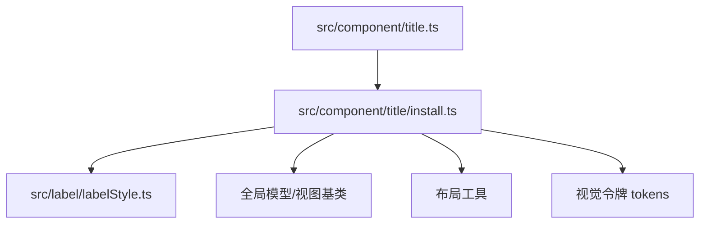
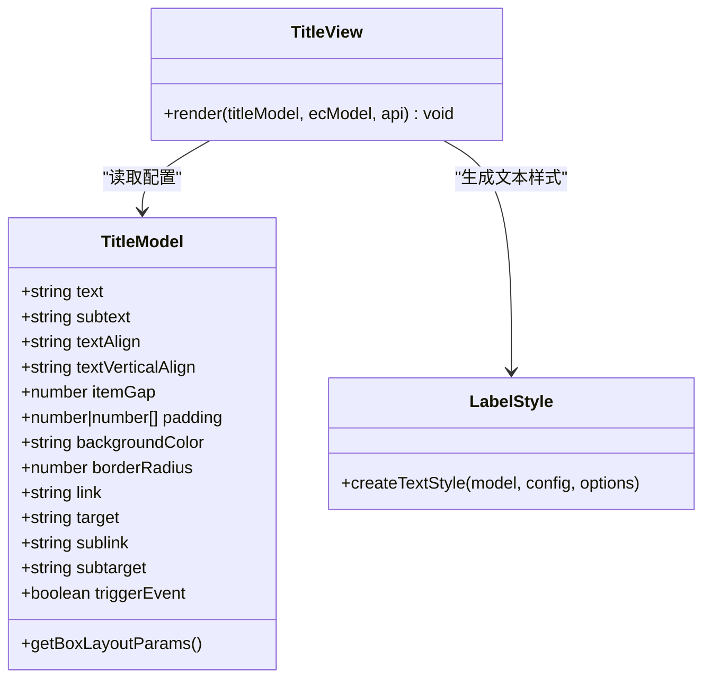
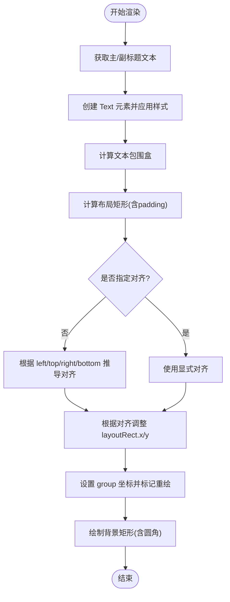
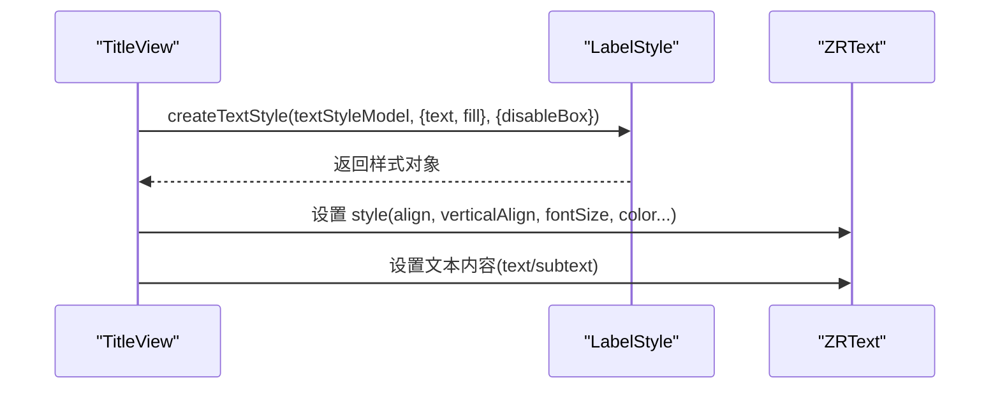
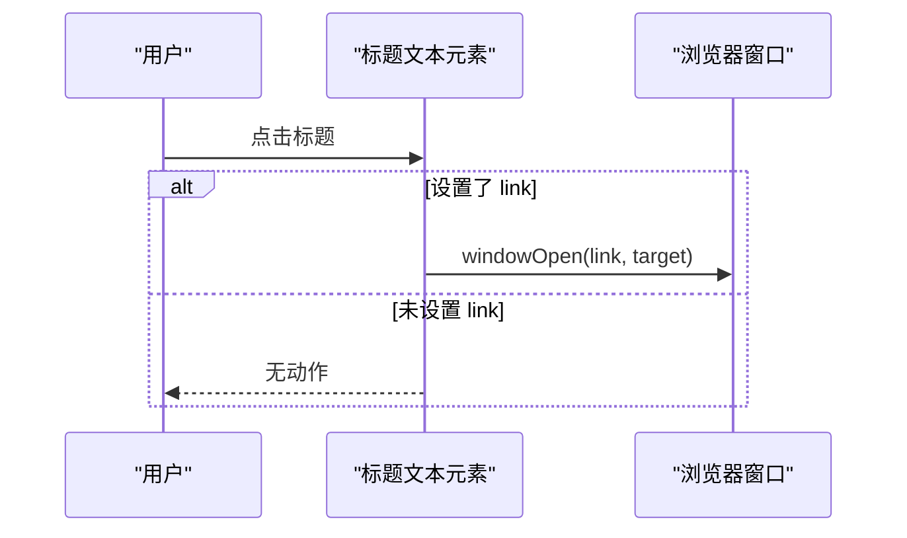
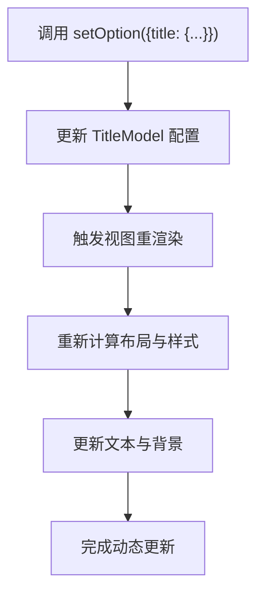
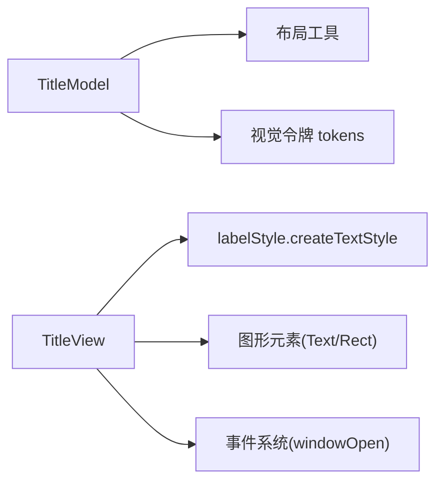

# 标题组件（Title）

<cite>
**本文引用的文件**
- [src/component/title.ts](file://src/component/title.ts)
- [src/component/title/install.ts](file://src/component/title/install.ts)
- [src/label/labelStyle.ts](file://src/label/labelStyle.ts)
- [src/i18n/langZH.ts](file://src/i18n/langZH.ts)
- [test/gauge-group-title-detail.html](file://test/gauge-group-title-detail.html)
- [test/toolbox-title.html](file://test/toolbox-title.html)
</cite>

## 目录
1. [简介](#简介)
2. [项目结构](#项目结构)
3. [核心组件](#核心组件)
4. [架构总览](#架构总览)
5. [详细组件分析](#详细组件分析)
6. [依赖关系分析](#依赖关系分析)
7. [性能考量](#性能考量)
8. [故障排查指南](#故障排查指南)
9. [结论](#结论)
10. [附录](#附录)

## 简介
本章节面向 ECharts 的标题组件（Title），系统讲解如何为图表添加主标题与副标题，涵盖定位方式、文本样式定制、富文本支持、响应式布局与动态更新、多语言与国际化配置，并提供实际案例参考。标题组件通过 Model 与 View 分离实现：Model 负责配置解析与默认值，View 负责渲染文本、背景与交互事件。

## 项目结构
标题组件位于 component/title 目录下，采用“入口注册 + 安装器”的组织方式：
- 入口文件负责统一注册组件
- install.ts 包含 TitleModel 与 TitleView 的实现、默认配置、布局计算与渲染逻辑
- 文本样式由 label/labelStyle.ts 提供通用能力
- 国际化资源在 i18n 下按语言组织

图示来源
- [src/component/title.ts:20-23](file://src/component/title.ts#L20-L23)
- [src/component/title/install.ts:20-42](file://src/component/title/install.ts#L20-L42)

章节来源
- [src/component/title.ts:20-23](file://src/component/title.ts#L20-L23)
- [src/component/title/install.ts:20-42](file://src/component/title/install.ts#L20-L42)

## 核心组件
- TitleModel：定义标题的配置项、默认值与布局模式（box）。包含 text、subtext、textAlign、textVerticalAlign、itemGap、padding、borderRadius、backgroundColor、link/sublink/target/subtarget、triggerEvent 等。
- TitleView：根据 Model 创建主标题与副标题文本元素，设置对齐与位置，绘制背景矩形，绑定点击跳转与事件透传。
- 文本样式：通过 createTextStyle 生成文本样式，支持继承、状态样式与富文本能力。

章节来源
- [src/component/title/install.ts:44-139](file://src/component/title/install.ts#L44-L139)
- [src/component/title/install.ts:142-286](file://src/component/title/install.ts#L142-L286)
- [src/label/labelStyle.ts:20-78](file://src/label/labelStyle.ts#L20-L78)

## 架构总览
标题组件遵循 ECharts 的组件架构：Model 持有配置与默认值，View 负责渲染与交互；通过布局系统计算最终位置与尺寸，结合文本样式与背景绘制完成输出。

图示来源
- [src/component/title/install.ts:100-139](file://src/component/title/install.ts#L100-L139)
- [src/component/title/install.ts:142-286](file://src/component/title/install.ts#L142-L286)
- [src/label/labelStyle.ts:20-78](file://src/label/labelStyle.ts#L20-L78)

## 详细组件分析

### 标题定位与布局
- 布局模式：box，忽略尺寸，使用 getLayoutRect 计算最终矩形区域。
- 水平对齐：若未显式设置 textAlign，会根据 left/right 自动推导（left→left，right→right，center→center；middle 会被规范化为 center）。
- 垂直对齐：若未显式设置 textVerticalAlign，会根据 top/bottom 自动推导（top→top，bottom→bottom，center→middle；center 会被规范化为 middle）。
- 位置修正：当 align 为 right 或 verticalAlign 为 bottom/middle 时，会相应调整 layoutRect 的 x/y，确保文本锚点正确。
- 内边距与背景：padding 影响背景矩形绘制范围；borderRadius 控制背景圆角。

图示来源
- [src/component/title/install.ts:148-286](file://src/component/title/install.ts#L148-L286)

章节来源
- [src/component/title/install.ts:148-286](file://src/component/title/install.ts#L148-L286)

### 文本样式与富文本
- 主/副标题分别通过 textStyle 与 subtextStyle 定制字体大小、颜色、粗细等。
- 使用 createTextStyle 统一处理样式合并、状态样式与继承逻辑。
- 富文本：ECharts 标签体系支持富文本语法，可在文本中嵌入不同样式的片段（如加粗、高亮、链接等），适用于复杂标题排版。

图示来源
- [src/component/title/install.ts:157-184](file://src/component/title/install.ts#L157-L184)
- [src/label/labelStyle.ts:20-78](file://src/label/labelStyle.ts#L20-L78)

章节来源
- [src/component/title/install.ts:157-184](file://src/component/title/install.ts#L157-L184)
- [src/label/labelStyle.ts:20-78](file://src/label/labelStyle.ts#L20-L78)

### 交互与链接
- 支持主标题与副标题分别设置 link/sublink 与 target/subtarget，点击可在新窗口打开链接。
- triggerEvent 控制是否将事件透传到上层，便于与图表事件系统集成。
- silent 属性根据是否有链接或触发事件决定文本元素是否响应交互。

图示来源
- [src/component/title/install.ts:186-202](file://src/component/title/install.ts#L186-L202)

章节来源
- [src/component/title/install.ts:186-202](file://src/component/title/install.ts#L186-L202)

### 响应式标题布局与动态更新
- 响应式布局：基于 box 布局模式与 getLayoutRect，标题会根据容器尺寸与 padding 自适应位置与尺寸；textAlign/textVerticalAlign 会自动推导以适配不同屏幕。
- 动态更新：通过 setOption 更新 title 配置（如 text、subtext、textStyle、link 等），视图会重新渲染并应用新的样式与布局。

章节来源
- [src/component/title/install.ts:148-286](file://src/component/title/install.ts#L148-L286)

### 多语言支持与国际化配置
- 标题本身不直接内置多语言键，但可通过以下方式实现国际化：
  - 在业务层根据当前语言选择文案，动态设置 title.text/title.subtext。
  - 借助 ECharts 的 locale 机制与 i18n 资源（如 langZH.ts）统一管理文案，再注入到标题配置中。
- 示例：中文本地化资源定义了时间、图例、工具箱等文案，可作为多语言方案的基础。

章节来源
- [src/i18n/langZH.ts:20-141](file://src/i18n/langZH.ts#L20-L141)

### 实际案例参考
- 仪表盘中的标题与详情组合：展示如何在复杂图表中使用标题进行信息聚合。
- 工具箱标题：演示标题在不同组件中的样式与行为。

章节来源
- [test/gauge-group-title-detail.html](file://test/gauge-group-title-detail.html)
- [test/toolbox-title.html](file://test/toolbox-title.html)

## 依赖关系分析
- TitleModel 依赖布局系统与默认令牌（tokens），用于默认位置、颜色与尺寸。
- TitleView 依赖 label 样式模块生成文本样式，依赖布局工具计算位置，依赖图形库创建文本与背景元素。
- 事件与链接功能依赖浏览器窗口操作与事件系统。

图示来源
- [src/component/title/install.ts:20-42](file://src/component/title/install.ts#L20-L42)
- [src/component/title/install.ts:148-286](file://src/component/title/install.ts#L148-L286)

章节来源
- [src/component/title/install.ts:20-42](file://src/component/title/install.ts#L20-L42)
- [src/component/title/install.ts:148-286](file://src/component/title/install.ts#L148-L286)

## 性能考量
- 文本测量与布局：频繁更新标题文本可能导致多次包围盒测量，建议批量更新或使用缓存策略。
- 背景绘制：背景矩形每次渲染都会重新计算，避免不必要的重绘。
- 事件绑定：仅在需要时启用 triggerEvent，减少事件监听开销。
- 富文本复杂度：富文本片段过多会影响渲染性能，应合理控制层级与样式数量。

## 故障排查指南
- 标题未显示：检查 show 是否为 true；确认文本非空；验证布局参数（left/top/right/bottom）是否冲突。
- 对齐异常：确认 textAlign/textVerticalAlign 是否与 left/top/right/bottom 配合；注意 middle/center 的规范化。
- 链接无效：检查 link/sublink 是否有效 URL；target/subtarget 是否正确；浏览器是否允许新窗口打开。
- 样式不生效：确认 textStyle/subtextStyle 是否被覆盖；检查 createTextStyle 的参数与状态样式。
- 事件未触发：确认 triggerEvent 是否开启；检查 silent 是否阻止了事件传播。

章节来源
- [src/component/title/install.ts:148-286](file://src/component/title/install.ts#L148-L286)

## 结论
标题组件提供了灵活的定位、样式与交互能力，能够胜任从简单标题到复杂富文本排版的多种场景。通过合理的布局与样式配置，结合响应式与动态更新机制，可以在不同设备与数据变化下保持稳定的展示效果。多语言支持可通过业务层与 ECharts 国际化资源协同实现。

## 附录
- 常用配置项速览（来自 TitleOption 接口）：
  - 文本：text、subtext
  - 对齐：textAlign、textVerticalAlign（兼容 textBaseline）
  - 间距：itemGap、padding
  - 背景：backgroundColor、borderRadius
  - 链接：link、target、sublink、subtarget
  - 事件：triggerEvent
  - 样式：textStyle、subtextStyle

章节来源
- [src/component/title/install.ts:44-139](file://src/component/title/install.ts#L44-L139)