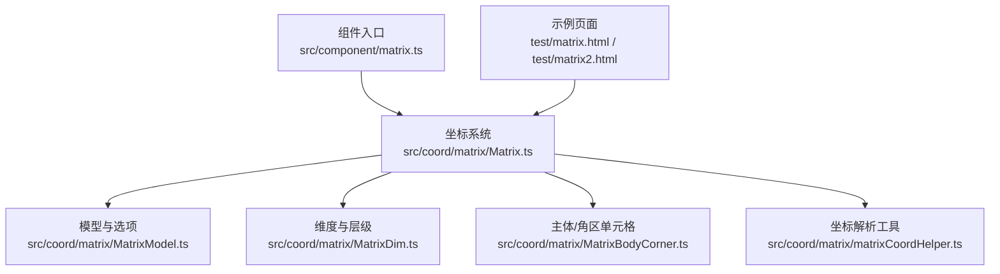
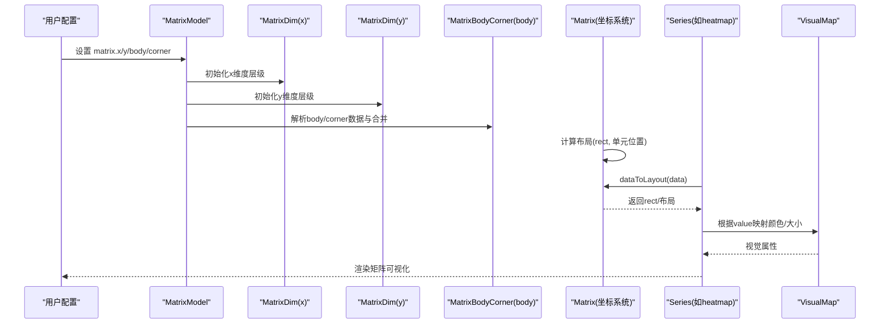
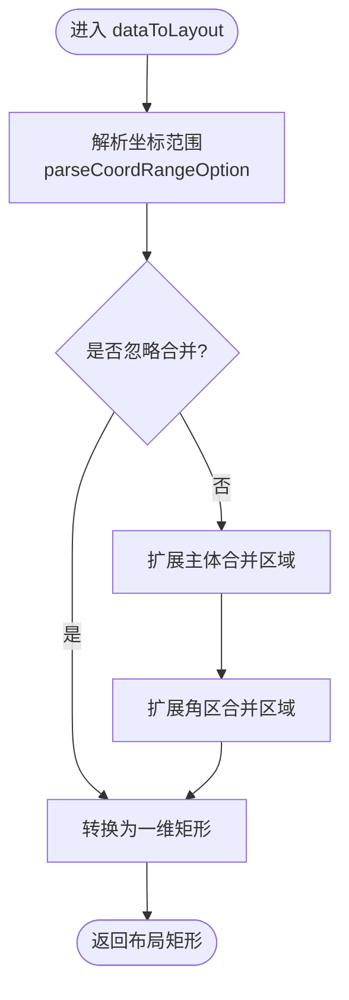
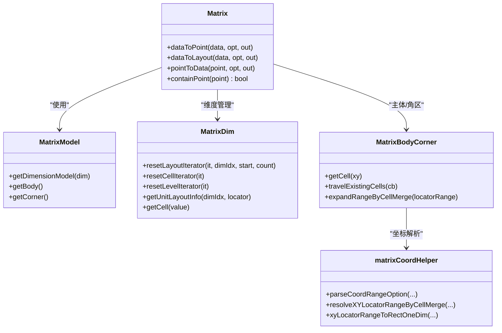

# 矩阵组件 (Matrix)

<cite>
**本文引用的文件**
- [src/component/matrix.ts](file://src/component/matrix.ts)
- [src/coord/matrix/Matrix.ts](file://src/coord/matrix/Matrix.ts)
- [src/coord/matrix/MatrixModel.ts](file://src/coord/matrix/MatrixModel.ts)
- [src/coord/matrix/MatrixDim.ts](file://src/coord/matrix/MatrixDim.ts)
- [src/coord/matrix/MatrixBodyCorner.ts](file://src/coord/matrix/MatrixBodyCorner.ts)
- [src/coord/matrix/matrixCoordHelper.ts](file://src/coord/matrix/matrixCoordHelper.ts)
- [test/matrix.html](file://test/matrix.html)
- [test/matrix2.html](file://test/matrix2.html)
</cite>

## 目录
1. [简介](#简介)
2. [项目结构](#项目结构)
3. [核心组件](#核心组件)
4. [架构总览](#架构总览)
5. [详细组件分析](#详细组件分析)
6. [依赖关系分析](#依赖关系分析)
7. [性能与大数据优化](#性能与大数据优化)
8. [故障排查指南](#故障排查指南)
9. [结论](#结论)
10. [附录：配置项速查](#附录：配置项速查)

## 简介
ECharts 的矩阵组件（Matrix）提供二维网格坐标系统，用于构建相关性矩阵、热力图、多维统计报表和科学计算可视化。它支持层级维度（树形行列）、单元格合并、视觉映射（visualMap）、标签（label）与交互事件，能够与多种系列（如 heatmap、graph、custom、scatter、pie 等）协同工作，实现丰富的矩阵数据分析场景。

## 项目结构
矩阵相关代码主要分布在以下模块：
- 组件注册入口：component/matrix.ts
- 坐标系统与布局：coord/matrix/Matrix.ts
- 模型与选项定义：coord/matrix/MatrixModel.ts
- 维度与层级管理：coord/matrix/MatrixDim.ts
- 主体与角区单元格管理：coord/matrix/MatrixBodyCorner.ts
- 坐标解析与范围工具：coord/matrix/matrixCoordHelper.ts
- 示例与用例：test/matrix*.html

图表来源
- [src/component/matrix.ts:20-23](file://src/component/matrix.ts#L20-L23)
- [src/coord/matrix/Matrix.ts:84-105](file://src/coord/matrix/Matrix.ts#L84-L105)
- [src/coord/matrix/MatrixModel.ts:300-352](file://src/coord/matrix/MatrixModel.ts#L300-L352)
- [src/coord/matrix/MatrixDim.ts:116-172](file://src/coord/matrix/MatrixDim.ts#L116-L172)
- [src/coord/matrix/MatrixBodyCorner.ts:76-97](file://src/coord/matrix/MatrixBodyCorner.ts#L76-L97)
- [src/coord/matrix/matrixCoordHelper.ts:92-105](file://src/coord/matrix/matrixCoordHelper.ts#L92-L105)

章节来源
- [src/component/matrix.ts:20-23](file://src/component/matrix.ts#L20-L23)
- [src/coord/matrix/Matrix.ts:84-105](file://src/coord/matrix/Matrix.ts#L84-L105)

## 核心组件
- 坐标系统 Matrix：负责矩阵的整体布局、数据到像素/布局的转换、点与数据的互转、包含性判断等。
- 模型 MatrixModel：维护 matrix.x/y/body/corner 的配置、默认样式、以及 body/corner 的单元格集合。
- 维度 MatrixDim：管理 x/y 维度的层级树、单元定位器、排序元信息、迭代器等。
- 主体/角区 MatrixBodyCorner：处理 matrix.body/corner.data 定义的单元格样式、值、合并区域等。
- 工具 matrixCoordHelper：解析坐标范围、合并区域扩展、矩形转换、钳制策略等。

章节来源
- [src/coord/matrix/Matrix.ts:55-119](file://src/coord/matrix/Matrix.ts#L55-L119)
- [src/coord/matrix/MatrixModel.ts:36-49](file://src/coord/matrix/MatrixModel.ts#L36-L49)
- [src/coord/matrix/MatrixDim.ts:116-172](file://src/coord/matrix/MatrixDim.ts#L116-L172)
- [src/coord/matrix/MatrixBodyCorner.ts:49-71](file://src/coord/matrix/MatrixBodyCorner.ts#L49-L71)
- [src/coord/matrix/matrixCoordHelper.ts:42-55](file://src/coord/matrix/matrixCoordHelper.ts#L42-L55)

## 架构总览
矩阵坐标系统由“模型 + 维度 + 主体/角区 + 工具”构成，配合 series 使用 visualMap 进行视觉编码，形成从数据到可视化的完整链路。

图表来源
- [src/coord/matrix/MatrixModel.ts:318-338](file://src/coord/matrix/MatrixModel.ts#L318-L338)
- [src/coord/matrix/MatrixDim.ts:174-299](file://src/coord/matrix/MatrixDim.ts#L174-L299)
- [src/coord/matrix/MatrixBodyCorner.ts:103-241](file://src/coord/matrix/MatrixBodyCorner.ts#L103-L241)
- [src/coord/matrix/Matrix.ts:125-142](file://src/coord/matrix/Matrix.ts#L125-L142)
- [src/coord/matrix/Matrix.ts:181-231](file://src/coord/matrix/Matrix.ts#L181-L231)

## 详细组件分析

### 坐标系统 Matrix
- 维度声明：支持 x、y、value 三个维度，其中 x/y 为序数型（ordinal），value 用于数值映射。
- 创建与注入：在 ecModel 中遍历 matrix 组件并创建实例，将坐标系统注入到各组件。
- 布局流程：基于 box layout 计算矩阵矩形，再按维度层级分配单元尺寸与位置；随后计算主体与角区的合并区域布局。
- 数据转换：
  - dataToPoint：将矩阵坐标转换为像素中心点。
  - dataToLayout：将坐标或范围转换为布局矩形，支持忽略合并单元格或钳制边界。
  - pointToData：将像素点反转为矩阵坐标（支持主体/角区/外部区域判定）。
- 包含性：containPoint 判断点是否在矩阵矩形内。

图表来源
- [src/coord/matrix/Matrix.ts:181-231](file://src/coord/matrix/Matrix.ts#L181-L231)
- [src/coord/matrix/matrixCoordHelper.ts:92-105](file://src/coord/matrix/matrixCoordHelper.ts#L92-L105)

章节来源
- [src/coord/matrix/Matrix.ts:55-119](file://src/coord/matrix/Matrix.ts#L55-L119)
- [src/coord/matrix/Matrix.ts:125-142](file://src/coord/matrix/Matrix.ts#L125-L142)
- [src/coord/matrix/Matrix.ts:152-231](file://src/coord/matrix/Matrix.ts#L152-L231)
- [src/coord/matrix/Matrix.ts:250-316](file://src/coord/matrix/Matrix.ts#L250-L316)

### 模型与选项 MatrixModel
- 配置项：matrix.x/y 维度定义、matrix.body/corner 单元格数据、背景样式、边框 z-index、tooltip、事件触发开关等。
- 默认样式：为维度、主体、角区提供默认 label、itemStyle、dividerLineStyle 等。
- 生命周期：optionUpdated 时重建维度模型与 body/corner 实例，确保配置变更生效。

章节来源
- [src/coord/matrix/MatrixModel.ts:36-49](file://src/coord/matrix/MatrixModel.ts#L36-L49)
- [src/coord/matrix/MatrixModel.ts:242-297](file://src/coord/matrix/MatrixModel.ts#L242-L297)
- [src/coord/matrix/MatrixModel.ts:318-352](file://src/coord/matrix/MatrixModel.ts#L318-L352)

### 维度与层级 MatrixDim
- 数据结构：维护 cells（叶子与非叶子节点）、levels（层级信息）、leavesCount、ordinalMeta、scale。
- 初始化：
  - 通过 matrix.x/y.data 或 length 构建层级树；若未指定则从 series.dataset/data 收集维度值。
  - 对重复值进行去重或唯一化处理，保证查询一致性。
- 迭代与查找：
  - resetLayoutIterator/resetCellIterator/resetLevelIterator 提供不同粒度的遍历。
  - getUnitLayoutInfo/getCell 支持按定位器或值获取单元布局与维度单元。
- 布局参与：与 Matrix 协作完成单元尺寸与位置分配。

章节来源
- [src/coord/matrix/MatrixDim.ts:116-172](file://src/coord/matrix/MatrixDim.ts#L116-L172)
- [src/coord/matrix/MatrixDim.ts:174-299](file://src/coord/matrix/MatrixDim.ts#L174-L299)
- [src/coord/matrix/MatrixDim.ts:363-439](file://src/coord/matrix/MatrixDim.ts#L363-L439)

### 主体与角区 MatrixBodyCorner
- 作用：管理 matrix.body/corner.data 中的单元格定义，包括 coord、value、itemStyle、mergeCells、coordClamp 等。
- 合并逻辑：
  - 解析 coord 为定位器范围，支持跨行/列的区域选择。
  - 当 mergeCells 为 true 时，计算合并区域的并集，避免重叠冲突，更新 owner 与 span。
- 稀疏存储：仅存在被显式定义的单元格，减少内存占用。
- 快速路径：单单元格定位时直接通过 inSpanOf 获取合并区域，提升性能。

章节来源
- [src/coord/matrix/MatrixBodyCorner.ts:49-71](file://src/coord/matrix/MatrixBodyCorner.ts#L49-L71)
- [src/coord/matrix/MatrixBodyCorner.ts:103-241](file://src/coord/matrix/MatrixBodyCorner.ts#L103-L241)
- [src/coord/matrix/MatrixBodyCorner.ts:249-285](file://src/coord/matrix/MatrixBodyCorner.ts#L249-L285)

### 坐标解析与范围工具 matrixCoordHelper
- 钳制策略：MatrixClampOption 提供 none/all/body/corner 四种边界处理方式。
- 范围解析：parseCoordRangeOption 将用户输入的坐标或范围解析为定位器范围，支持部分维度无效时的独立计算。
- 合并扩展：resolveXYLocatorRangeByCellMerge 将当前范围与已定义的合并区域求并集。
- 矩形转换：xyLocatorRangeToRectOneDim 将定位器范围转换为一维矩形信息。

章节来源
- [src/coord/matrix/matrixCoordHelper.ts:42-55](file://src/coord/matrix/matrixCoordHelper.ts#L42-L55)
- [src/coord/matrix/matrixCoordHelper.ts:92-105](file://src/coord/matrix/matrixCoordHelper.ts#L92-L105)
- [src/coord/matrix/matrixCoordHelper.ts:212-247](file://src/coord/matrix/matrixCoordHelper.ts#L212-L247)
- [src/coord/matrix/matrixCoordHelper.ts:305-320](file://src/coord/matrix/matrixCoordHelper.ts#L305-L320)

## 依赖关系分析
- 组件入口通过 use(install) 注册矩阵组件，使 ECharts 能识别 matrix 类型。
- Matrix 依赖 MatrixModel 获取维度与单元格配置，依赖 MatrixDim 进行维度层级管理与布局。
- MatrixBodyCorner 依赖 matrixCoordHelper 进行坐标范围解析与合并扩展。
- 示例页面展示了矩阵与 heatmap、graph、custom、scatter、pie 等系列的组合使用。

图表来源
- [src/coord/matrix/Matrix.ts:55-119](file://src/coord/matrix/Matrix.ts#L55-L119)
- [src/coord/matrix/MatrixModel.ts:300-352](file://src/coord/matrix/MatrixModel.ts#L300-L352)
- [src/coord/matrix/MatrixDim.ts:116-172](file://src/coord/matrix/MatrixDim.ts#L116-L172)
- [src/coord/matrix/MatrixBodyCorner.ts:76-97](file://src/coord/matrix/MatrixBodyCorner.ts#L76-L97)
- [src/coord/matrix/matrixCoordHelper.ts:92-105](file://src/coord/matrix/matrixCoordHelper.ts#L92-L105)

章节来源
- [src/component/matrix.ts:20-23](file://src/component/matrix.ts#L20-L23)
- [src/coord/matrix/Matrix.ts:84-105](file://src/coord/matrix/Matrix.ts#L84-L105)

## 性能与大数据优化
- 稀疏存储：MatrixBodyCorner 仅保存被显式定义的单元格，降低大矩阵内存占用。
- 快速路径：单单元格定位时通过 inSpanOf 直接获取合并区域，避免全量遍历。
- 迭代器复用：MatrixDim 使用 ListIterator 减少对象创建开销。
- 布局计算：优先分配指定尺寸，剩余空间均分，避免复杂内容自适应带来的性能问题。
- 建议：
  - 对于超大规模矩阵，结合 dataset 与 series 的 encode 明确映射，减少冗余数据。
  - 合理使用 matrix.x/y.length 控制行列规模，避免过多层级导致布局复杂。
  - 使用 visualMap 的 calculable 与分段映射，提高交互响应速度。

[本节为通用指导，不直接分析具体文件]

## 故障排查指南
- 坐标无效或越界：
  - 检查 matrix.x/y.data 是否为数组且元素格式正确（字符串或含 value 的对象）。
  - 确认 coord 输入符合 [[xmin,xmax],[ymin,ymax]] 或 [x,y] 形式。
  - 使用 clamp 策略（body/corner）限制越界行为。
- 合并区域异常：
  - 确认 mergeCells 与 coordClamp 的组合是否符合预期。
  - 检查多个合并区域是否存在重叠，系统会合并为更大区域并调整 owner。
- 标签显示问题：
  - 检查 label.show、padding、overflow 配置，避免文本溢出或截断异常。
- 事件不触发：
  - 确认 triggerEvent 与 silent 配置，必要时启用 matrix.triggerEvent 或关闭 body.label.silent。

章节来源
- [src/coord/matrix/MatrixDim.ts:174-299](file://src/coord/matrix/MatrixDim.ts#L174-L299)
- [src/coord/matrix/MatrixBodyCorner.ts:103-241](file://src/coord/matrix/MatrixBodyCorner.ts#L103-L241)
- [src/coord/matrix/matrixCoordHelper.ts:92-105](file://src/coord/matrix/matrixCoordHelper.ts#L92-L105)

## 结论
矩阵组件提供了强大的二维网格坐标系统，支持层级维度、单元格合并、视觉映射与多系列协同，适用于相关性矩阵、热力图、多维统计报表与科学计算可视化。通过合理的配置与优化策略，可以在大数据量场景下保持良好性能与交互体验。

[本节为总结，不直接分析具体文件]

## 附录：配置项速查
- matrix.x/y：维度定义
  - data：维度单元数组，支持字符串或 {value, children} 层级结构。
  - length：简单指定行列数量（当无需复杂层级时使用）。
  - levels：层级尺寸配置（levelSize），支持百分比与绝对值。
  - show：是否显示维度标题区域。
  - dividerLineStyle：分隔线样式。
- matrix.body/corner：主体/角区单元格
  - data：单元格定义数组，支持 coord、value、itemStyle、mergeCells、coordClamp。
  - label：单元格标签配置（formatter、show、padding、overflow）。
  - itemStyle：单元格样式（color、borderColor、borderWidth、z2）。
  - silent：是否静默（影响事件穿透）。
- matrix.backgroundStyle：整体背景样式。
- matrix.borderZ2：外边框与分隔线的 z-index。
- matrix.tooltip：矩阵单元格 tooltip 配置。
- matrix.triggerEvent：是否允许矩阵区域触发事件。

章节来源
- [src/coord/matrix/MatrixModel.ts:36-49](file://src/coord/matrix/MatrixModel.ts#L36-L49)
- [src/coord/matrix/MatrixModel.ts:136-194](file://src/coord/matrix/MatrixModel.ts#L136-L194)
- [src/coord/matrix/MatrixModel.ts:242-297](file://src/coord/matrix/MatrixModel.ts#L242-L297)

## 实际案例与用法参考
- 热力图与矩阵：展示 heatmap 在 matrix 坐标系统中的使用，支持 visualMap 连续映射与标签显示。
- 无头矩阵：隐藏 matrix.x/y 标题，仅保留主体网格。
- 自定义系列：使用 custom 系列在矩阵单元格内绘制条形、表情等图形。
- 散点与图：在矩阵单元格中绘制 scatter/graph，支持 links 与 symbol。
- 事件与交互：演示 matrix.body/corner 的点击事件与 silent 控制。

章节来源
- [test/matrix.html:62-125](file://test/matrix.html#L62-L125)
- [test/matrix.html:135-180](file://test/matrix.html#L135-L180)
- [test/matrix.html:305-369](file://test/matrix.html#L305-L369)
- [test/matrix.html:446-528](file://test/matrix.html#L446-L528)
- [test/matrix.html:633-706](file://test/matrix.html#L633-L706)
- [test/matrix.html:717-800](file://test/matrix.html#L717-L800)
- [test/matrix2.html:46-151](file://test/matrix2.html#L46-L151)