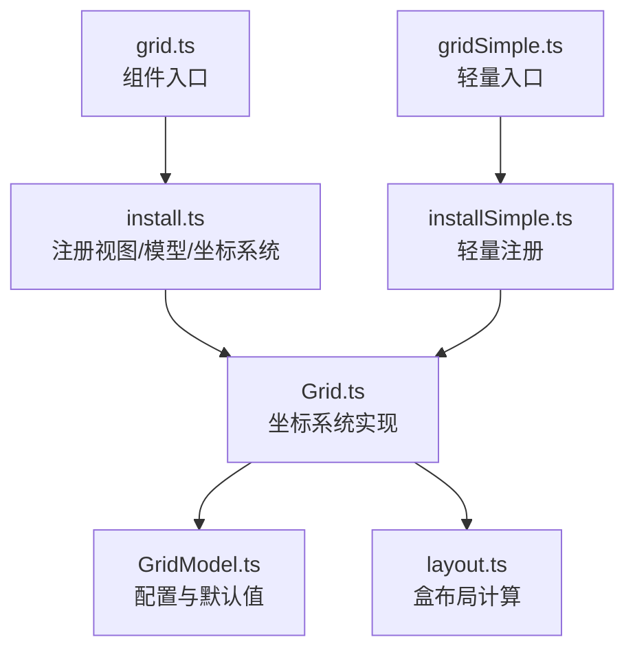
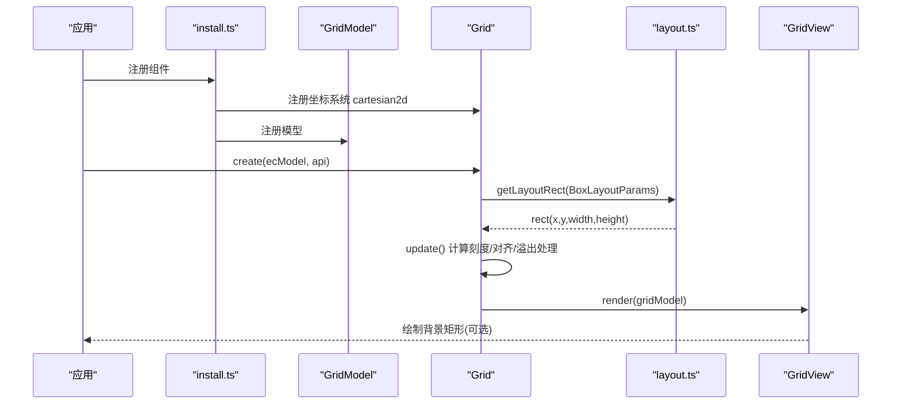
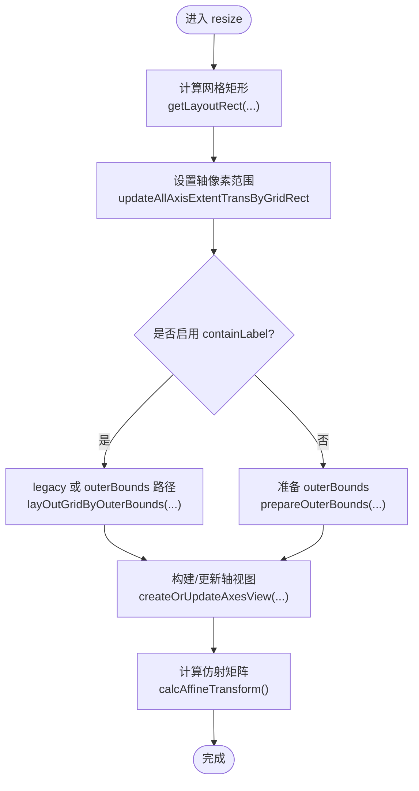
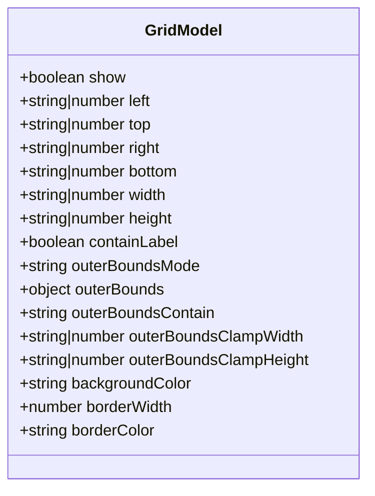
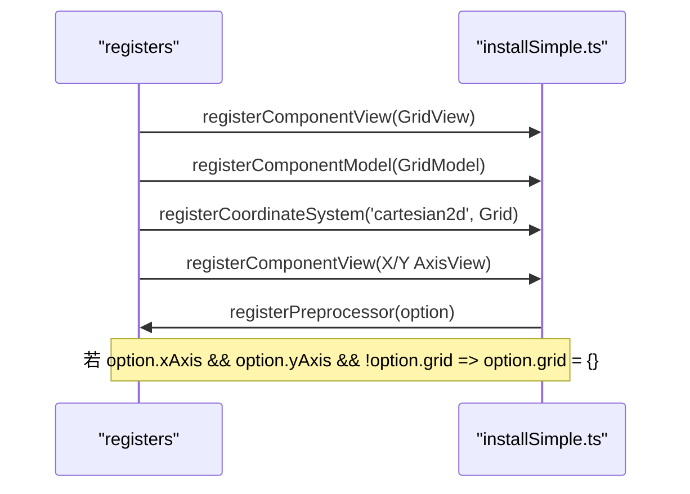
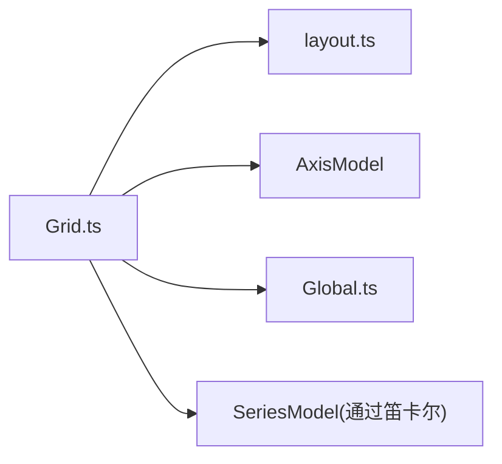

# 网格组件 (Grid)

<cite>
**本文引用的文件**
- [src/component/grid.ts](file://src/component/grid.ts)
- [src/component/gridSimple.ts](file://src/component/gridSimple.ts)
- [src/component/grid/install.ts](file://src/component/grid/install.ts)
- [src/component/grid/installSimple.ts](file://src/component/grid/installSimple.ts)
- [src/coord/cartesian/Grid.ts](file://src/coord/cartesian/Grid.ts)
- [src/coord/cartesian/GridModel.ts](file://src/coord/cartesian/GridModel.ts)
- [src/util/layout.ts](file://src/util/layout.ts)
- [test/multipleGrid.html](file://test/multipleGrid.html)
</cite>

## 目录
1. [简介](#简介)
2. [项目结构](#项目结构)
3. [核心组件](#核心组件)
4. [架构总览](#架构总览)
5. [详细组件分析](#详细组件分析)
6. [依赖关系分析](#依赖关系分析)
7. [性能与移动端适配](#性能与移动端适配)
8. [故障排查指南](#故障排查指南)
9. [结论](#结论)
10. [附录：配置项速查与示例场景](#附录配置项速查与示例场景)

## 简介
网格（Grid）是 ECharts 直角坐标系图表的基础布局容器，负责定义绘图区域、边距与尺寸，协调多轴对齐与标签溢出处理，并为笛卡尔坐标系提供统一的坐标变换。通过 grid 的配置，可以精确控制图表在画布中的位置与大小，支持百分比与像素混合设置，并具备响应式能力。

## 项目结构
- 组件入口与安装
  - 完整网格组件入口：[src/component/grid.ts](file://src/component/grid.ts)
  - 轻量网格组件入口：[src/component/gridSimple.ts](file://src/component/gridSimple.ts)
  - 安装器（注册视图、模型、坐标系统与预处理）：
    - [src/component/grid/install.ts](file://src/component/grid/install.ts)
    - [src/component/grid/installSimple.ts](file://src/component/grid/installSimple.ts)
- 坐标系统实现
  - 网格坐标系统主类：[src/coord/cartesian/Grid.ts](file://src/coord/cartesian/Grid.ts)
  - 网格模型与默认配置：[src/coord/cartesian/GridModel.ts](file://src/coord/cartesian/GridModel.ts)
- 布局工具
  - 通用盒布局计算与参考容器创建：[src/util/layout.ts](file://src/util/layout.ts)
- 示例
  - 多网格布局示例页面：[test/multipleGrid.html](file://test/multipleGrid.html)

**图示来源**
- [src/component/grid.ts:20-24](file://src/component/grid.ts#L20-L24)
- [src/component/grid/install.ts:20-27](file://src/component/grid/install.ts#L20-L27)
- [src/component/grid/installSimple.ts:20-78](file://src/component/grid/installSimple.ts#L20-L78)
- [src/coord/cartesian/Grid.ts:103-132](file://src/coord/cartesian/Grid.ts#L103-L132)
- [src/coord/cartesian/GridModel.ts:98-147](file://src/coord/cartesian/GridModel.ts#L98-L147)
- [src/util/layout.ts:476-549](file://src/util/layout.ts#L476-L549)

**章节来源**
- [src/component/grid.ts:20-24](file://src/component/grid.ts#L20-L24)
- [src/component/gridSimple.ts:20-23](file://src/component/gridSimple.ts#L20-L23)
- [src/component/grid/install.ts:20-27](file://src/component/grid/install.ts#L20-L27)
- [src/component/grid/installSimple.ts:20-78](file://src/component/grid/installSimple.ts#L20-L78)
- [src/coord/cartesian/Grid.ts:103-132](file://src/coord/cartesian/Grid.ts#L103-L132)
- [src/coord/cartesian/GridModel.ts:98-147](file://src/coord/cartesian/GridModel.ts#L98-L147)
- [src/util/layout.ts:476-549](file://src/util/layout.ts#L476-L549)

## 核心组件
- Grid 坐标系统
  - 职责：维护网格矩形区域、管理 X/Y 轴集合、创建笛卡尔坐标系实例、执行 resize/update、提供数据与像素坐标转换。
  - 关键方法：getRect、resize、update、getCartesian(s)、convertToPixel/FromPixel、containPoint。
- GridModel 模型
  - 职责：承载 grid 配置项（位置、尺寸、外边界约束、背景等），合并主题与默认值，提供 getBoxLayoutParams 供布局使用。
- 安装器
  - 注册 GridView（可选绘制背景矩形）、GridModel、cartesian2d 坐标系统、x/y 轴模型与视图，并在存在 xAxis 与 yAxis 时自动创建 grid。

**章节来源**
- [src/coord/cartesian/Grid.ts:103-132](file://src/coord/cartesian/Grid.ts#L103-L132)
- [src/coord/cartesian/Grid.ts:134-279](file://src/coord/cartesian/Grid.ts#L134-L279)
- [src/coord/cartesian/GridModel.ts:98-147](file://src/coord/cartesian/GridModel.ts#L98-L147)
- [src/component/grid/installSimple.ts:31-78](file://src/component/grid/installSimple.ts#L31-L78)

## 架构总览
网格作为“坐标系统宿主”，在初始化阶段收集所有 x/y 轴，组合成笛卡尔坐标系；在更新阶段根据布局参数计算网格矩形，调整轴刻度与标签，必要时收缩布局以避免标签溢出；最终为系列提供 dataToPoint/pointToData 等坐标转换能力。

**图示来源**
- [src/component/grid/install.ts:20-27](file://src/component/grid/install.ts#L20-L27)
- [src/coord/cartesian/Grid.ts:536-603](file://src/coord/cartesian/Grid.ts#L536-L603)
- [src/coord/cartesian/Grid.ts:207-279](file://src/coord/cartesian/Grid.ts#L207-L279)
- [src/component/grid/installSimple.ts:31-48](file://src/component/grid/installSimple.ts#L31-L48)
- [src/util/layout.ts:476-549](file://src/util/layout.ts#L476-L549)

## 详细组件分析

### Grid 坐标系统（Grid.ts）
- 初始化与坐标系统构建
  - 遍历 xAxis/yAxis，按 index 组合生成 Cartesian2D，注入到 Grid 内部映射。
- 布局与更新
  - resize：基于 BoxLayout 计算网格矩形，先设置轴像素范围，再根据 containLabel/outerBounds 策略进行二次布局与轴视图构建，最后计算仿射矩阵加速坐标转换。
  - update：统一刻度 nice/对齐，处理 onZero 逻辑，必要时再次 resize。
- 坐标转换
  - convertToPixel/FromPixel：根据 finder 定位目标笛卡尔或轴，调用对应转换方法。
- 查询接口
  - getCartesian/getAxes/getAxis：按索引或查找规则获取笛卡尔坐标系与轴。

**图示来源**
- [src/coord/cartesian/Grid.ts:207-279](file://src/coord/cartesian/Grid.ts#L207-L279)

**章节来源**
- [src/coord/cartesian/Grid.ts:103-132](file://src/coord/cartesian/Grid.ts#L103-L132)
- [src/coord/cartesian/Grid.ts:134-279](file://src/coord/cartesian/Grid.ts#L134-L279)
- [src/coord/cartesian/Grid.ts:281-392](file://src/coord/cartesian/Grid.ts#L281-L392)
- [src/coord/cartesian/Grid.ts:407-513](file://src/coord/cartesian/Grid.ts#L407-L513)
- [src/coord/cartesian/Grid.ts:536-603](file://src/coord/cartesian/Grid.ts#L536-L603)

### GridModel 与配置项（GridModel.ts）
- 布局模式：box，支持 left/right/top/bottom/width/height 及百分比/像素混合。
- 外边界约束：
  - outerBoundsMode：'auto'/'same'/'none'，控制是否以外部边界限制布局。
  - outerBounds：定义约束矩形（可基于 canvas 或 boxCoordinateSystem）。
  - outerBoundsContain：'all'/'axisLabel'/'auto'，决定包含范围。
  - outerBoundsClampWidth/Height：防止收缩后小于原始尺寸的阈值（百分比）。
- 兼容项：containLabel（已弃用，建议使用 outerBounds）。
- 视觉：backgroundColor、borderWidth、borderColor。

**图示来源**
- [src/coord/cartesian/GridModel.ts:39-96](file://src/coord/cartesian/GridModel.ts#L39-L96)
- [src/coord/cartesian/GridModel.ts:126-147](file://src/coord/cartesian/GridModel.ts#L126-L147)

**章节来源**
- [src/coord/cartesian/GridModel.ts:39-96](file://src/coord/cartesian/GridModel.ts#L39-L96)
- [src/coord/cartesian/GridModel.ts:98-147](file://src/coord/cartesian/GridModel.ts#L98-L147)

### 安装器与预处理（install.ts / installSimple.ts）
- 注册 GridView：当 grid.show 为真时，绘制背景矩形（基于 coordinateSystem.getRect()）。
- 注册 GridModel 与 cartesian2d 坐标系统。
- 注册 x/y 轴模型与视图。
- 预处理：若配置了 xAxis 与 yAxis 但未显式配置 grid，则自动创建空 grid。

**图示来源**
- [src/component/grid/installSimple.ts:31-78](file://src/component/grid/installSimple.ts#L31-L78)

**章节来源**
- [src/component/grid/install.ts:20-27](file://src/component/grid/install.ts#L20-L27)
- [src/component/grid/installSimple.ts:31-78](file://src/component/grid/installSimple.ts#L31-L78)

### 多网格布局与复杂仪表盘（示例）
- 多网格示例页面展示了在同一画布中放置多个 grid，分别承载不同图表，形成仪表盘式布局。
- 实践中可通过为每个 grid 指定不同的 left/right/top/bottom/width/height 来划分空间，结合 legend/title/dataZoom 等组件共同构成复杂界面。

**章节来源**
- [test/multipleGrid.html](file://test/multipleGrid.html)

## 依赖关系分析
- Grid 依赖：
  - layout 工具：用于计算网格矩形与参考容器。
  - 轴模型与视图：X/Y 轴创建、刻度与标签布局。
  - 全局模型：遍历组件、注入坐标系统。
- 耦合点：
  - Grid 与 Axis 强耦合（共享 extent、对齐、onZero）。
  - Grid 与 Series 通过笛卡尔坐标系间接耦合（数据到像素转换）。

**图示来源**
- [src/coord/cartesian/Grid.ts:26-78](file://src/coord/cartesian/Grid.ts#L26-L78)
- [src/util/layout.ts:476-549](file://src/util/layout.ts#L476-L549)

**章节来源**
- [src/coord/cartesian/Grid.ts:26-78](file://src/coord/cartesian/Grid.ts#L26-L78)
- [src/util/layout.ts:476-549](file://src/util/layout.ts#L476-L549)

## 性能与移动端适配
- 性能优化建议
  - 避免不必要的 containLabel：仅在确实需要严格包含标签时使用，否则优先使用 outerBounds 更精确且开销更低。
  - 减少多次 resize：尽量在一次 setOption 中完成布局相关配置，避免频繁触发重排。
  - 合理使用 outerBoundsClamp：防止极端情况下网格过小导致渲染抖动。
  - 大数数据场景：配合 series.large 与 progressive 渲染，降低坐标转换压力。
- 移动端适配策略
  - 使用百分比与像素混合的 left/right/top/bottom，确保在不同屏幕下自适应。
  - 利用 media 配置切换 grid 布局（如缩小边距、隐藏次要轴）。
  - 在窄屏上适当增大 touch 交互区域（dataZoom、tooltip），提升可用性。

[本节为通用指导，不直接分析具体文件]

## 故障排查指南
- 未显示网格背景
  - 检查 grid.show 是否为 true；仅当为真时才会绘制背景矩形。
- 标签溢出或被裁剪
  - 使用 outerBoundsMode='same' 与 outerBoundsContain='axisLabel' 替代已弃用的 containLabel。
  - 若仍溢出，调整 outerBoundsClampWidth/Height 防止过度收缩。
- 多轴刻度不对齐
  - 确认数值轴启用了 alignTicks，并确保基准轴未被 break 干扰。
- 坐标转换异常
  - 确认 series 的 xAxisIndex/yAxisIndex 与 grid 内轴索引一致；错误索引会导致转换失败。

**章节来源**
- [src/component/grid/installSimple.ts:31-48](file://src/component/grid/installSimple.ts#L31-L48)
- [src/coord/cartesian/GridModel.ts:39-96](file://src/coord/cartesian/GridModel.ts#L39-L96)
- [src/coord/cartesian/Grid.ts:134-279](file://src/coord/cartesian/Grid.ts#L134-L279)

## 结论
Grid 是 ECharts 直角坐标系的核心布局容器，通过灵活的布局参数与外边界约束机制，既能满足简单图表的快速上手，也能支撑复杂仪表盘的多网格编排。合理运用 outerBounds 与 containLabel 的演进方案，可在保证精度的同时获得更好的性能表现。

## 附录：配置项速查与示例场景
- 常用配置项
  - 位置与尺寸：left、right、top、bottom、width、height（支持百分比与像素）
  - 外边界约束：outerBoundsMode、outerBounds、outerBoundsContain、outerBoundsClampWidth、outerBoundsClampHeight
  - 兼容项：containLabel（已弃用，建议迁移至 outerBounds）
  - 视觉：backgroundColor、borderWidth、borderColor
- 典型场景
  - 单图居中留白：设置合理的 top/left/right/bottom，使图表主体居中。
  - 多图表仪表盘：为每个 grid 分配独立区域，配合 legend/title 形成面板化布局。
  - 移动端紧凑布局：缩小边距、隐藏次要轴，使用百分比尺寸自适应屏幕。
- 参考示例
  - 多网格布局示例：[test/multipleGrid.html](file://test/multipleGrid.html)

**章节来源**
- [src/coord/cartesian/GridModel.ts:39-96](file://src/coord/cartesian/GridModel.ts#L39-L96)
- [test/multipleGrid.html](file://test/multipleGrid.html)