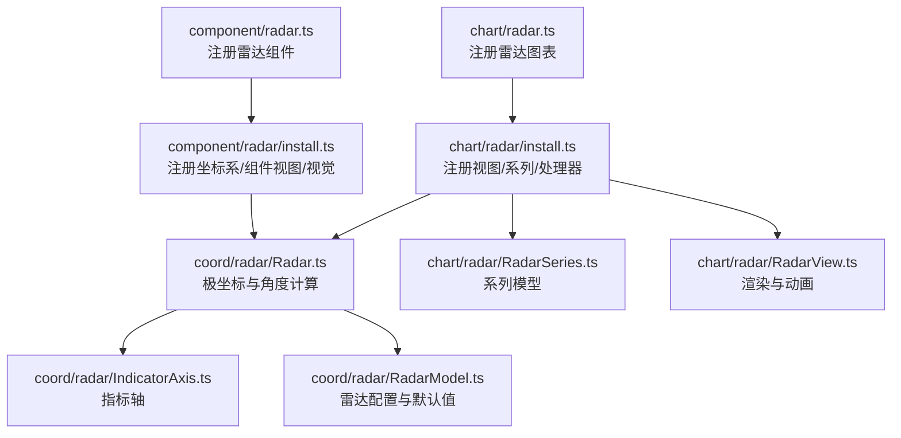
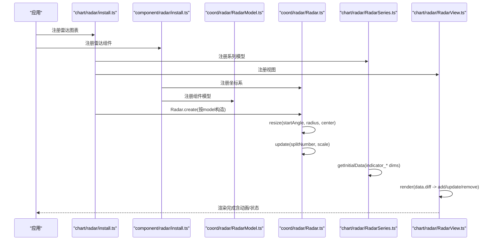
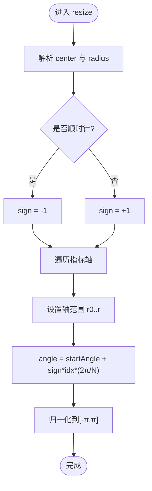
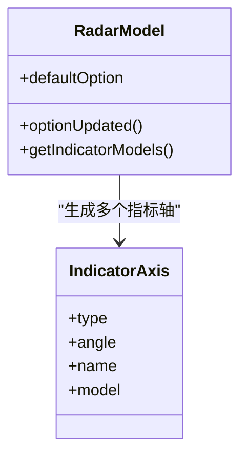
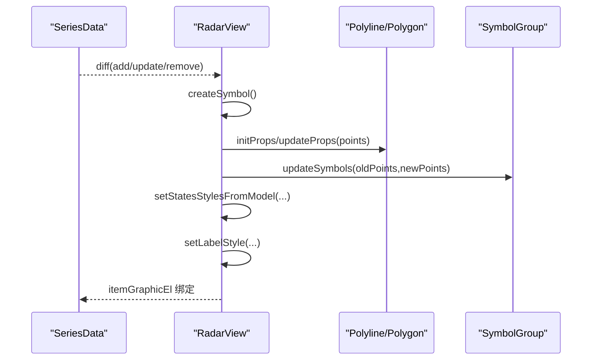
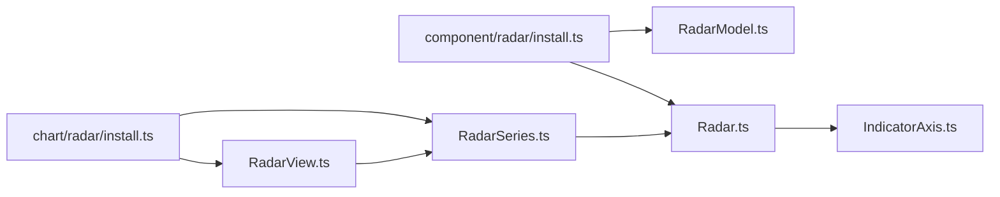

# 雷达组件（Radar）

<cite>
**本文引用的文件**
- [src/chart/radar.ts](file://src/chart/radar.ts)
- [src/component/radar.ts](file://src/component/radar.ts)
- [src/chart/radar/install.ts](file://src/chart/radar/install.ts)
- [src/component/radar/install.ts](file://src/component/radar/install.ts)
- [src/coord/radar/Radar.ts](file://src/coord/radar/Radar.ts)
- [src/coord/radar/IndicatorAxis.ts](file://src/coord/radar/IndicatorAxis.ts)
- [src/coord/radar/RadarModel.ts](file://src/coord/radar/RadarModel.ts)
- [src/chart/radar/RadarSeries.ts](file://src/chart/radar/RadarSeries.ts)
- [src/chart/radar/RadarView.ts](file://src/chart/radar/RadarView.ts)
- [test/radar.html](file://test/radar.html)
- [test/radar2.html](file://test/radar2.html)
- [test/radar3.html](file://test/radar3.html)
</cite>

## 目录
1. [简介](#简介)
2. [项目结构](#项目结构)
3. [核心组件](#核心组件)
4. [架构总览](#架构总览)
5. [详细组件分析](#详细组件分析)
6. [依赖关系分析](#依赖关系分析)
7. [性能与优化建议](#性能与优化建议)
8. [故障排查指南](#故障排查指南)
9. [结论](#结论)
10. [附录：配置项速查与实战案例](#附录配置项速查与实战案例)

## 简介
本章节面向希望使用 ECharts 雷达图进行多维度数据可视化的读者，系统讲解雷达组件的工作原理、极坐标系统与角度计算、指示器配置、图形形状与分割区域设置，并结合实际用例演示能力评估、产品对比与多维度评分等场景。文档同时覆盖动画与交互特性，帮助快速构建高质量的多边形数据可视化。

## 项目结构
ECharts 的雷达功能由“坐标系 + 组件 + 系列模型 + 视图”共同构成：
- 坐标系 Radar：负责极坐标布局、指标轴角度计算、数据点与像素坐标转换
- 组件 RadarModel：定义雷达图的中心、半径、起始角、方向、指示器、轴线与分割区域等全局配置
- 系列 RadarSeriesModel：定义雷达系列的数据结构与默认样式、提示框格式化
- 视图 RadarView：渲染多边形、折线、符号与标签，处理状态切换与动画
- 安装入口：chart/radar 与 component/radar 分别注册系列、坐标系与视觉重置逻辑

**图示来源**
- [src/chart/radar.ts:20-23](file://src/chart/radar.ts#L20-L23)
- [src/component/radar.ts:21-24](file://src/component/radar.ts#L21-L24)
- [src/chart/radar/install.ts:28-36](file://src/chart/radar/install.ts#L28-L36)
- [src/component/radar/install.ts:26-43](file://src/component/radar/install.ts#L26-L43)
- [src/coord/radar/Radar.ts:41-82](file://src/coord/radar/Radar.ts#L41-L82)
- [src/coord/radar/IndicatorAxis.ts:26-39](file://src/coord/radar/IndicatorAxis.ts#L26-L39)
- [src/coord/radar/RadarModel.ts:112-191](file://src/coord/radar/RadarModel.ts#L112-L191)
- [src/chart/radar/RadarSeries.ts:75-103](file://src/chart/radar/RadarSeries.ts#L75-L103)
- [src/chart/radar/RadarView.ts:39-49](file://src/chart/radar/RadarView.ts#L39-L49)

**章节来源**
- [src/chart/radar.ts:20-23](file://src/chart/radar.ts#L20-L23)
- [src/component/radar.ts:21-24](file://src/component/radar.ts#L21-L24)
- [src/chart/radar/install.ts:28-36](file://src/chart/radar/install.ts#L28-L36)
- [src/component/radar/install.ts:26-43](file://src/component/radar/install.ts#L26-L43)

## 核心组件
- 坐标系 Radar：维护中心点、半径范围、起始角与方向；为每个指标创建 IndicatorAxis，并提供 dataToPoint、pointToData 等坐标转换方法
- 组件 RadarModel：解析 indicator 指标数组，生成内部指标轴模型；提供 shape、splitArea、axisLine、axisLabel 等外观控制
- 系列 RadarSeriesModel：定义雷达系列数据格式、tooltip 格式化、默认样式与行为
- 视图 RadarView：基于 SeriesData 差异更新，绘制 Polygon/Polyline/Symbol，应用状态样式与标签，支持动画过渡

**章节来源**
- [src/coord/radar/Radar.ts:41-158](file://src/coord/radar/Radar.ts#L41-L158)
- [src/coord/radar/RadarModel.ts:112-191](file://src/coord/radar/RadarModel.ts#L112-L191)
- [src/chart/radar/RadarSeries.ts:75-175](file://src/chart/radar/RadarSeries.ts#L75-L175)
- [src/chart/radar/RadarView.ts:39-282](file://src/chart/radar/RadarView.ts#L39-L282)

## 架构总览
雷达图从配置到渲染的关键流程如下：
- 初始化阶段：chart/radar 与 component/radar 通过 install 注册坐标系、组件视图、系列模型与处理器
- 坐标系统一：Radar.create 根据 RadarModel 实例化 Radar，并关联系列
- 数据准备：RadarSeriesModel.getInitialData 生成维度为 indicator_0..n 的数据
- 布局与更新：Radar.resize 计算中心、半径、起始角与指标轴角度；Radar.update 统一刻度对齐
- 渲染阶段：RadarView 基于数据差异创建/更新图形元素，应用样式与动画

**图示来源**
- [src/chart/radar/install.ts:28-36](file://src/chart/radar/install.ts#L28-L36)
- [src/component/radar/install.ts:26-43](file://src/component/radar/install.ts#L26-L43)
- [src/coord/radar/Radar.ts:192-212](file://src/coord/radar/Radar.ts#L192-L212)
- [src/coord/radar/Radar.ts:130-173](file://src/coord/radar/Radar.ts#L130-L173)
- [src/chart/radar/RadarSeries.ts:98-103](file://src/chart/radar/RadarSeries.ts#L98-L103)
- [src/chart/radar/RadarView.ts:112-178](file://src/chart/radar/RadarView.ts#L112-L178)

## 详细组件分析

### 极坐标系统与角度计算
- 中心与半径：Radar.resize 解析 center 与 radius（支持百分比），确定 cx、cy、r0、r
- 起始角与方向：startAngle 以度为单位转换为弧度；clockwise 决定角度递增方向
- 指标轴角度：每个指标轴按索引均匀分布，角度 = startAngle ± idx * (2π / N)，并归一化到 [-π, π]
- 坐标转换：
  - dataToPoint：先经 IndicatorAxis.dataToCoord 得到径向坐标，再 coordToPoint 转为像素坐标
  - pointToData：将像素点反算为最近指标轴索引与径向值

**图示来源**
- [src/coord/radar/Radar.ts:130-158](file://src/coord/radar/Radar.ts#L130-L158)

**章节来源**
- [src/coord/radar/Radar.ts:88-128](file://src/coord/radar/Radar.ts#L88-L128)
- [src/coord/radar/Radar.ts:130-158](file://src/coord/radar/Radar.ts#L130-L158)

### 指示器配置（indicator）
- 指标定义：indicator 数组中每项可包含 name/text、min、max、color、axisType 等
- 默认边界：当仅设置 max>0 时自动补 min=0；仅设置 min<0 时自动补 max=0
- 名称样式：axisName 控制显示、formatter、颜色与间距；支持字符串模板或函数
- 刻度与分割：splitNumber 控制同心环数量；splitArea/splitLine 控制背景区域与网格线

**图示来源**
- [src/coord/radar/RadarModel.ts:120-191](file://src/coord/radar/RadarModel.ts#L120-L191)
- [src/coord/radar/IndicatorAxis.ts:26-39](file://src/coord/radar/IndicatorAxis.ts#L26-L39)

**章节来源**
- [src/coord/radar/RadarModel.ts:120-191](file://src/coord/radar/RadarModel.ts#L120-L191)
- [src/coord/radar/RadarModel.ts:197-245](file://src/coord/radar/RadarModel.ts#L197-L245)

### 图形形状（shape）与分割区域（splitArea）
- shape：'polygon' 或 'circle'，影响雷达网格形状
- splitArea：继承 value 轴默认样式，可开启/关闭背景区域填充
- axisLine/axisTick/axisLabel：控制轴线、刻度与标签显示与样式

**章节来源**
- [src/coord/radar/RadarModel.ts:197-245](file://src/coord/radar/RadarModel.ts#L197-L245)

### 系列模型与视图（RadarSeriesModel & RadarView）
- 数据维度：generateCoord='indicator_'，自动生成 indicator_0..n 维度
- Tooltip：按指标轴顺序输出名称与数值，支持排序与标记色
- 渲染：
  - 新增/更新/删除：基于 SeriesData.diff 管理图形组
  - 图形元素：Polyline（折线）、Polygon（多边形）、Symbol（顶点符号）
  - 状态样式：emphasis/select/blur 下的 lineStyle/areaStyle/itemStyle
  - 标签：setLabelStyle 支持默认文本与继承颜色

**图示来源**
- [src/chart/radar/RadarView.ts:52-105](file://src/chart/radar/RadarView.ts#L52-L105)
- [src/chart/radar/RadarView.ts:112-178](file://src/chart/radar/RadarView.ts#L112-L178)
- [src/chart/radar/RadarView.ts:180-270](file://src/chart/radar/RadarView.ts#L180-L270)

**章节来源**
- [src/chart/radar/RadarSeries.ts:98-175](file://src/chart/radar/RadarSeries.ts#L98-L175)
- [src/chart/radar/RadarView.ts:39-282](file://src/chart/radar/RadarView.ts#L39-L282)

### 动画与交互
- 动画：initProps/updateProps 驱动初始与更新动画；saveOldStyle 用于过渡
- 交互：
  - tooltip：formatTooltip 与 getTooltipPosition 实现按指标定位与展示
  - emphasis/select/blur：通过 setStatesStylesFromModel 与 ensureState 切换样式
  - 事件：支持 triggerEvent 与 click/dispatchAction 等

**章节来源**
- [src/chart/radar/RadarSeries.ts:105-150](file://src/chart/radar/RadarSeries.ts#L105-L150)
- [src/chart/radar/RadarView.ts:209-270](file://src/chart/radar/RadarView.ts#L209-L270)

## 依赖关系分析
- chart/radar 与 component/radar 作为入口，分别注册系列与坐标系
- RadarModel 提供配置与默认值，Radar 基于模型构建坐标系统
- RadarSeriesModel 依赖坐标系维度，RadarView 依赖 SeriesData 与图形库
- IndicatorAxis 复用 Axis 基类，继承通用刻度与样式能力

**图示来源**
- [src/chart/radar/install.ts:28-36](file://src/chart/radar/install.ts#L28-L36)
- [src/component/radar/install.ts:26-43](file://src/component/radar/install.ts#L26-L43)
- [src/coord/radar/Radar.ts:41-82](file://src/coord/radar/Radar.ts#L41-L82)
- [src/coord/radar/RadarModel.ts:112-191](file://src/coord/radar/RadarModel.ts#L112-L191)
- [src/chart/radar/RadarSeries.ts:75-103](file://src/chart/radar/RadarSeries.ts#L75-L103)
- [src/chart/radar/RadarView.ts:39-49](file://src/chart/radar/RadarView.ts#L39-L49)

**章节来源**
- [src/chart/radar/install.ts:28-36](file://src/chart/radar/install.ts#L28-L36)
- [src/component/radar/install.ts:26-43](file://src/component/radar/install.ts#L26-L43)

## 性能与优化建议
- 指标数量与数据量：指标越多、数据点越大，渲染压力越高；可通过减少 splitNumber、隐藏不必要的 axisLabel/axisTick 提升性能
- 动画与状态：频繁更新会触发大量 initProps/updateProps；在大数据集上可考虑禁用动画或降低 symbolSize
- 视觉映射：结合 visualMap 对面积或线条着色，避免过多独立样式对象
- 布局：合理设置 center 与 radius，避免过小导致重叠或过大导致空白

[本节为通用指导，不直接分析具体文件]

## 故障排查指南
- 指标未显示：检查 indicator 是否正确传入，axisName.show 是否为 true；确认 radarIndex 与 series.radarIndex 匹配
- 数值异常：确保 indicator.min/max 合理；若只设 max/min，另一侧会自动补齐
- 坐标错位：核对 startAngle 与 clockwise；确认数据维度与指标顺序一致
- 动画卡顿：减少 symbol 数量或关闭 symbol；降低 areaStyle 透明度或移除 decal
- 交互无响应：确认 triggerEvent 已启用；检查 tooltip 与 legend 配置

**章节来源**
- [src/coord/radar/RadarModel.ts:120-191](file://src/coord/radar/RadarModel.ts#L120-L191)
- [src/coord/radar/RadarModel.ts:197-245](file://src/coord/radar/RadarModel.ts#L197-L245)
- [src/chart/radar/RadarSeries.ts:105-150](file://src/chart/radar/RadarSeries.ts#L105-L150)
- [src/chart/radar/RadarView.ts:209-270](file://src/chart/radar/RadarView.ts#L209-L270)

## 结论
ECharts 雷达组件通过清晰的坐标系与组件分离设计，提供了灵活的指示器配置、强大的极坐标角度计算与丰富的渲染能力。借助 RadarModel、Radar、RadarSeriesModel 与 RadarView 的协作，用户可以轻松构建人才评估、产品竞争力分析与绩效评估等多维度可视化场景，并通过动画与交互提升用户体验。

[本节为总结性内容，不直接分析具体文件]

## 附录：配置项速查与实战案例

### 常用配置项速查
- radar 组件
  - center：中心位置（支持百分比）
  - radius：内半径与外半径（支持单值或数组）
  - startAngle：起始角度（度）
  - clockwise：是否顺时针
  - shape：'polygon' | 'circle'
  - splitNumber：同心环数量
  - splitArea/splitLine：背景区域与网格线
  - axisName：名称显示、formatter、颜色与间距
  - indicator：指标数组（name/text、min、max、color、axisType）
- series.radar
  - data：多维数组，每项对应一个指标值
  - lineStyle/areaStyle/itemStyle：线条、面积、符号样式
  - label：顶点标签显示与位置
  - symbol/symbolSize/symbolRotate：顶点符号及其尺寸与旋转
  - emphasis/select/blur：状态样式
  - radarIndex：关联的雷达组件索引

**章节来源**
- [src/coord/radar/RadarModel.ts:197-245](file://src/coord/radar/RadarModel.ts#L197-L245)
- [src/chart/radar/RadarSeries.ts:152-175](file://src/chart/radar/RadarSeries.ts#L152-L175)

### 实战案例参考
- 基础雷达图与多系列对比：见 test/radar.html
- 浏览器占比变化时间序列雷达图：见 test/radar2.html
- 多雷达图并列展示（不同指标集合）：见 test/radar3.html

**章节来源**
- [test/radar.html:43-141](file://test/radar.html#L43-L141)
- [test/radar2.html:43-112](file://test/radar2.html#L43-L112)
- [test/radar3.html:43-140](file://test/radar3.html#L43-L140)