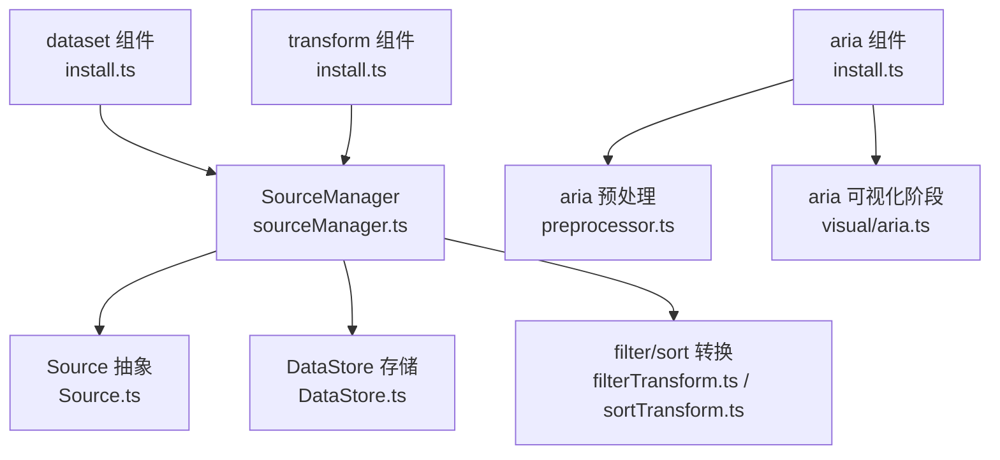
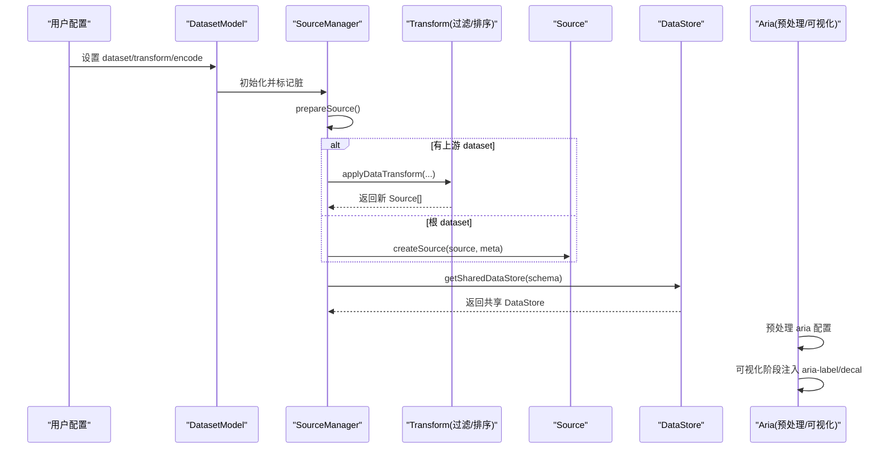
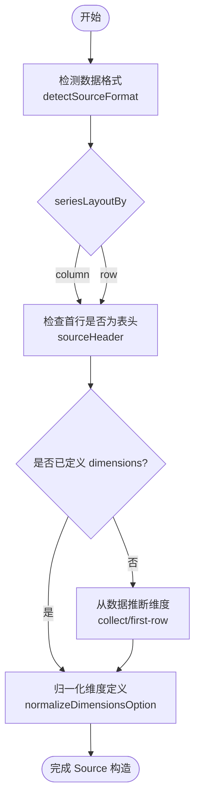
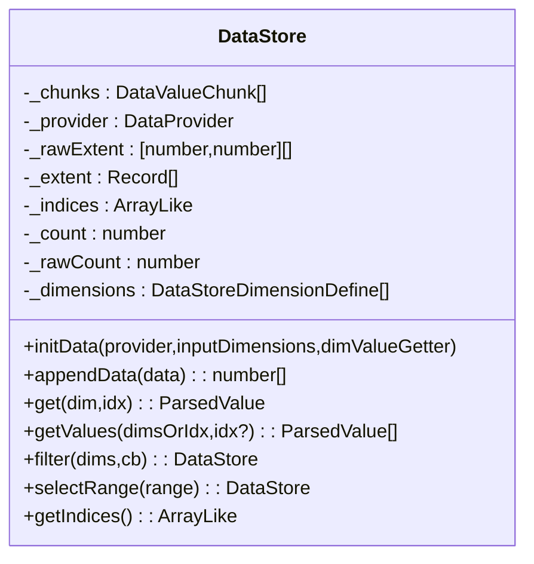
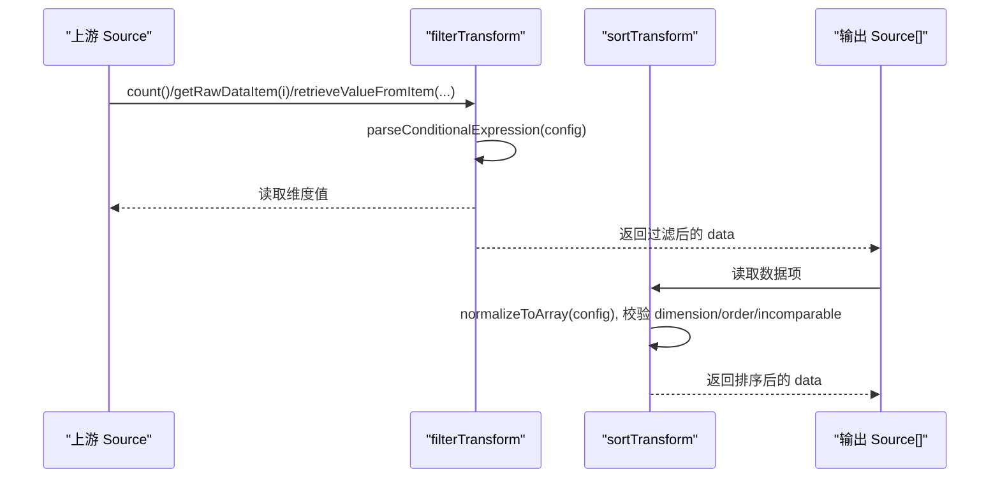
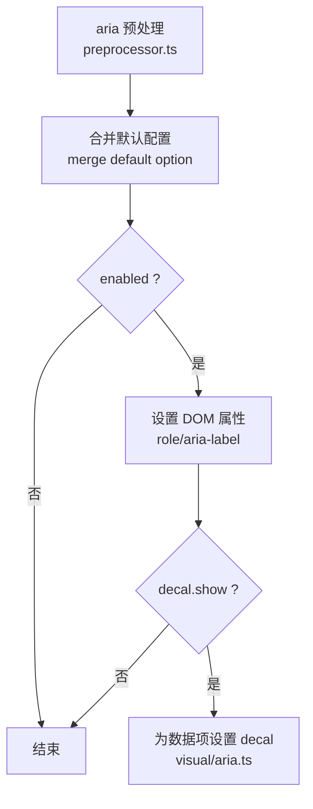
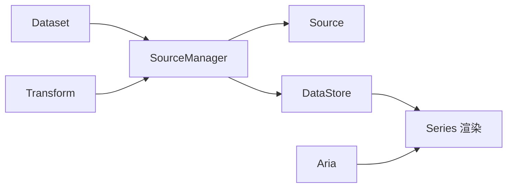
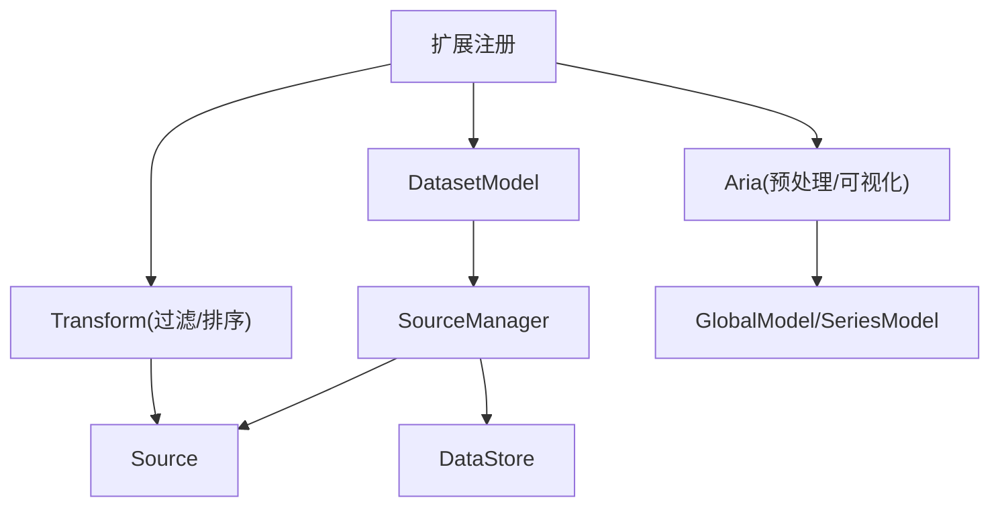

# 数据管理组件

<cite>
**本文引用的文件**
- [src/component/dataset.ts](file://src/component/dataset.ts)
- [src/component/dataset/install.ts](file://src/component/dataset/install.ts)
- [src/data/Source.ts](file://src/data/Source.ts)
- [src/data/DataStore.ts](file://src/data/DataStore.ts)
- [src/data/helper/sourceManager.ts](file://src/data/helper/sourceManager.ts)
- [src/component/transform.ts](file://src/component/transform.ts)
- [src/component/transform/install.ts](file://src/component/transform/install.ts)
- [src/component/transform/filterTransform.ts](file://src/component/transform/filterTransform.ts)
- [src/component/transform/sortTransform.ts](file://src/component/transform/sortTransform.ts)
- [src/component/aria.ts](file://src/component/aria.ts)
- [src/component/aria/install.ts](file://src/component/aria/install.ts)
- [src/visual/aria.ts](file://src/visual/aria.ts)
- [src/component/aria/preprocessor.ts](file://src/component/aria/preprocessor.ts)
</cite>

## 目录
1. [简介](#简介)
2. [项目结构](#项目结构)
3. [核心组件](#核心组件)
4. [架构总览](#架构总览)
5. [详细组件分析](#详细组件分析)
6. [依赖关系分析](#依赖关系分析)
7. [性能考虑](#性能考虑)
8. [故障排查指南](#故障排查指南)
9. [结论](#结论)
10. [附录](#附录)

## 简介
本文件系统性介绍 ECharts 的数据管理组件体系，围绕三大能力展开：
- 数据集（Dataset）：统一的数据声明与绑定入口，支持多种数据格式、自动推断维度与布局，简化 series 与图表之间的数据映射。
- 数据转换（Transform）：在 dataset 层提供过滤、排序等数据处理能力，支持链式管道与多结果引用，便于构建复杂分析流程。
- 无障碍访问（Aria）：为视障用户提供可访问的文本描述与视觉标记，提升图表的可读性与可用性。

同时说明这些组件如何与图表数据集成，以及在大规模数据场景下的性能优化策略与实践建议。

## 项目结构
ECharts 将数据管理能力拆分为“组件注册 + 数据源抽象 + 数据存取 + 转换管线 + 无障碍处理”的层次化结构：
- 组件注册入口：dataset、transform、aria 三个组件通过 install 函数向扩展系统注册模型、视图、预处理与可视化阶段处理器。
- 数据源抽象：Source 负责解析与推断数据来源格式、维度定义与布局方向；DataStore 负责多维数据的存储、索引、范围计算与高效查询。
- 数据管线：SourceManager 串联 dataset 与 series，协调上游来源、应用 transform 并产出 Source；Series 侧通过共享 DataStore 避免重复计算。
- 转换实现：内置 filter 与 sort 两种外部数据转换，支持条件表达式与多字段排序。
- 无障碍：preprocessor 规范化 aria 配置，visual 阶段生成 DOM 属性与 decal 视觉标记，增强屏幕阅读器体验。

图示来源
- [src/component/dataset/install.ts:60-99](file://src/component/dataset/install.ts#L60-L99)
- [src/data/helper/sourceManager.ts:133-193](file://src/data/helper/sourceManager.ts#L133-L193)
- [src/data/Source.ts:197-224](file://src/data/Source.ts#L197-L224)
- [src/data/DataStore.ts:162-234](file://src/data/DataStore.ts#L162-L234)
- [src/component/transform/install.ts:24-27](file://src/component/transform/install.ts#L24-L27)
- [src/component/transform/filterTransform.ts:34-97](file://src/component/transform/filterTransform.ts#L34-L97)
- [src/component/transform/sortTransform.ts:77-206](file://src/component/transform/sortTransform.ts#L77-L206)
- [src/component/aria/install.ts:24-27](file://src/component/aria/install.ts#L24-L27)
- [src/component/aria/preprocessor.ts:23-41](file://src/component/aria/preprocessor.ts#L23-L41)
- [src/visual/aria.ts:46-63](file://src/visual/aria.ts#L46-L63)

章节来源
- [src/component/dataset/install.ts:60-99](file://src/component/dataset/install.ts#L60-L99)
- [src/data/helper/sourceManager.ts:133-193](file://src/data/helper/sourceManager.ts#L133-L193)
- [src/data/Source.ts:197-224](file://src/data/Source.ts#L197-L224)
- [src/data/DataStore.ts:162-234](file://src/data/DataStore.ts#L162-L234)
- [src/component/transform/install.ts:24-27](file://src/component/transform/install.ts#L24-L27)
- [src/component/transform/filterTransform.ts:34-97](file://src/component/transform/filterTransform.ts#L34-L97)
- [src/component/transform/sortTransform.ts:77-206](file://src/component/transform/sortTransform.ts#L77-L206)
- [src/component/aria/install.ts:24-27](file://src/component/aria/install.ts#L24-L27)
- [src/component/aria/preprocessor.ts:23-41](file://src/component/aria/preprocessor.ts#L23-L41)
- [src/visual/aria.ts:46-63](file://src/visual/aria.ts#L46-L63)

## 核心组件
- 数据集（Dataset）
  - 作用：集中声明 source、dimensions、seriesLayoutBy、sourceHeader，以及从其他 dataset 引用或进行 transform 的结果引用。
  - 关键行为：创建 SourceManager，禁用 transform 选项合并以避免意外覆盖，并在选项更新时标记脏状态以触发重新计算。
- 数据转换（Transform）
  - 作用：在 dataset 层对数据进行过滤、排序等处理，支持链式管道与多结果引用。
  - 关键行为：注册 filter 与 sort 转换，基于上游 Source 读取维度信息与值，输出新的数据集合。
- 无障碍访问（Aria）
  - 作用：为图表 DOM 注入 role 与 aria-label，并为数据项附加 decal 视觉标记，帮助屏幕阅读器理解图表内容。
  - 关键行为：预处理兼容旧版配置，可视化阶段根据系列与数据生成标签与装饰。

章节来源
- [src/component/dataset/install.ts:60-99](file://src/component/dataset/install.ts#L60-L99)
- [src/component/transform/install.ts:24-27](file://src/component/transform/install.ts#L24-L27)
- [src/component/aria/install.ts:24-27](file://src/component/aria/install.ts#L24-L27)

## 架构总览
下图展示了 Dataset、Transform、Aria 与底层数据源/存储的协作关系，以及数据流向。

图示来源
- [src/component/dataset/install.ts:71-84](file://src/component/dataset/install.ts#L71-L84)
- [src/data/helper/sourceManager.ts:186-275](file://src/data/helper/sourceManager.ts#L186-L275)
- [src/data/Source.ts:197-224](file://src/data/Source.ts#L197-L224)
- [src/data/DataStore.ts:376-423](file://src/data/DataStore.ts#L376-L423)
- [src/component/aria/install.ts:24-27](file://src/component/aria/install.ts#L24-L27)
- [src/visual/aria.ts:46-63](file://src/visual/aria.ts#L46-L63)

## 详细组件分析

### 数据集（Dataset）与数据源抽象
- 数据格式与自动推断
  - 支持 original、arrayRows、objectRows、keyedColumns、typedArray 等多种格式，并通过 detectSourceFormat 自动识别。
  - 依据 seriesLayoutBy 与 sourceHeader 推断起始行与维度名称，必要时使用 guessOrdinal 推断分类维度类型。
- 维度定义与归一化
  - dimensionsDefine 可由用户显式声明或从数据中收集；normalizeDimensionsOption 会去重、补全 displayName，并处理重复名。
- 与 Series 的关系
  - Series 可通过 encode 将维度映射到坐标轴与视觉通道；SourceManager 会在 series 侧按需创建或复用 Source，减少内存占用。

图示来源
- [src/data/Source.ts:256-294](file://src/data/Source.ts#L256-L294)
- [src/data/Source.ts:300-401](file://src/data/Source.ts#L300-L401)
- [src/data/Source.ts:426-469](file://src/data/Source.ts#L426-L469)

章节来源
- [src/data/Source.ts:197-224](file://src/data/Source.ts#L197-L224)
- [src/data/Source.ts:256-294](file://src/data/Source.ts#L256-L294)
- [src/data/Source.ts:300-401](file://src/data/Source.ts#L300-L401)
- [src/data/Source.ts:426-469](file://src/data/Source.ts#L426-L469)

### 数据存取（DataStore）与共享机制
- 多维数据存储
  - 按维度分块存储（chunks），支持 float/int/ordinal/time 等类型，使用 TypedArray 优化内存与访问速度。
  - 维护 rawExtent 与 extent 缓存，用于快速计算数值范围。
- 过滤与范围选择
  - filter 与 selectRange 通过 indices 映射实现不可变子集，避免复制原始数据；selectRange 针对单/双维度做了内联优化以提升大数据性能。
- 共享 DataStore
  - SourceManager.getSharedDataStore 基于 schema 哈希缓存 DataStore，多个 series 可共享同一份数据，降低内存与计算开销。

图示来源
- [src/data/DataStore.ts:162-234](file://src/data/DataStore.ts#L162-L234)
- [src/data/DataStore.ts:325-379](file://src/data/DataStore.ts#L325-L379)
- [src/data/DataStore.ts:606-661](file://src/data/DataStore.ts#L606-L661)
- [src/data/DataStore.ts:667-781](file://src/data/DataStore.ts#L667-L781)
- [src/data/DataStore.ts:376-423](file://src/data/DataStore.ts#L376-L423)

章节来源
- [src/data/DataStore.ts:162-234](file://src/data/DataStore.ts#L162-L234)
- [src/data/DataStore.ts:325-379](file://src/data/DataStore.ts#L325-L379)
- [src/data/DataStore.ts:606-661](file://src/data/DataStore.ts#L606-L661)
- [src/data/DataStore.ts:667-781](file://src/data/DataStore.ts#L667-L781)
- [src/data/DataStore.ts:376-423](file://src/data/DataStore.ts#L376-L423)

### 数据转换（Transform）：过滤与排序
- 过滤（filter）
  - 基于条件表达式解析与求值，逐条读取上游数据项，仅保留满足条件的记录。
  - 严格校验 dimension 是否存在，否则抛出错误提示。
- 排序（sort）
  - 支持多字段排序，允许指定升序/降序、值解析器与不可比较值的处理策略（min/max）。
  - 仅支持 arrayRows/objectRows 格式的上游数据。

图示来源
- [src/component/transform/filterTransform.ts:34-97](file://src/component/transform/filterTransform.ts#L34-L97)
- [src/component/transform/sortTransform.ts:77-206](file://src/component/transform/sortTransform.ts#L77-L206)

章节来源
- [src/component/transform/filterTransform.ts:34-97](file://src/component/transform/filterTransform.ts#L34-L97)
- [src/component/transform/sortTransform.ts:77-206](file://src/component/transform/sortTransform.ts#L77-L206)

### 无障碍访问（Aria）
- 预处理
  - 兼容旧版 show 属性，迁移 description/general/series/data 至 label 下，确保配置一致性。
- 可视化阶段
  - 若启用，为图表 DOM 设置 role="img" 与 aria-label；当数据量较大时仅展示部分数据摘要。
  - 可选地为数据项添加 decal 视觉标记，辅助视觉区分与屏幕阅读器语义。

图示来源
- [src/component/aria/preprocessor.ts:23-41](file://src/component/aria/preprocessor.ts#L23-L41)
- [src/visual/aria.ts:46-63](file://src/visual/aria.ts#L46-L63)
- [src/visual/aria.ts:138-247](file://src/visual/aria.ts#L138-L247)

章节来源
- [src/component/aria/preprocessor.ts:23-41](file://src/component/aria/preprocessor.ts#L23-L41)
- [src/visual/aria.ts:46-63](file://src/visual/aria.ts#L46-L63)
- [src/visual/aria.ts:138-247](file://src/visual/aria.ts#L138-L247)

### 与图表数据的集成方式
- Dataset 作为数据中心，Series 通过 encode 将维度映射到坐标轴与视觉通道；SourceManager 负责在 series 侧按需创建或复用 DataStore，保证多系列共享数据。
- Transform 在 dataset 层执行，输出新的 Source，供后续 dataset 或 series 消费，形成数据管线。
- Aria 在渲染前后注入可访问性信息，不影响数据流但提升用户体验。

图示来源
- [src/data/helper/sourceManager.ts:186-275](file://src/data/helper/sourceManager.ts#L186-L275)
- [src/data/DataStore.ts:376-423](file://src/data/DataStore.ts#L376-L423)
- [src/visual/aria.ts:46-63](file://src/visual/aria.ts#L46-L63)

## 依赖关系分析
- 组件注册依赖扩展系统，安装时分别注册 model/view、transform、preprocessor/visual。
- SourceManager 依赖 Source 与 DataStore，向上游 dataset 或 series 获取数据，向下提供共享 DataStore。
- Transform 依赖上游 Source 的维度信息与值读取 API，输出新的数据集合。
- Aria 依赖全局模型与系列模型，读取标题与系列信息生成标签。

图示来源
- [src/component/dataset/install.ts:96-99](file://src/component/dataset/install.ts#L96-L99)
- [src/component/transform/install.ts:24-27](file://src/component/transform/install.ts#L24-L27)
- [src/component/aria/install.ts:24-27](file://src/component/aria/install.ts#L24-L27)
- [src/data/helper/sourceManager.ts:133-193](file://src/data/helper/sourceManager.ts#L133-L193)
- [src/visual/aria.ts:46-63](file://src/visual/aria.ts#L46-L63)

章节来源
- [src/component/dataset/install.ts:96-99](file://src/component/dataset/install.ts#L96-L99)
- [src/component/transform/install.ts:24-27](file://src/component/transform/install.ts#L24-L27)
- [src/component/aria/install.ts:24-27](file://src/component/aria/install.ts#L24-L27)
- [src/data/helper/sourceManager.ts:133-193](file://src/data/helper/sourceManager.ts#L133-L193)
- [src/visual/aria.ts:46-63](file://src/visual/aria.ts#L46-L63)

## 性能考虑
- 数据格式与存储
  - 优先使用 typedArray 与合适的维度类型（float/int/time）以减少内存占用并提升访问速度。
  - DataStore 按维度分块存储，避免跨维度的不必要拷贝。
- 过滤与范围选择
  - 使用 selectRange 而非通用 filter 可获得显著性能提升，尤其在单/双维度场景下进行了内联优化。
  - 大数据场景下，结合 dataZoom 等交互组件进行范围筛选，减少渲染压力。
- 共享与缓存
  - 通过 SourceManager 的共享 DataStore 机制，多个 series 复用同一份数据，避免重复计算与内存浪费。
  - SourceManager 的版本签名与脏标记机制，仅在必要时重建 Source，提高增量更新效率。
- 转换成本
  - 过滤与排序会产生中间数据副本，建议在 dataset 层尽早进行，减少下游处理的数据规模。
  - 对于超大数组，谨慎使用 sort；必要时先过滤再排序，或采用采样/聚合策略。

[本节为通用性能指导，不直接分析具体文件]

## 故障排查指南
- 过滤转换报错
  - 现象：未指定 dimension 或 dimension 不存在时报错。
  - 排查：确认 config.dimension 指向有效维度；查看上游 Source 的维度列表。
  - 参考路径
    - [src/component/transform/filterTransform.ts:48-83](file://src/component/transform/filterTransform.ts#L48-L83)
- 排序转换报错
  - 现象：未指定 dimension/order、incomparable 非法、parser 无效或上游格式不支持。
  - 排查：校验 config 字段；确认上游 sourceFormat 为 arrayRows/objectRows。
  - 参考路径
    - [src/component/transform/sortTransform.ts:104-178](file://src/component/transform/sortTransform.ts#L104-L178)
- 维度推断异常
  - 现象：dimensions 未正确推断或重复命名导致引用混乱。
  - 排查：显式声明 dimensions；检查 seriesLayoutBy 与 sourceHeader；查看 normalizeDimensionsOption 的去重逻辑。
  - 参考路径
    - [src/data/Source.ts:300-401](file://src/data/Source.ts#L300-L401)
    - [src/data/Source.ts:426-469](file://src/data/Source.ts#L426-L469)
- 无障碍标签缺失
  - 现象：aria-label 未生效或显示不完整。
  - 排查：确认 aria.enabled；检查 label.maxCount 限制；确认 DOM 存在（SSR 环境可能跳过）。
  - 参考路径
    - [src/visual/aria.ts:46-63](file://src/visual/aria.ts#L46-L63)
    - [src/visual/aria.ts:138-247](file://src/visual/aria.ts#L138-L247)

章节来源
- [src/component/transform/filterTransform.ts:48-83](file://src/component/transform/filterTransform.ts#L48-L83)
- [src/component/transform/sortTransform.ts:104-178](file://src/component/transform/sortTransform.ts#L104-L178)
- [src/data/Source.ts:300-401](file://src/data/Source.ts#L300-L401)
- [src/data/Source.ts:426-469](file://src/data/Source.ts#L426-L469)
- [src/visual/aria.ts:46-63](file://src/visual/aria.ts#L46-L63)
- [src/visual/aria.ts:138-247](file://src/visual/aria.ts#L138-L247)

## 结论
ECharts 的数据管理组件体系以 Dataset 为中心，配合 Source/DataStore 的抽象与共享机制，实现了灵活、可扩展且高性能的数据处理能力。Transform 在 dataset 层提供过滤、排序等常用操作，便于构建复杂分析流水线；Aria 则在渲染阶段注入可访问性信息，提升图表的包容性。通过合理的数据格式选择、转换顺序与共享策略，可在大规模数据场景下获得良好的性能表现。

[本节为总结性内容，不直接分析具体文件]

## 附录
- 实践建议
  - 明确声明 dimensions 与 seriesLayoutBy，减少推断不确定性。
  - 在 dataset 层尽早进行过滤与聚合，降低下游数据规模。
  - 使用 selectRange 替代通用 filter，以获得更好的大数据性能。
  - 开启 aria 以提升可访问性，并根据需要调整 label 的最大数量。
  - 对超大数组谨慎排序，必要时先过滤或采样。

[本节为补充建议，不直接分析具体文件]