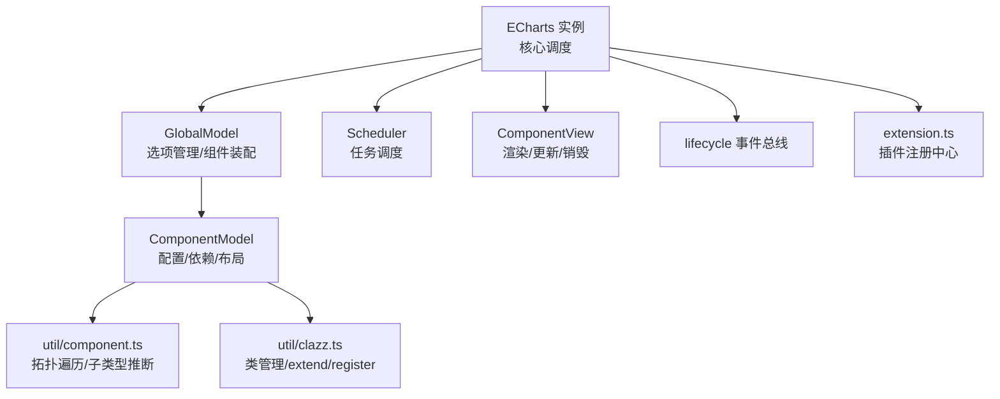
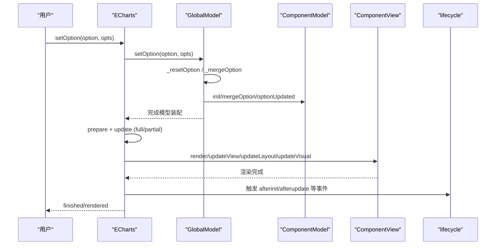
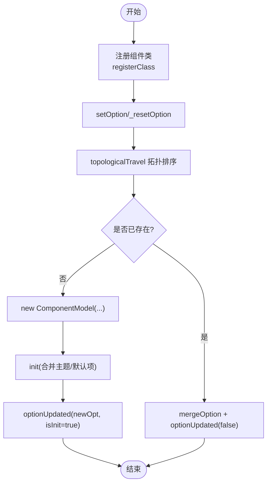
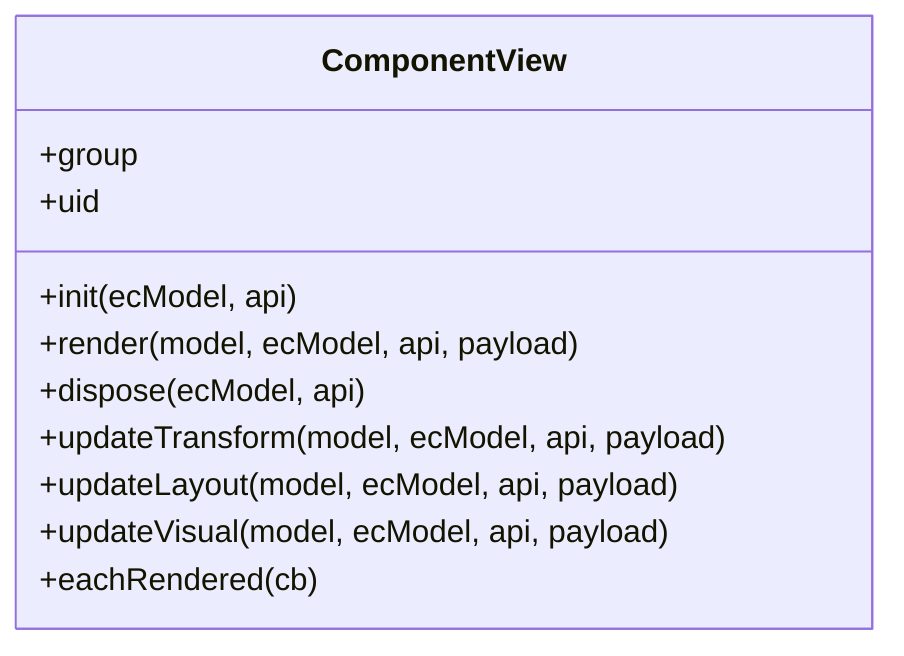
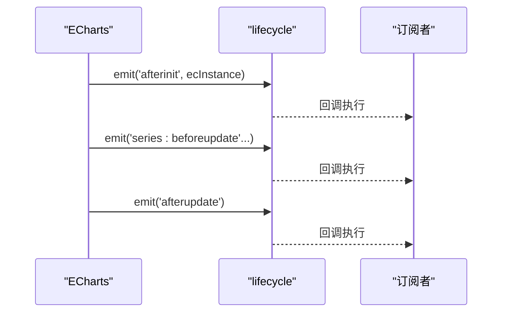
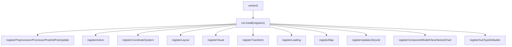
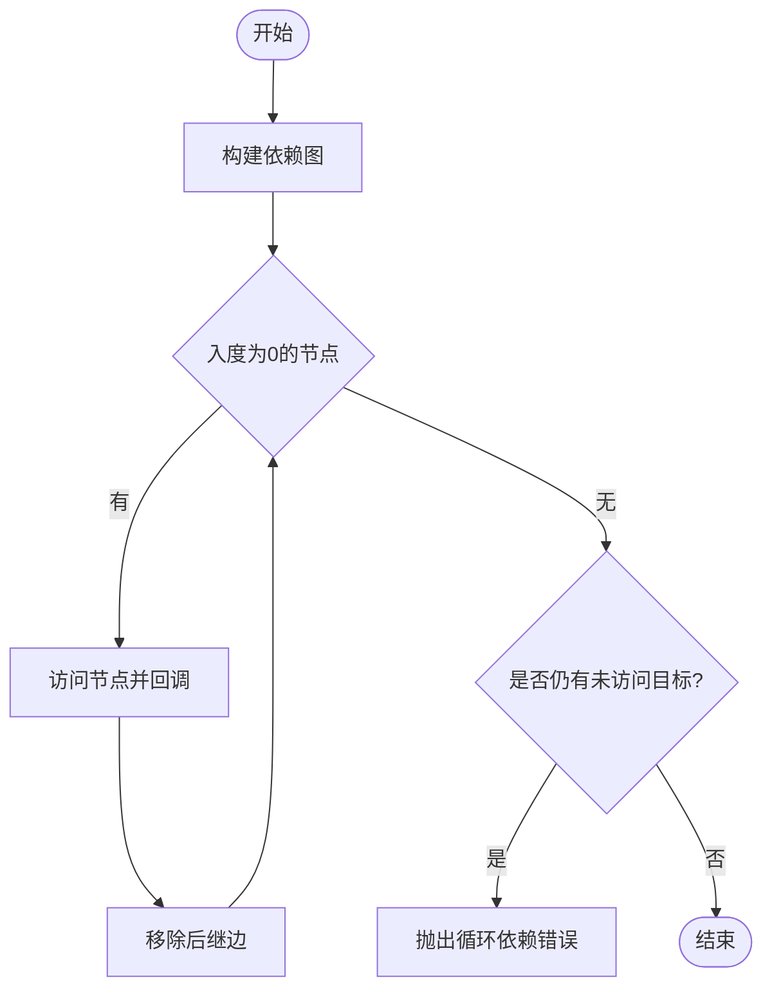
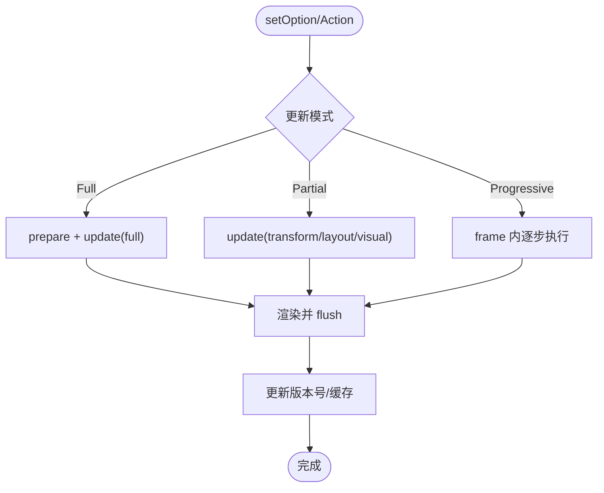
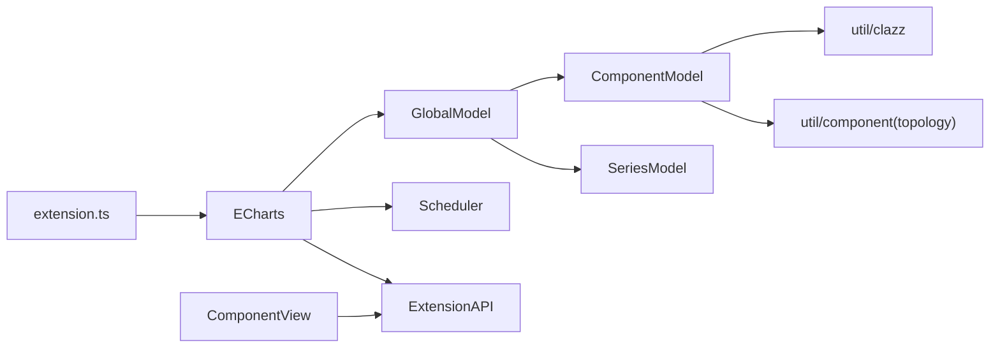

# 组件生命周期

<cite>
**本文引用的文件**
- [src/core/lifecycle.ts](file://src/core/lifecycle.ts)
- [src/model/Component.ts](file://src/model/Component.ts)
- [src/view/Component.ts](file://src/view/Component.ts)
- [src/core/echarts.ts](file://src/core/echarts.ts)
- [src/model/Global.ts](file://src/model/Global.ts)
- [src/util/component.ts](file://src/util/component.ts)
- [src/util/clazz.ts](file://src/util/clazz.ts)
- [src/extension.ts](file://src/extension.ts)
</cite>

## 目录
1. [简介](#简介)
2. [项目结构](#项目结构)
3. [核心组件](#核心组件)
4. [架构总览](#架构总览)
5. [详细组件分析](#详细组件分析)
6. [依赖关系分析](#依赖关系分析)
7. [性能考量](#性能考量)
8. [故障排查指南](#故障排查指南)
9. [结论](#结论)
10. [附录](#附录)

## 简介
本文件系统性阐述 ECharts 组件的生命周期管理机制，覆盖组件的创建、初始化、更新与销毁；解释 Model-View 架构在组件中的作用；说明组件间事件通信机制；深入解析组件注册、依赖解析与插件系统实现原理；提供扩展与自定义组件的方法；并给出增量更新与内存管理等性能优化策略及实践案例。

## 项目结构
围绕组件生命周期，ECharts 的核心模块分布如下：
- 生命周期事件总线：用于在关键阶段触发全局事件（如 afterinit、series:afterupdate 等）
- Model 层：负责配置合并、默认值注入、主题合并、布局参数处理、依赖拓扑遍历
- View 层：负责渲染、布局、视觉更新、元素遍历与交互状态切换
- 调度与主流程：统一编排数据预处理、坐标系统、视觉编码、布局与渲染
- 插件系统：集中注册各类扩展点（处理器、布局、视觉、动作、坐标系统等）
- 类管理与类型推断：支持 extend、registerClass、topologicalTravel 等能力

图表来源
- [src/core/echarts.ts:211-277](file://src/core/echarts.ts#L211-L277)
- [src/model/Global.ts:216-512](file://src/model/Global.ts#L216-L512)
- [src/model/Component.ts:155-189](file://src/model/Component.ts#L155-L189)
- [src/view/Component.ts:87-129](file://src/view/Component.ts#L87-L129)
- [src/core/lifecycle.ts:55-72](file://src/core/lifecycle.ts#L55-L72)
- [src/util/component.ts:107-177](file://src/util/component.ts#L107-L177)
- [src/util/clazz.ts:227-351](file://src/util/clazz.ts#L227-L351)
- [src/extension.ts:49-123](file://src/extension.ts#L49-L123)

章节来源
- [src/core/echarts.ts:211-277](file://src/core/echarts.ts#L211-L277)
- [src/model/Global.ts:216-512](file://src/model/Global.ts#L216-L512)
- [src/model/Component.ts:155-189](file://src/model/Component.ts#L155-L189)
- [src/view/Component.ts:87-129](file://src/view/Component.ts#L87-L129)
- [src/core/lifecycle.ts:55-72](file://src/core/lifecycle.ts#L55-L72)
- [src/util/component.ts:107-177](file://src/util/component.ts#L107-L177)
- [src/util/clazz.ts:227-351](file://src/util/clazz.ts#L227-L351)
- [src/extension.ts:49-123](file://src/extension.ts#L49-L123)

## 核心组件
- ECharts 实例与调度器：负责生命周期入口（setOption、dispatchAction、resize）、帧循环推进、懒更新与渐进式渲染
- GlobalModel：选项归一化、组件拓扑装配、合并策略（替换/正常合并）、系列索引重建
- ComponentModel：配置合并、默认值与主题注入、布局参数合并、依赖声明与拓扑遍历
- ComponentView：渲染入口、更新钩子（transform/layout/visual）、元素遍历、销毁
- lifecycle 事件总线：在关键阶段广播事件，供外部或内部监听
- extension.ts：统一的插件注册入口，暴露 register* API 给扩展使用
- util/component.ts：拓扑遍历、子类型推断、默认选项继承工具
- util/clazz.ts：类扩展、类管理（register/getClass/hasClass）、子类容器

章节来源
- [src/core/echarts.ts:359-431](file://src/core/echarts.ts#L359-L431)
- [src/model/Global.ts:156-512](file://src/model/Global.ts#L156-L512)
- [src/model/Component.ts:53-189](file://src/model/Component.ts#L53-L189)
- [src/view/Component.ts:64-143](file://src/view/Component.ts#L64-L143)
- [src/core/lifecycle.ts:55-72](file://src/core/lifecycle.ts#L55-L72)
- [src/extension.ts:49-123](file://src/extension.ts#L49-L123)
- [src/util/component.ts:107-177](file://src/util/component.ts#L107-L177)
- [src/util/clazz.ts:227-351](file://src/util/clazz.ts#L227-L351)

## 架构总览
ECharts 采用“Model-View”分离与“调度驱动”的架构：
- Model 层专注配置与数据准备，不直接操作 DOM/Canvas
- View 层专注渲染与交互，通过 updateTransform/updateLayout/updateVisual 分阶段更新
- 调度器按优先级执行数据预处理、视觉编码、布局与渲染，支持全量更新、局部更新与渐进式更新
- 生命周期事件贯穿关键阶段，便于扩展与调试

图表来源
- [src/core/echarts.ts:737-800](file://src/core/echarts.ts#L737-L800)
- [src/model/Global.ts:216-512](file://src/model/Global.ts#L216-L512)
- [src/model/Component.ts:155-189](file://src/model/Component.ts#L155-L189)
- [src/view/Component.ts:92-129](file://src/view/Component.ts#L92-L129)
- [src/core/lifecycle.ts:55-72](file://src/core/lifecycle.ts#L55-L72)

## 详细组件分析

### 组件创建与初始化（Model 侧）
- 组件类通过 registerClass 注册到类管理器，支持 mainType/subType 的多级容器
- GlobalModel 在 setOption/_resetOption/_mergeOption 中根据拓扑顺序创建/合并组件
- ComponentModel.init 负责合并主题与默认选项；mergeOption 支持布局参数合并；optionUpdated 作为配置变更回调
- 依赖解析通过 topologicalTravel 保证先构建依赖再构建被依赖者

图表来源
- [src/util/clazz.ts:227-351](file://src/util/clazz.ts#L227-L351)
- [src/model/Global.ts:312-512](file://src/model/Global.ts#L312-L512)
- [src/model/Component.ts:155-189](file://src/model/Component.ts#L155-L189)
- [src/util/component.ts:107-177](file://src/util/component.ts#L107-L177)

章节来源
- [src/util/clazz.ts:227-351](file://src/util/clazz.ts#L227-L351)
- [src/model/Global.ts:312-512](file://src/model/Global.ts#L312-L512)
- [src/model/Component.ts:155-189](file://src/model/Component.ts#L155-L189)
- [src/util/component.ts:107-177](file://src/util/component.ts#L107-L177)

### 视图渲染与更新（View 侧）
- ComponentView 提供 init/render/dispose 以及 updateTransform/updateLayout/updateVisual 等更新钩子
- 渲染由调度器在 full/partial/progressive 三种模式下调用，按需更新 transform/layout/visual
- eachRendered 可用于遍历新渲染的元素，配合渐进式渲染提升性能

图表来源
- [src/view/Component.ts:64-143](file://src/view/Component.ts#L64-L143)

章节来源
- [src/view/Component.ts:64-143](file://src/view/Component.ts#L64-L143)

### 生命周期事件与通信
- lifecycle 事件总线在关键阶段触发事件：afterinit、coordsys:aftercreate、series:beforeupdate、series:layoutlabels、series:transition、series:afterupdate、afterupdate
- 这些事件为跨组件通信、调试与扩展提供了稳定钩子

图表来源
- [src/core/lifecycle.ts:55-72](file://src/core/lifecycle.ts#L55-L72)

章节来源
- [src/core/lifecycle.ts:55-72](file://src/core/lifecycle.ts#L55-L72)

### 插件系统与扩展点
- extension.ts 暴露 use API，集中注册预处理器、处理器、后处理器、动作、坐标系统、布局、视觉、变换、加载效果、地图、更新生命周期等
- 扩展可通过 registerComponentModel/registerComponentView/registerSeriesModel/registerChartView 注册自定义组件/视图
- 支持 registerSubTypeDefaulter 动态决定子类型，增强可扩展性

图表来源
- [src/extension.ts:49-123](file://src/extension.ts#L49-L123)

章节来源
- [src/extension.ts:49-123](file://src/extension.ts#L49-L123)

### 依赖解析与拓扑遍历
- ComponentModel 通过 static dependencies 声明依赖
- util/component.ts 的 enableTopologicalTravel 基于活动网络进行拓扑排序，确保依赖先于被依赖者构建
- 若检测到循环依赖，将抛出错误提示

图表来源
- [src/util/component.ts:107-177](file://src/util/component.ts#L107-L177)

章节来源
- [src/util/component.ts:107-177](file://src/util/component.ts#L107-L177)

### 扩展与自定义组件
- 继承现有组件：通过 ComponentModel.extend/ComponentView.extend 创建子类，重写必要方法
- 注册自定义组件：使用 extension.ts 提供的 registerComponentModel/registerComponentView 等方法
- 子类型推断：通过 registerSubTypeDefaulter 根据配置动态确定 subType
- 示例路径参考：
  - 自定义系列安装入口：[src/chart/custom.ts:21-24](file://src/chart/custom.ts#L21-L24)
  - 类扩展与管理：[src/util/clazz.ts:77-129](file://src/util/clazz.ts#L77-L129), [src/util/clazz.ts:227-351](file://src/util/clazz.ts#L227-L351)
  - 组件模型基类：[src/model/Component.ts:155-189](file://src/model/Component.ts#L155-L189)
  - 视图基类：[src/view/Component.ts:87-129](file://src/view/Component.ts#L87-L129)

章节来源
- [src/chart/custom.ts:21-24](file://src/chart/custom.ts#L21-L24)
- [src/util/clazz.ts:77-129](file://src/util/clazz.ts#L77-L129)
- [src/util/clazz.ts:227-351](file://src/util/clazz.ts#L227-L351)
- [src/model/Component.ts:155-189](file://src/model/Component.ts#L155-L189)
- [src/view/Component.ts:87-129](file://src/view/Component.ts#L87-L129)

### 性能优化策略
- 增量更新：通过 partial 更新（updateTransform/updateView/updateLayout/updateVisual）减少不必要的重计算与重绘
- 渐进式渲染：在每帧内逐步执行数据预处理、视觉编码、布局与渲染，避免阻塞主线程
- 懒更新：setOption 支持 lazyUpdate，延迟到下一帧执行，降低频繁更新的开销
- 缓存与版本控制：使用 EC_UPDATE_CYCLE_VERSION_KEY 标记更新版本，避免过期渲染结果
- 内存管理：组件 dispose 释放资源；视图组 group 可遍历清理；避免持有无用引用

图表来源
- [src/core/echarts.ts:211-277](file://src/core/echarts.ts#L211-L277)
- [src/core/echarts.ts:620-704](file://src/core/echarts.ts#L620-L704)
- [src/core/echarts.ts:737-800](file://src/core/echarts.ts#L737-L800)

章节来源
- [src/core/echarts.ts:211-277](file://src/core/echarts.ts#L211-L277)
- [src/core/echarts.ts:620-704](file://src/core/echarts.ts#L620-L704)
- [src/core/echarts.ts:737-800](file://src/core/echarts.ts#L737-L800)

## 依赖关系分析
- ECharts 实例依赖 GlobalModel、Scheduler、ExtensionAPI、CoordinateSystemManager
- GlobalModel 依赖 ComponentModel、SeriesModel、OptionManager、拓扑遍历工具
- ComponentModel 依赖 Model、布局工具、类管理、拓扑遍历
- ComponentView 依赖 ZRender Group、ExtensionAPI、事件过滤与高亮分发
- extension.ts 聚合所有注册入口，形成插件生态

图表来源
- [src/core/echarts.ts:454-618](file://src/core/echarts.ts#L454-L618)
- [src/model/Global.ts:156-214](file://src/model/Global.ts#L156-L214)
- [src/model/Component.ts:53-189](file://src/model/Component.ts#L53-L189)
- [src/view/Component.ts:64-143](file://src/view/Component.ts#L64-L143)
- [src/extension.ts:49-123](file://src/extension.ts#L49-L123)

章节来源
- [src/core/echarts.ts:454-618](file://src/core/echarts.ts#L454-L618)
- [src/model/Global.ts:156-214](file://src/model/Global.ts#L156-L214)
- [src/model/Component.ts:53-189](file://src/model/Component.ts#L53-L189)
- [src/view/Component.ts:64-143](file://src/view/Component.ts#L64-L143)
- [src/extension.ts:49-123](file://src/extension.ts#L49-L123)

## 性能考量
- 优先使用局部更新：在 dispatchAction 或 setOption 时尽量指定 update 方法，避免全量重算
- 合理使用懒更新：高频 setOption 场景启用 lazyUpdate，减少重复渲染
- 渐进式渲染：大数据集下利用 frame 内逐步执行，保持流畅交互
- 控制动画与过渡：仅在必要时开启动画，避免过度绘制
- 内存回收：及时 dispose 不再使用的组件/视图，避免内存泄漏

## 故障排查指南
- 组件缺失：当使用未导入的组件或系列时，会输出错误日志提示如何引入
- 循环依赖：拓扑遍历检测到环时将抛出错误，需检查组件 dependencies 声明
- 多次 tooltip：当前仅允许一个 tooltip，重复定义会发出警告
- 生命周期内禁止嵌套调用：在 EC_CYCLE 期间不允许再次触发 setOption 等入口，避免状态不一致

章节来源
- [src/model/Global.ts:142-154](file://src/model/Global.ts#L142-L154)
- [src/model/Global.ts:440-452](file://src/model/Global.ts#L440-L452)
- [src/util/component.ts:152-158](file://src/util/component.ts#L152-L158)
- [src/core/echarts.ts:741-747](file://src/core/echarts.ts#L741-L747)

## 结论
ECharts 的组件生命周期以“调度驱动 + Model-View 分离”为核心，通过全局事件总线、拓扑依赖解析与插件系统，实现了高度可扩展与高性能的渲染管线。开发者可通过继承与注册机制扩展组件，结合增量更新与渐进式渲染优化性能，并在关键生命周期钩子中进行业务逻辑集成。

## 附录
- 常用生命周期事件：afterinit、coordsys:aftercreate、series:beforeupdate、series:layoutlabels、series:transition、series:afterupdate、afterupdate
- 常用扩展点：registerPreprocessor/Processor/PostInit/PostUpdate、registerAction、registerCoordinateSystem、registerLayout、registerVisual、registerTransform、registerLoading、registerMap、registerUpdateLifecycle
- 自定义组件步骤：
  1) 定义 Model/View 类并继承基类
  2) 通过 registerClass 注册
  3) 使用 extension.ts 的 register* 方法注册到系统
  4) 在 setOption 中使用该组件类型