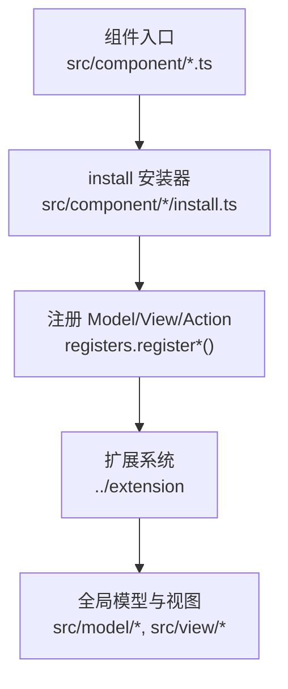
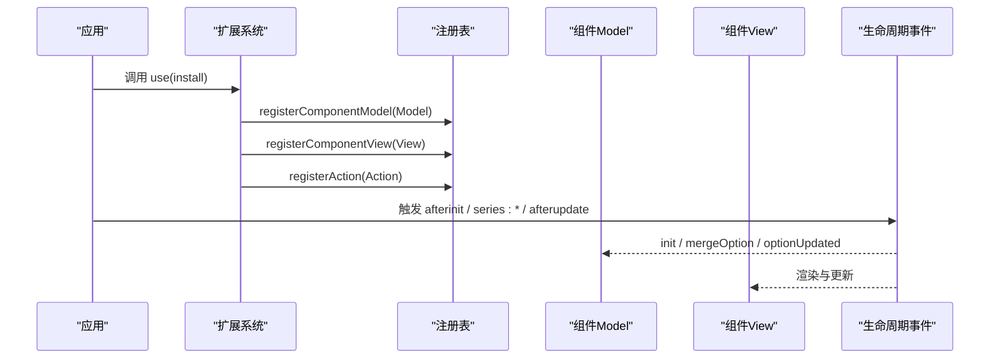
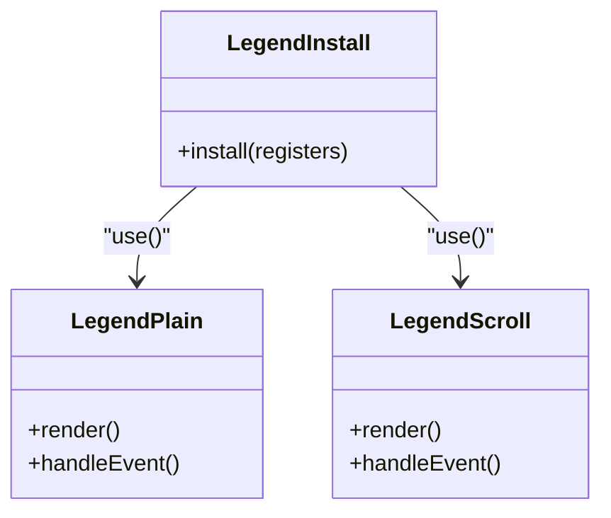
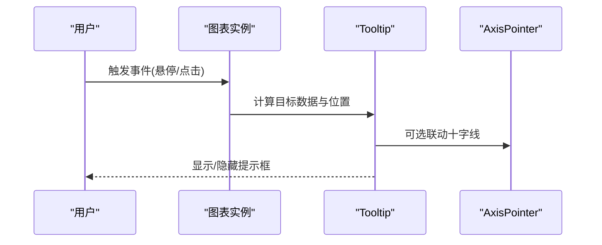
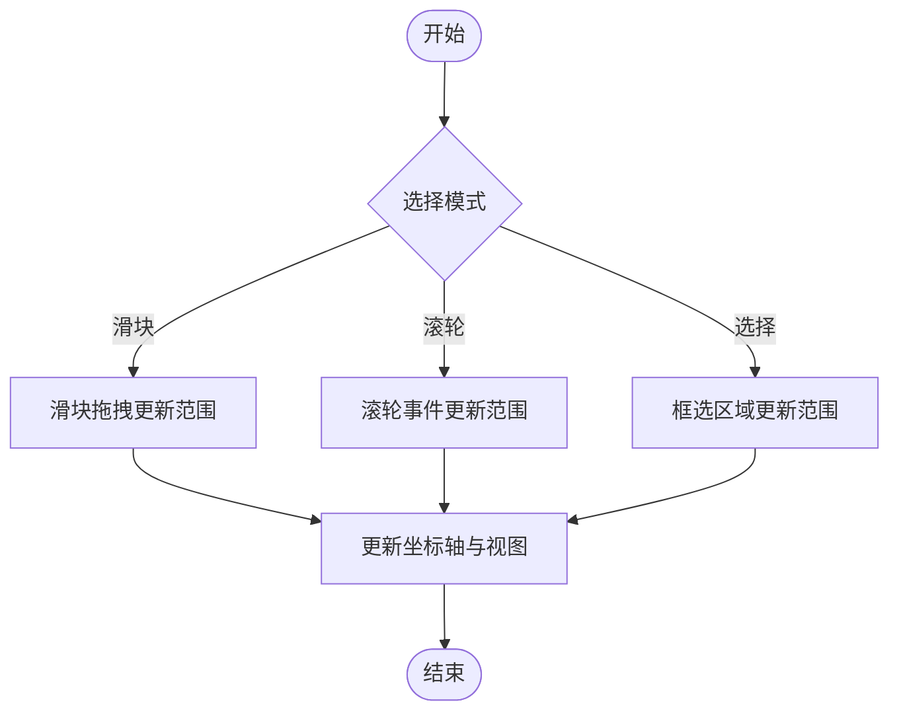
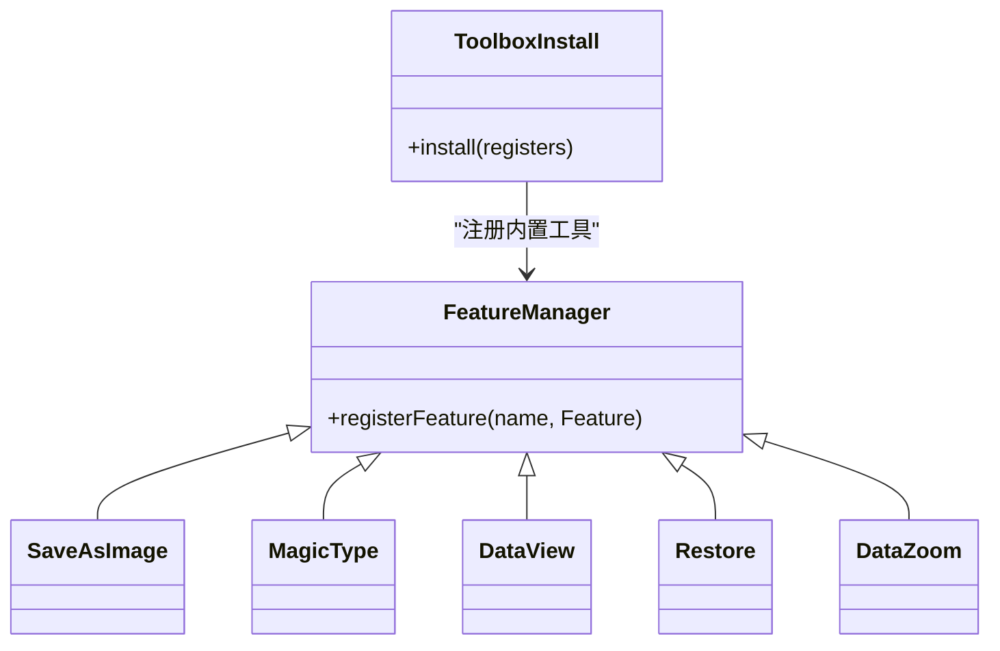
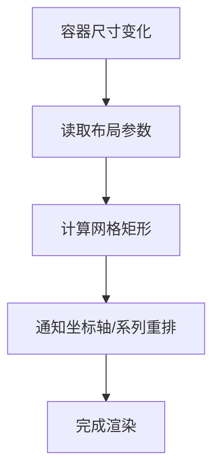
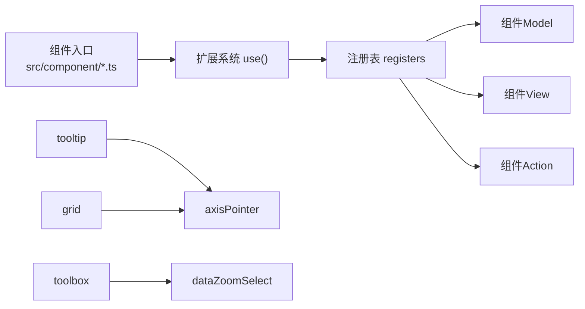

# 组件系统

<cite>
**本文引用的文件**
- [src/component/legend.ts](file://src/component/legend.ts)
- [src/component/tooltip.ts](file://src/component/tooltip.ts)
- [src/component/dataZoom.ts](file://src/component/dataZoom.ts)
- [src/component/toolbox.ts](file://src/component/toolbox.ts)
- [src/component/grid.ts](file://src/component/grid.ts)
- [src/component/title.ts](file://src/component/title.ts)
- [src/component/timeline.ts](file://src/component/timeline.ts)
- [src/component/legend/install.ts](file://src/component/legend/install.ts)
- [src/component/tooltip/install.ts](file://src/component/tooltip/install.ts)
- [src/component/dataZoom/install.ts](file://src/component/dataZoom/install.ts)
- [src/component/toolbox/install.ts](file://src/component/toolbox/install.ts)
- [src/component/grid/install.ts](file://src/component/grid/install.ts)
- [src/core/lifecycle.ts](file://src/core/lifecycle.ts)
- [src/model/Component.ts](file://src/model/Component.ts)
</cite>

## 目录
1. [简介](#简介)
2. [项目结构](#项目结构)
3. [核心组件](#核心组件)
4. [架构总览](#架构总览)
5. [详细组件分析](#详细组件分析)
6. [依赖关系分析](#依赖关系分析)
7. [性能考量](#性能考量)
8. [故障排查指南](#故障排查指南)
9. [结论](#结论)
10. [附录](#附录)

## 简介
本章节面向希望深入理解 ECharts 组件系统的读者，围绕组件的生命周期、注册机制以及与图表的集成方式展开。重点覆盖交互组件（图例 Legend、提示框 Tooltip、数据缩放 DataZoom、工具栏 Toolbox）与布局组件（网格 Grid、标题 Title、时间轴 Timeline），并提供组合使用案例与性能优化建议。

## 项目结构
ECharts 的组件以“入口文件 + install 安装器”的形式组织：每个组件在 src/component/<name>.ts 中通过 use(install) 完成注册；install.ts 负责将 Model/View 与 Action 等能力注入到框架。

图示来源
- [src/component/legend.ts:20-25](file://src/component/legend.ts#L20-L25)
- [src/component/tooltip.ts:20-23](file://src/component/tooltip.ts#L20-L23)
- [src/component/dataZoom.ts:20-24](file://src/component/dataZoom.ts#L20-L24)
- [src/component/toolbox.ts:20-23](file://src/component/toolbox.ts#L20-L23)
- [src/component/grid.ts:20-24](file://src/component/grid.ts#L20-L24)
- [src/component/legend/install.ts:20-27](file://src/component/legend/install.ts#L20-L27)
- [src/component/tooltip/install.ts:20-57](file://src/component/tooltip/install.ts#L20-L57)
- [src/component/dataZoom/install.ts:20-31](file://src/component/dataZoom/install.ts#L20-L31)
- [src/component/toolbox/install.ts:20-44](file://src/component/toolbox/install.ts#L20-L44)
- [src/component/grid/install.ts:20-27](file://src/component/grid/install.ts#L20-L27)

章节来源
- [src/component/legend.ts:20-25](file://src/component/legend.ts#L20-L25)
- [src/component/tooltip.ts:20-23](file://src/component/tooltip.ts#L20-L23)
- [src/component/dataZoom.ts:20-24](file://src/component/dataZoom.ts#L20-L24)
- [src/component/toolbox.ts:20-23](file://src/component/toolbox.ts#L20-L23)
- [src/component/grid.ts:20-24](file://src/component/grid.ts#L20-L24)
- [src/component/legend/install.ts:20-27](file://src/component/legend/install.ts#L20-L27)
- [src/component/tooltip/install.ts:20-57](file://src/component/tooltip/install.ts#L20-L57)
- [src/component/dataZoom/install.ts:20-31](file://src/component/dataZoom/install.ts#L20-L31)
- [src/component/toolbox/install.ts:20-44](file://src/component/toolbox/install.ts#L20-L44)
- [src/component/grid/install.ts:20-27](file://src/component/grid/install.ts#L20-L27)

## 核心组件
本节聚焦以下组件及其安装器：
- 图例（Legend）：提供系列可见性切换、筛选与样式定制
- 提示框（Tooltip）：内容格式化、触发条件与定位策略
- 数据缩放（DataZoom）：滑块、滚轮、选择模式
- 工具栏（Toolbox）：内置工具与自定义扩展
- 网格（Grid）：布局计算与响应式适配
- 标题（Title）：多行文本与位置控制
- 时间轴（Timeline）：时间序列展示与动画控制

章节来源
- [src/component/legend/install.ts:20-27](file://src/component/legend/install.ts#L20-L27)
- [src/component/tooltip/install.ts:20-57](file://src/component/tooltip/install.ts#L20-L57)
- [src/component/dataZoom/install.ts:20-31](file://src/component/dataZoom/install.ts#L20-L31)
- [src/component/toolbox/install.ts:20-44](file://src/component/toolbox/install.ts#L20-L44)
- [src/component/grid/install.ts:20-27](file://src/component/grid/install.ts#L20-L27)

## 架构总览
ECharts 组件遵循“Model-View-Action”的统一范式：
- Model：承载配置、默认值合并、主题继承与布局参数
- View：负责渲染与交互事件处理
- Action：统一的事件驱动更新入口（如 showTip/hideTip）

组件生命周期由核心事件总线驱动，包括初始化、布局、过渡与更新后回调。

图示来源
- [src/component/tooltip/install.ts:20-57](file://src/component/tooltip/install.ts#L20-L57)
- [src/component/legend/install.ts:20-27](file://src/component/legend/install.ts#L20-L27)
- [src/component/dataZoom/install.ts:20-31](file://src/component/dataZoom/install.ts#L20-L31)
- [src/component/toolbox/install.ts:20-44](file://src/component/toolbox/install.ts#L20-L44)
- [src/core/lifecycle.ts:44-72](file://src/core/lifecycle.ts#L44-L72)

章节来源
- [src/core/lifecycle.ts:44-72](file://src/core/lifecycle.ts#L44-L72)
- [src/model/Component.ts:155-189](file://src/model/Component.ts#L155-L189)

## 详细组件分析

### 图例（Legend）
- 显示控制与筛选：通过图例项与系列的关联实现显示/隐藏与联动筛选
- 样式定制：支持图标、文本、布局与滚动等多种形态
- 注册机制：install 同时注册 plain 与 scroll 两种图例变体

图示来源
- [src/component/legend/install.ts:20-27](file://src/component/legend/install.ts#L20-L27)

章节来源
- [src/component/legend/install.ts:20-27](file://src/component/legend/install.ts#L20-L27)

### 提示框（Tooltip）
- 内容格式化：通过 formatter 或模板化内容生成提示内容
- 触发条件：支持鼠标悬停、点击、十字线等触发方式
- 定位策略：自动定位、跟随鼠标、边界避让
- 注册机制：安装时启用 axisPointer，并注册 showTip/hideTip 动作

图示来源
- [src/component/tooltip/install.ts:20-57](file://src/component/tooltip/install.ts#L20-L57)

章节来源
- [src/component/tooltip/install.ts:20-57](file://src/component/tooltip/install.ts#L20-L57)

### 数据缩放（DataZoom）
- 滑块模式：底部/侧边滑块拖拽缩放
- 滚轮模式：鼠标滚轮缩放
- 选择模式：框选区域进行缩放
- 注册机制：install 同时注册 inside 与 slider 两种实现

图示来源
- [src/component/dataZoom/install.ts:20-31](file://src/component/dataZoom/install.ts#L20-L31)

章节来源
- [src/component/dataZoom/install.ts:20-31](file://src/component/dataZoom/install.ts#L20-L31)

### 工具栏（Toolbox）
- 内置工具：保存图片、类型切换、数据视图、还原、数据缩放
- 自定义扩展：通过 featureManager 注册新工具
- 集成点：可与 DataZoom 选择模式联动

图示来源
- [src/component/toolbox/install.ts:20-44](file://src/component/toolbox/install.ts#L20-L44)

章节来源
- [src/component/toolbox/install.ts:20-44](file://src/component/toolbox/install.ts#L20-L44)

### 网格（Grid）
- 布局计算：基于 left/right/top/bottom/width/height 计算绘图区域
- 响应式适配：随容器尺寸变化重新计算布局
- 联动：与 axisPointer 等组件协同工作

图示来源
- [src/component/grid/install.ts:20-27](file://src/component/grid/install.ts#L20-L27)

章节来源
- [src/component/grid/install.ts:20-27](file://src/component/grid/install.ts#L20-L27)

### 标题（Title）
- 多行文本：支持富文本与换行
- 位置控制：top/left/right/bottom 及偏移量
- 样式定制：字体、颜色、阴影等

章节来源
- [src/component/title.ts:20-23](file://src/component/title.ts#L20-L23)

### 时间轴（Timeline）
- 时间序列展示：按时间步推进数据
- 动画控制：帧率、缓动、过渡效果
- 事件联动：与图表状态同步更新

章节来源
- [src/component/timeline.ts:20-28](file://src/component/timeline.ts#L20-L28)

## 依赖关系分析
- 组件入口统一通过 use(install) 接入扩展系统
- install 内部依赖 registers 完成 Model/View/Action 的注册
- 部分组件存在子依赖：例如 tooltip 依赖 axisPointer；grid 也依赖 axisPointer；dataZoom 与 toolbox 可联动 dataZoomSelect

图示来源
- [src/component/tooltip/install.ts:20-57](file://src/component/tooltip/install.ts#L20-L57)
- [src/component/grid/install.ts:20-27](file://src/component/grid/install.ts#L20-L27)
- [src/component/toolbox/install.ts:20-44](file://src/component/toolbox/install.ts#L20-L44)

章节来源
- [src/component/tooltip/install.ts:20-57](file://src/component/tooltip/install.ts#L20-L57)
- [src/component/grid/install.ts:20-27](file://src/component/grid/install.ts#L20-L27)
- [src/component/toolbox/install.ts:20-44](file://src/component/toolbox/install.ts#L20-L44)

## 性能考量
- 按需引入：仅 use 需要的组件安装器，减少包体积与初始化开销
- 避免频繁 setOption：批量更新配置，利用 diff 与增量更新
- 合理设置 dataZoom 模式：大数据集优先使用选择模式或采样
- 控制 tooltip 触发频率：在高密度数据场景下降低事件频率
- 复用 theme 与默认配置：减少重复计算与样式解析

[本节为通用指导，不直接分析具体文件]

## 故障排查指南
- 组件未生效：确认对应 install 是否被 use；检查 registers 是否正确注册 Model/View/Action
- 提示框不显示：检查 tooltip 触发条件与 axisPointer 依赖是否安装
- 缩放无效：确认 dataZoom 模式与坐标轴类型匹配；检查是否在正确的坐标系中使用
- 工具栏按钮无响应：确认 feature 已注册且未被禁用；检查事件绑定与作用域
- 布局错乱：核对 grid 的布局参数与容器尺寸；确保在 resize 后重新计算

章节来源
- [src/component/tooltip/install.ts:20-57](file://src/component/tooltip/install.ts#L20-L57)
- [src/component/dataZoom/install.ts:20-31](file://src/component/dataZoom/install.ts#L20-L31)
- [src/component/toolbox/install.ts:20-44](file://src/component/toolbox/install.ts#L20-L44)
- [src/component/grid/install.ts:20-27](file://src/component/grid/install.ts#L20-L27)

## 结论
ECharts 的组件系统以统一的 Model-View-Action 范式与可扩展的注册机制为核心，配合清晰的生命周期管理，实现了高度解耦与灵活组合。通过对图例、提示框、数据缩放、工具栏以及网格、标题、时间轴等关键组件的理解与实践，开发者可以构建出高性能、易维护且体验优秀的可视化应用。

[本节为总结性内容，不直接分析具体文件]

## 附录
- 组件生命周期事件参考：afterinit、series:beforeupdate、series:layoutlabels、series:transition、series:afterupdate、afterupdate
- 组件默认选项合并流程：主题 -> 组件默认 -> 用户配置；布局参数按 layoutMode 合并

章节来源
- [src/core/lifecycle.ts:44-72](file://src/core/lifecycle.ts#L44-L72)
- [src/model/Component.ts:160-189](file://src/model/Component.ts#L160-L189)