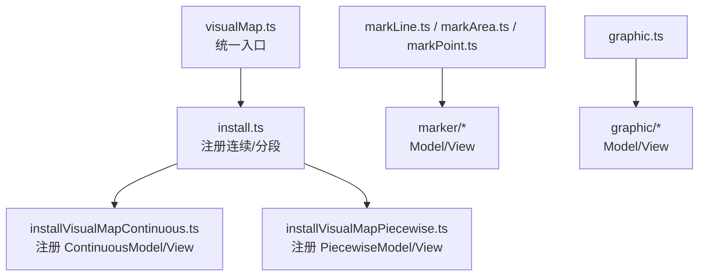
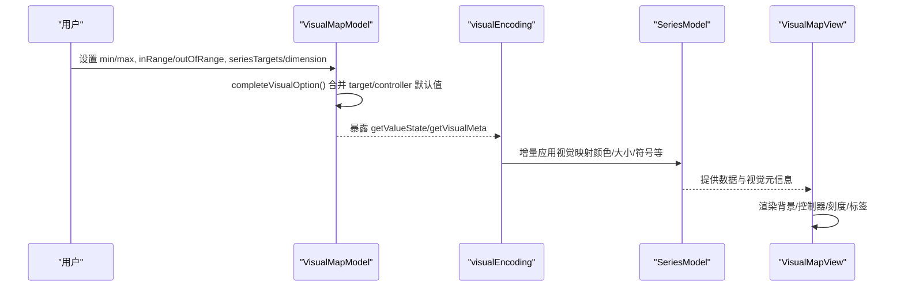
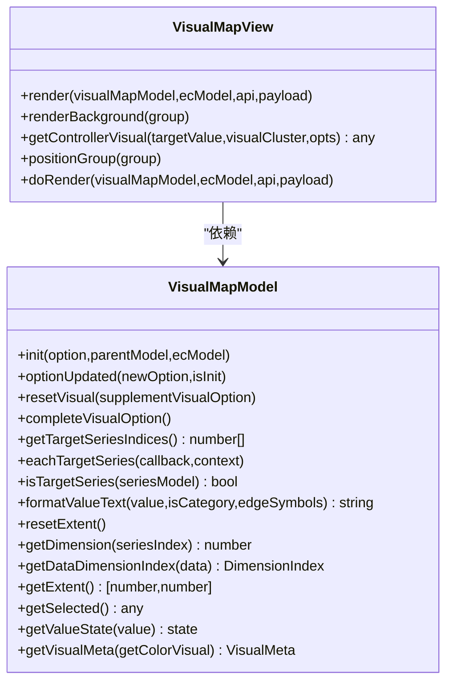
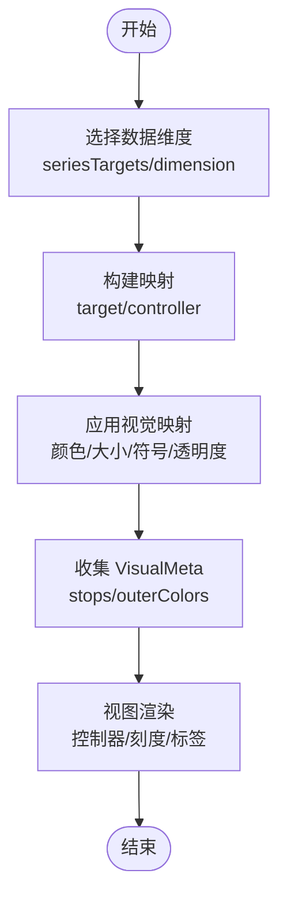
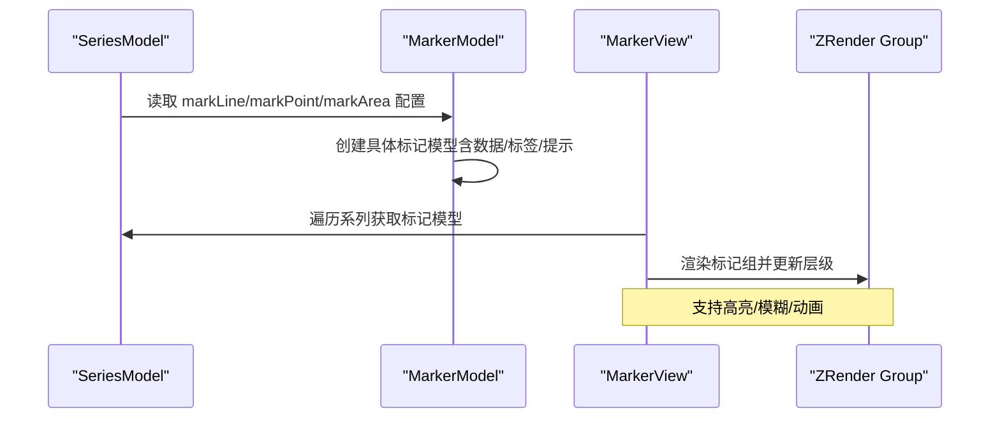
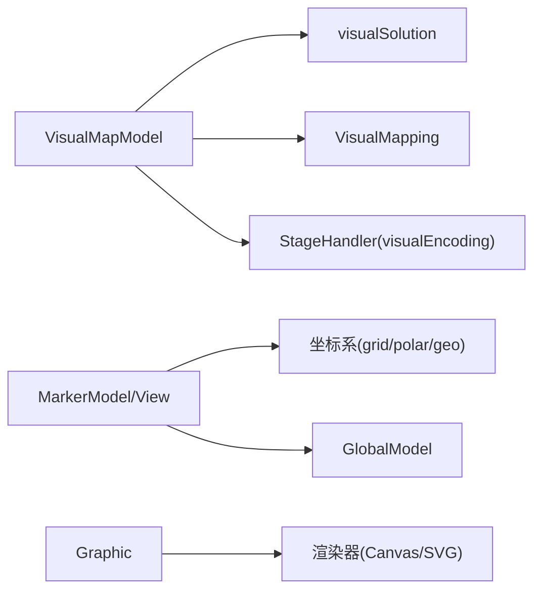

# 视觉映射组件

<cite>
**本文引用的文件**
- [src/component/visualMap.ts](file://src/component/visualMap.ts)
- [src/component/visualMapContinuous.ts](file://src/component/visualMapContinuous.ts)
- [src/component/visualMapPiecewise.ts](file://src/component/visualMapPiecewise.ts)
- [src/component/visualMap/install.ts](file://src/component/visualMap/install.ts)
- [src/component/visualMap/installVisualMapContinuous.ts](file://src/component/visualMap/installVisualMapContinuous.ts)
- [src/component/visualMap/installVisualMapPiecewise.ts](file://src/component/visualMap/installVisualMapPiecewise.ts)
- [src/component/visualMap/VisualMapModel.ts](file://src/component/visualMap/VisualMapModel.ts)
- [src/component/visualMap/VisualMapView.ts](file://src/component/visualMap/VisualMapView.ts)
- [src/component/visualMap/helper.ts](file://src/component/visualMap/helper.ts)
- [src/component/visualMap/visualEncoding.ts](file://src/component/visualMap/visualEncoding.ts)
- [src/component/markLine.ts](file://src/component/markLine.ts)
- [src/component/markArea.ts](file://src/component/markArea.ts)
- [src/component/markPoint.ts](file://src/component/markPoint.ts)
- [src/component/marker/MarkerModel.ts](file://src/component/marker/MarkerModel.ts)
- [src/component/marker/MarkerView.ts](file://src/component/marker/MarkerView.ts)
- [src/component/graphic.ts](file://src/component/graphic.ts)
</cite>

## 目录
1. [简介](#简介)
2. [项目结构](#项目结构)
3. [核心组件](#核心组件)
4. [架构总览](#架构总览)
5. [详细组件分析](#详细组件分析)
6. [依赖关系分析](#依赖关系分析)
7. [性能考量](#性能考量)
8. [故障排查指南](#故障排查指南)
9. [结论](#结论)
10. [附录：使用案例与最佳实践](#附录使用案例与最佳实践)

## 简介
本文件系统性介绍 ECharts 的视觉映射组件系统，涵盖：
- 视觉映射（VisualMap）：将数据值映射到颜色、大小、透明度、符号等视觉属性，支持连续型与分段型两种模式。
- 标记组件（MarkLine/Area/Point）：在图表中添加参考线、区域和特殊标记点，用于强调关键信息或阈值。
- 图形组件（Graphic）：提供自定义 SVG/Canvas 元素与动画能力，增强可视化表达。

重点说明：
- 视觉映射的计算规则、渐变配置与分段设置。
- 标记组件如何定位、渲染并与坐标系联动。
- 图形组件如何添加自定义元素与动画。
- 通过实际案例展示如何组合这些组件提升图表的信息密度与视觉效果。

## 项目结构
ECharts 将“视觉映射”“标记”“图形”作为独立组件进行模块化注册与实现：
- 入口注册：各组件通过统一的 use(install) 机制完成插件式安装。
- 模型与视图分离：每个组件包含 Model（配置、状态、计算）与 View（布局、绘制）。
- 编码管线：视觉映射通过 StageHandler 在系列数据处理阶段注入视觉属性。

图示来源
- [src/component/visualMap.ts:20-23](file://src/component/visualMap.ts#L20-L23)
- [src/component/visualMap/install.ts:20-30](file://src/component/visualMap/install.ts#L20-L30)
- [src/component/visualMap/installVisualMapContinuous.ts:20-30](file://src/component/visualMap/installVisualMapContinuous.ts#L20-L30)
- [src/component/visualMap/installVisualMapPiecewise.ts:20-30](file://src/component/visualMap/installVisualMapPiecewise.ts#L20-L30)
- [src/component/markLine.ts:20-23](file://src/component/markLine.ts#L20-L23)
- [src/component/markArea.ts:20-23](file://src/component/markArea.ts#L20-L23)
- [src/component/markPoint.ts:20-25](file://src/component/markPoint.ts#L20-L25)
- [src/component/graphic.ts:20-23](file://src/component/graphic.ts#L20-L23)

章节来源
- [src/component/visualMap.ts:20-23](file://src/component/visualMap.ts#L20-L23)
- [src/component/visualMap/install.ts:20-30](file://src/component/visualMap/install.ts#L20-L30)
- [src/component/visualMap/installVisualMapContinuous.ts:20-30](file://src/component/visualMap/installVisualMapContinuous.ts#L20-L30)
- [src/component/visualMap/installVisualMapPiecewise.ts:20-30](file://src/component/visualMap/installVisualMapPiecewise.ts#L20-L30)
- [src/component/markLine.ts:20-23](file://src/component/markLine.ts#L20-L23)
- [src/component/markArea.ts:20-23](file://src/component/markArea.ts#L20-L23)
- [src/component/markPoint.ts:20-25](file://src/component/markPoint.ts#L20-L25)
- [src/component/graphic.ts:20-23](file://src/component/graphic.ts#L20-L23)

## 核心组件
- 视觉映射（VisualMap）
  - 类型：连续型（continuous）、分段型（piecewise）
  - 职责：根据数据维度与范围，生成目标（series）与控制器（控件）的视觉映射；提供文本格式化、选择状态、尺寸与对齐等能力。
- 标记（MarkLine/Area/Point）
  - 类型：参考线、参考区域、参考点
  - 职责：基于坐标系或统计方法定位并渲染标记，支持标签、提示框、高亮与层级控制。
- 图形（Graphic）
  - 类型：自定义图形容器
  - 职责：允许用户直接添加图形元素与动画，扩展图表表现力。

章节来源
- [src/component/visualMap/VisualMapModel.ts:179-708](file://src/component/visualMap/VisualMapModel.ts#L179-L708)
- [src/component/visualMap/VisualMapView.ts:33-173](file://src/component/visualMap/VisualMapView.ts#L33-L173)
- [src/component/marker/MarkerModel.ts:101-270](file://src/component/marker/MarkerModel.ts#L101-L270)
- [src/component/marker/MarkerView.ts:38-124](file://src/component/marker/MarkerView.ts#L38-L124)
- [src/component/graphic.ts:20-23](file://src/component/graphic.ts#L20-L23)

## 架构总览
视觉映射从“配置解析→视觉映射构建→编码注入→视图渲染”形成完整链路；标记与图形则分别以独立的组件体系挂载到图表中，复用坐标系统与全局模型。

图示来源
- [src/component/visualMap/VisualMapModel.ts:484-619](file://src/component/visualMap/VisualMapModel.ts#L484-L619)
- [src/component/visualMap/visualEncoding.ts:28-80](file://src/component/visualMap/visualEncoding.ts#L28-L80)
- [src/component/visualMap/VisualMapView.ts:53-173](file://src/component/visualMap/VisualMapView.ts#L53-L173)

## 详细组件分析

### 视觉映射（VisualMap）
- 模型（VisualMapModel）
  - 负责：选项合并、目标系列筛选（seriesIndex/seriesId/seriesTargets）、维度选择（dimension）、值域范围（min/max）、状态列表（inRange/outOfRange）、控制器与目标的视觉映射构建、文本格式化、项尺寸与对齐。
  - 关键点：
    - 通过 visualSolution.createVisualMappings 为目标与控制器创建映射。
    - completeVisualOption 处理兼容性与默认值（如 color/inactiveColor/symbolSize 归一化）。
    - formatValueText 支持字符串模板与函数回调，处理区间边界显示。
- 视图（VisualMapView）
  - 负责：背景绘制、位置布局、控制器视觉值获取（getControllerVisual），以及 doRender 的具体渲染逻辑（由连续/分段子类实现）。
- 辅助与编码
  - helper：自动对齐策略、批量高亮参数转换。
  - visualEncoding：在系列处理阶段注入视觉属性，收集 VisualMeta 供后续渲染使用。

图示来源
- [src/component/visualMap/VisualMapModel.ts:179-708](file://src/component/visualMap/VisualMapModel.ts#L179-L708)
- [src/component/visualMap/VisualMapView.ts:33-173](file://src/component/visualMap/VisualMapView.ts#L33-L173)

章节来源
- [src/component/visualMap/VisualMapModel.ts:179-708](file://src/component/visualMap/VisualMapModel.ts#L179-L708)
- [src/component/visualMap/VisualMapView.ts:33-173](file://src/component/visualMap/VisualMapView.ts#L33-L173)
- [src/component/visualMap/helper.ts:26-90](file://src/component/visualMap/helper.ts#L26-L90)
- [src/component/visualMap/visualEncoding.ts:28-116](file://src/component/visualMap/visualEncoding.ts#L28-L116)

#### 视觉映射计算规则与分段/渐变
- 计算流程
  - 确定目标系列与维度：通过 seriesTargets 或 dimension 指定数据维度索引。
  - 构建映射：为 inRange/outOfRange 与 controller/target 分别创建映射对象。
  - 应用映射：在系列处理阶段调用 incrementalApplyVisual，按状态（valueState）应用颜色、大小、符号等。
  - 收集元信息：getVisualMeta 返回 stops 与 outerColors，供热力图、地图等渲染器使用。
- 分段与连续
  - 连续型：通过线性映射与渐变色带生成视觉值。
  - 分段型：依据 categories/pieces 将值域划分为若干段，每段可配置不同视觉属性。
- 文本格式化
  - 支持字符串模板（{value}/{value2}）与函数回调，自动处理最小/最大边界与精度。

图示来源
- [src/component/visualMap/visualEncoding.ts:28-80](file://src/component/visualMap/visualEncoding.ts#L28-L80)
- [src/component/visualMap/VisualMapModel.ts:484-619](file://src/component/visualMap/VisualMapModel.ts#L484-L619)

章节来源
- [src/component/visualMap/visualEncoding.ts:28-116](file://src/component/visualMap/visualEncoding.ts#L28-L116)
- [src/component/visualMap/VisualMapModel.ts:484-619](file://src/component/visualMap/VisualMapModel.ts#L484-L619)

### 标记组件（MarkLine/Area/Point）
- 模型（MarkerModel）
  - 职责：从宿主系列读取标记配置，创建具体标记模型（markLine/markPoint/markArea），管理数据、提示框、动画开关与层级。
  - 定位方式：支持绝对坐标、坐标系坐标、极坐标轴、统计方法（平均/最小/最大/中位数）。
- 视图（MarkerView）
  - 职责：按系列分组渲染标记组，维护 keep 标记清理未使用的组，更新 z/zlevel 层级，支持模糊态切换。
- 安装入口
  - markLine.ts/markArea.ts/markPoint.ts 分别通过 installMarkLine/installMarkArea/installMarkPoint 注册对应 Model/View。

图示来源
- [src/component/marker/MarkerModel.ts:101-270](file://src/component/marker/MarkerModel.ts#L101-L270)
- [src/component/marker/MarkerView.ts:38-124](file://src/component/marker/MarkerView.ts#L38-L124)
- [src/component/markLine.ts:20-23](file://src/component/markLine.ts#L20-L23)
- [src/component/markArea.ts:20-23](file://src/component/markArea.ts#L20-L23)
- [src/component/markPoint.ts:20-25](file://src/component/markPoint.ts#L20-L25)

章节来源
- [src/component/marker/MarkerModel.ts:101-270](file://src/component/marker/MarkerModel.ts#L101-L270)
- [src/component/marker/MarkerView.ts:38-124](file://src/component/marker/MarkerView.ts#L38-L124)
- [src/component/markLine.ts:20-23](file://src/component/markLine.ts#L20-L23)
- [src/component/markArea.ts:20-23](file://src/component/markArea.ts#L20-L23)
- [src/component/markPoint.ts:20-25](file://src/component/markPoint.ts#L20-L25)

### 图形组件（Graphic）
- 作用：提供自定义图形容器与元素管理能力，支持添加任意 SVG/Canvas 元素与动画。
- 安装：通过 graphic.ts 的 install 注册到 ECharts 扩展系统。
- 典型用法：叠加装饰性图形、动态指示器、品牌标识、复杂交互元素等。

章节来源
- [src/component/graphic.ts:20-23](file://src/component/graphic.ts#L20-L23)

## 依赖关系分析
- 视觉映射对视觉系统的依赖
  - 使用 visualSolution 创建映射、VisualMapping 准备与应用视觉类型。
  - 通过 StageHandler 在系列处理阶段注入视觉属性。
- 标记对坐标系统与全局模型的依赖
  - 依赖 grid/polar/geo 等坐标系进行定位。
  - 复用 tooltip、label、states 等通用能力。
- 图形对渲染器的依赖
  - 基于底层渲染器（Canvas/SVG）绘制自定义元素。

图示来源
- [src/component/visualMap/VisualMapModel.ts:20-47](file://src/component/visualMap/VisualMapModel.ts#L20-L47)
- [src/component/visualMap/visualEncoding.ts:20-27](file://src/component/visualMap/visualEncoding.ts#L20-L27)
- [src/component/marker/MarkerModel.ts:20-39](file://src/component/marker/MarkerModel.ts#L20-L39)
- [src/component/graphic.ts:20-23](file://src/component/graphic.ts#L20-L23)

章节来源
- [src/component/visualMap/VisualMapModel.ts:20-47](file://src/component/visualMap/VisualMapModel.ts#L20-L47)
- [src/component/visualMap/visualEncoding.ts:20-27](file://src/component/visualMap/visualEncoding.ts#L20-L27)
- [src/component/marker/MarkerModel.ts:20-39](file://src/component/marker/MarkerModel.ts#L20-L39)
- [src/component/graphic.ts:20-23](file://src/component/graphic.ts#L20-L23)

## 性能考量
- 大数据量场景
  - 视觉映射在大数量级时跳过部分编码路径（pipelineContext.large），避免重复计算。
- 映射构建成本
  - 合理设置 seriesTargets/dimension，减少不必要的系列扫描与维度推导。
- 标记渲染
  - 控制 markPoint 数量（源码注释提示不宜过多），避免过多图形元素影响性能。
- 动画与过渡
  - 合理使用动画开关与过渡时长，降低重绘压力。

章节来源
- [src/component/visualMap/visualEncoding.ts:31-47](file://src/component/visualMap/visualEncoding.ts#L31-L47)
- [src/component/markPoint.ts:20-25](file://src/component/markPoint.ts#L20-L25)

## 故障排查指南
- 视觉映射不生效
  - 检查是否设置了有效的 dimension 或 seriesTargets。
  - 确认 isTargetSeries 判断是否命中目标系列。
  - 查看 getVisualMeta 返回值是否为空（stops/outerColors）。
- 控制器样式异常
  - 核对 controller.inRange/outOfRange 的 symbol/symbolSize 是否被归一化。
  - 检查 inactiveColor 与 contentColor 配置是否正确。
- 标记未显示或位置错误
  - 确认坐标系存在且有效（grid/polar/geo）。
  - 检查坐标值类型与单位（像素/百分比/坐标值）。
  - 验证 z/zlevel 层级是否被覆盖。
- 图形元素不可见
  - 检查元素层级与裁剪区域。
  - 确认渲染器支持（SVG/Canvas）与浏览器兼容性。

章节来源
- [src/component/visualMap/VisualMapModel.ts:259-331](file://src/component/visualMap/VisualMapModel.ts#L259-L331)
- [src/component/visualMap/VisualMapModel.ts:448-478](file://src/component/visualMap/VisualMapModel.ts#L448-L478)
- [src/component/visualMap/VisualMapModel.ts:665-667](file://src/component/visualMap/VisualMapModel.ts#L665-L667)
- [src/component/marker/MarkerView.ts:102-121](file://src/component/marker/MarkerView.ts#L102-L121)

## 结论
ECharts 的视觉映射组件系统通过清晰的模型/视图分层、灵活的映射构建与编码管线，实现了数据到视觉属性的稳定映射；标记组件提供了强大的参考标注能力；图形组件则打开了高度自定义的表达空间。三者结合可显著提升图表的信息密度与视觉表现力。

## 附录：使用案例与最佳实践
- 视觉映射
  - 连续型：用 inRange.color 定义渐变色带，配合 min/max 与 precision 控制数值显示精度。
  - 分段型：用 categories 或 pieces 划分区间，为每段配置不同的 symbol/symbolSize/color。
  - 多系列映射：通过 seriesTargets 精确指定系列与维度，避免误映射。
- 标记
  - 参考线：使用 markLine 标注阈值或均值，配合 label 与 tooltip 增强可读性。
  - 参考区域：使用 markArea 强调特定区间（如高峰时段）。
  - 参考点：使用 markPoint 标注极值或异常点，注意控制数量。
- 图形
  - 自定义元素：叠加品牌 Logo、动态指示器、装饰边框等。
  - 动画效果：利用图形动画增强交互反馈，但需权衡性能。

[本节为概念性内容，不直接分析具体文件，故无“章节来源”]