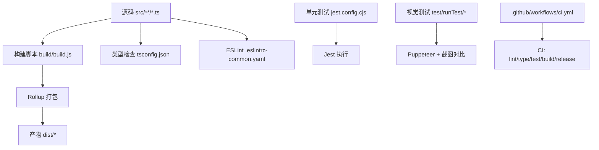
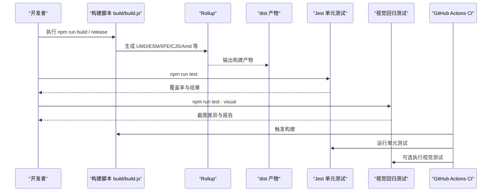
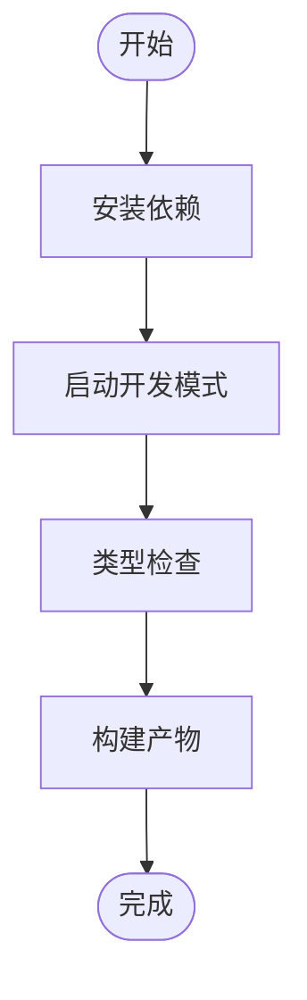
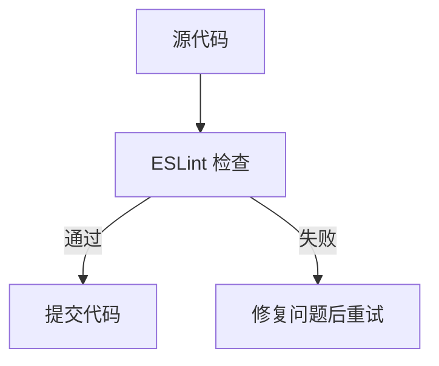
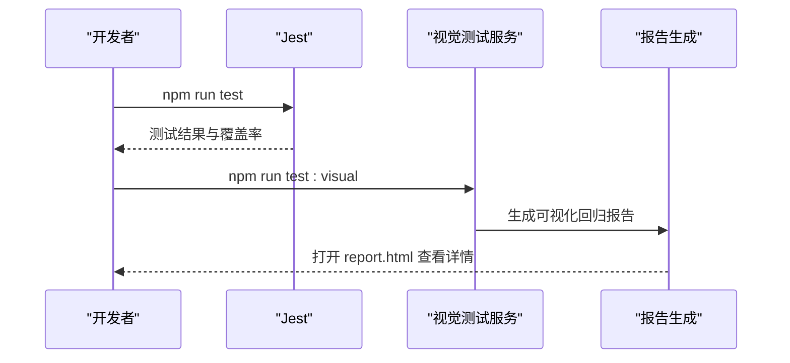
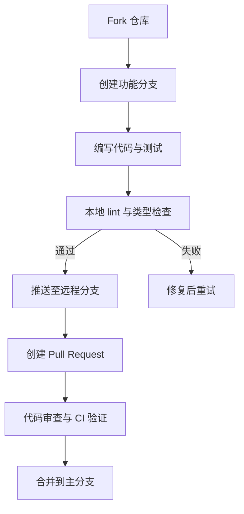
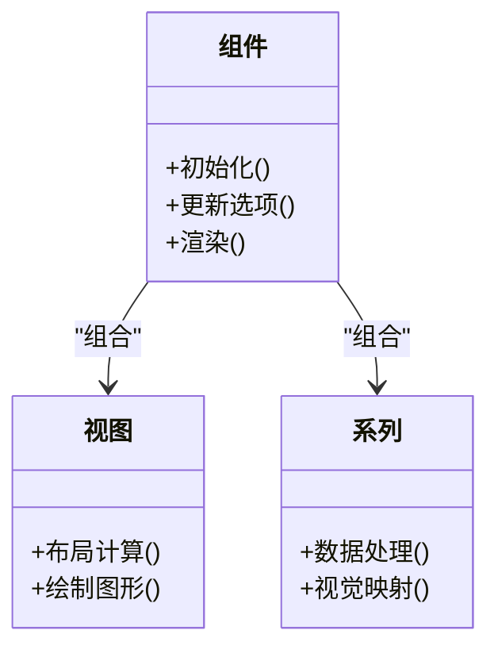
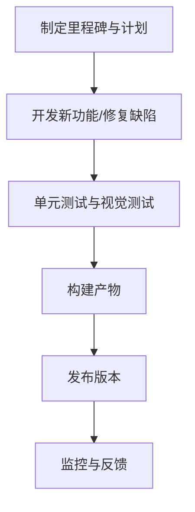
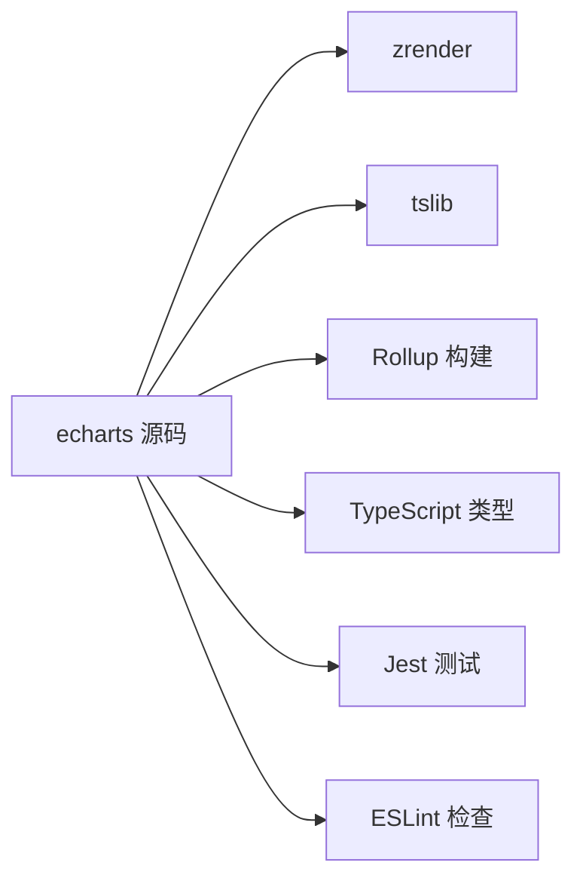

# 贡献指南

<cite>
**本文引用的文件**
- [package.json](file://package.json)
- [README.md](file://README.md)
- [CONTRIBUTING.md](file://CONTRIBUTING.md)
- [.eslintrc-common.yaml](file://.eslintrc-common.yaml)
- [tsconfig.json](file://tsconfig.json)
- [build/build.js](file://build/build.js)
- [test/ut/jest.config.cjs](file://test/ut/jest.config.cjs)
- [test/runTest/package.json](file://test/runTest/package.json)
- [test/runTest/config.js](file://test/runTest/config.js)
- [test/runTest/genReport.js](file://test/runTest/genReport.js)
- [test/runTest/util.js](file://test/runTest/util.js)
- [.github/workflows/ci.yml](file://.github/workflows/ci.yml)
- [.github/pull_request_template.md](file://.github/pull_request_template.md)
</cite>

## 目录
1. [简介](#简介)
2. [项目结构](#项目结构)
3. [核心组件](#核心组件)
4. [架构总览](#架构总览)
5. [详细组件分析](#详细组件分析)
6. [依赖分析](#依赖分析)
7. [性能考虑](#性能考虑)
8. [故障排查指南](#故障排查指南)
9. [结论](#结论)
10. [附录](#附录)

## 简介
本指南面向希望参与 ECharts 开发与贡献的开发者，覆盖开发环境搭建、代码规范、测试体系、提交流程、新功能开发指南以及发布与版本管理策略。内容基于仓库中的脚本、配置与工作流文件整理而成，确保与实际工程一致。

## 项目结构
ECharts 采用 TypeScript 源码组织，构建产物输出到 dist 目录；单元测试位于 test/ut，视觉回归测试位于 test/runTest；构建入口为 build/build.js；CI 由 GitHub Actions 驱动。

**图示来源**
- [build/build.js:30-141](file://build/build.js#L30-L141)
- [tsconfig.json:1-35](file://tsconfig.json#L1-L35)
- [.eslintrc-common.yaml:31-229](file://.eslintrc-common.yaml#L31-L229)
- [test/ut/jest.config.cjs:23-54](file://test/ut/jest.config.cjs#L23-L54)
- [test/runTest/package.json:1-20](file://test/runTest/package.json#L1-L20)
- [.github/workflows/ci.yml:13-96](file://.github/workflows/ci.yml#L13-L96)

**章节来源**
- [README.md:36-60](file://README.md#L36-L60)
- [package.json:43-73](file://package.json#L43-L73)

## 核心组件
- 构建系统：通过 Node 脚本调用 Rollup，支持多种构建类型（all/common/simple）、压缩、格式（umd/esm/iife/cjs/amd）与扩展包构建。
- 类型系统：TypeScript 编译目标 ES3，开启严格模式与声明文件生成，路径映射用于测试模块解析。
- 代码质量：ESLint 规则统一风格与安全性，配合 Husky 在提交前校验。
- 测试体系：Jest 运行单元用例并收集覆盖率；视觉回归测试使用 Puppeteer 截图比对并生成报告。
- CI 流水线：PR 触发 lint、类型检查、单元测试、构建与 DTS 测试。

**章节来源**
- [build/build.js:30-141](file://build/build.js#L30-L141)
- [tsconfig.json:1-35](file://tsconfig.json#L1-L35)
- [.eslintrc-common.yaml:31-229](file://.eslintrc-common.yaml#L31-L229)
- [test/ut/jest.config.cjs:23-54](file://test/ut/jest.config.cjs#L23-L54)
- [test/runTest/package.json:1-20](file://test/runTest/package.json#L1-L20)
- [.github/workflows/ci.yml:13-96](file://.github/workflows/ci.yml#L13-L96)

## 架构总览
下图展示了从源码到产物的构建流程，以及测试与 CI 的协作关系。

**图示来源**
- [build/build.js:30-141](file://build/build.js#L30-L141)
- [test/ut/jest.config.cjs:23-54](file://test/ut/jest.config.cjs#L23-L54)
- [test/runTest/package.json:15-18](file://test/runTest/package.json#L15-L18)
- [.github/workflows/ci.yml:54-96](file://.github/workflows/ci.yml#L54-L96)

## 详细组件分析

### 开发环境与依赖安装
- Node.js 版本要求：CI 使用 Node 20.x，建议本地使用相同或兼容版本。
- 依赖安装：在项目根目录执行依赖安装命令。
- 开发模式：启动快速构建与本地服务器，便于调试与查看测试用例。
- 类型检查：执行 TypeScript 类型检查命令。
- 生产构建：执行完整构建流程以生成所有产物。

**图示来源**
- [.github/workflows/ci.yml:32-46](file://.github/workflows/ci.yml#L32-L46)
- [README.md:43-58](file://README.md#L43-L58)
- [package.json:43-73](file://package.json#L43-L73)

**章节来源**
- [README.md:36-60](file://README.md#L36-L60)
- [package.json:43-73](file://package.json#L43-L73)
- [.github/workflows/ci.yml:32-46](file://.github/workflows/ci.yml#L32-L46)

### 代码规范与命名约定
- ESLint 规则：统一缩进、分号、引号、函数括号空格、行宽限制、禁止 console/debugger 等，启用 TypeScript 专用规则。
- 命名约定：遵循项目现有命名风格，避免全局污染，谨慎使用危险的全局变量。
- 头文件与许可证：提交前需通过头部检查脚本。

**图示来源**
- [.eslintrc-common.yaml:31-229](file://.eslintrc-common.yaml#L31-L229)
- [package.json:69-73](file://package.json#L69-L73)

**章节来源**
- [.eslintrc-common.yaml:31-229](file://.eslintrc-common.yaml#L31-L229)
- [package.json:69-73](file://package.json#L69-L73)

### 测试体系
- 单元测试：使用 Jest + ts-jest，匹配 spec 目录下的测试文件，启用 jsdom 环境、Canvas Mock 与自定义断言扩展，自动收集覆盖率。
- 视觉测试：基于 Puppeteer 渲染页面并截图，使用像素比对工具检测差异，生成 HTML 报告。
- 覆盖率报告：Jest 默认开启覆盖率收集，可在本地或 CI 中查看。

**图示来源**
- [test/ut/jest.config.cjs:23-54](file://test/ut/jest.config.cjs#L23-L54)
- [test/runTest/package.json:15-18](file://test/runTest/package.json#L15-L18)
- [test/runTest/genReport.js:220-371](file://test/runTest/genReport.js#L220-L371)

**章节来源**
- [test/ut/jest.config.cjs:23-54](file://test/ut/jest.config.cjs#L23-L54)
- [test/runTest/package.json:1-20](file://test/runTest/package.json#L1-L20)
- [test/runTest/genReport.js:220-371](file://test/runTest/genReport.js#L220-L371)

### 提交流程与 Pull Request 规范
- Git 工作流：遵循 Apache 行为准则，先搜索已有 Issue，再创建新 Issue 或 PR。
- PR 模板：填写变更类型、问题描述、修复前后说明、文档更新与安全检查等信息。
- 合并建议：建议在合并时压缩提交历史为单一提交。

**图示来源**
- [.github/pull_request_template.md:1-75](file://.github/pull_request_template.md#L1-L75)
- [CONTRIBUTING.md:20-46](file://CONTRIBUTING.md#L20-L46)

**章节来源**
- [.github/pull_request_template.md:1-75](file://.github/pull_request_template.md#L1-L75)
- [CONTRIBUTING.md:20-46](file://CONTRIBUTING.md#L20-L46)

### 新功能开发指南
- 模块设计：新增图表或组件应遵循现有目录结构（如 chart/component），并在对应 install 文件中注册。
- API 设计：保持向后兼容，避免破坏性变更；如需新增能力，提供渐进式升级路径。
- 类型定义：新增接口需在类型声明中补充，并通过类型检查。
- 测试覆盖：为新功能添加单元测试与必要的视觉测试用例。

[此图为概念性类图，不直接映射具体源码文件]

**章节来源**
- [src/chart/bar/install.ts](file://src/chart/bar/install.ts)
- [src/component/legend.ts](file://src/component/legend.ts)
- [tsconfig.json:29-34](file://tsconfig.json#L29-L34)

### 发布流程与版本管理
- 版本节奏：每月末发布小版本，提前两个版本进行里程碑讨论与冻结。
- 构建产物：release 脚本会依次构建 lib、国际化、全量产物、ESM、扩展与 SSR。
- CI 集成：PR 触发 lint、类型检查、单元测试、构建与 DTS 测试，确保质量。

**图示来源**
- [CONTRIBUTING.md:30-39](file://CONTRIBUTING.md#L30-L39)
- [package.json:53-53](file://package.json#L53-L53)
- [.github/workflows/ci.yml:89-96](file://.github/workflows/ci.yml#L89-L96)

**章节来源**
- [CONTRIBUTING.md:30-39](file://CONTRIBUTING.md#L30-L39)
- [package.json:53-53](file://package.json#L53-L53)
- [.github/workflows/ci.yml:89-96](file://.github/workflows/ci.yml#L89-L96)

## 依赖分析
- 运行时依赖：zrender（渲染引擎）、tslib（辅助库）。
- 构建与开发依赖：Rollup、TypeScript、Jest、ESLint、Puppeteer 等。
- 导出与入口：package.json 定义了多入口与类型导出，便于按需引入。

**图示来源**
- [package.json:75-117](file://package.json#L75-L117)
- [package.json:120-247](file://package.json#L120-L247)

**章节来源**
- [package.json:75-117](file://package.json#L75-L117)
- [package.json:120-247](file://package.json#L120-L247)

## 性能考虑
- 构建优化：启用压缩与按需打包可减少体积；ESM 输出利于现代打包器 Tree-shaking。
- 渲染性能：避免在高频回调中进行复杂计算；合理使用数据采样与过滤。
- 内存占用：大数据场景下注意对象复用与及时释放；避免不必要的深拷贝。
- 测试性能：单元测试聚焦逻辑正确性；视觉测试批量执行时注意资源隔离与缓存。

[本节为通用指导，不直接分析具体文件]

## 故障排查指南
- 构建失败：检查 Node 版本与依赖是否安装完整；确认 rollup 配置与输入输出路径。
- 类型错误：执行类型检查命令定位问题；确保 tsconfig 路径映射正确。
- 测试失败：查看 Jest 输出与覆盖率报告；必要时单独运行单测定位问题。
- 视觉测试差异：确认浏览器与渲染环境一致性；调整阈值或标记预期差异。

**章节来源**
- [build/build.js:144-161](file://build/build.js#L144-L161)
- [test/ut/jest.config.cjs:23-54](file://test/ut/jest.config.cjs#L23-L54)
- [test/runTest/genReport.js:220-371](file://test/runTest/genReport.js#L220-L371)

## 结论
通过本指南，你可以快速搭建 ECharts 开发环境、遵循代码规范、编写与执行测试、按照规范提交 PR，并理解发布与版本管理流程。建议在每次提交前执行 lint 与类型检查，确保代码质量；新功能需配套测试与文档更新，保障向后兼容性与可维护性。

## 附录
- 常用命令参考：
  - 安装依赖与准备环境
  - 启动开发模式与本地服务器
  - 执行类型检查与构建
  - 运行单元测试与视觉测试
  - 生成完整发布产物

**章节来源**
- [README.md:43-58](file://README.md#L43-L58)
- [package.json:43-73](file://package.json#L43-L73)