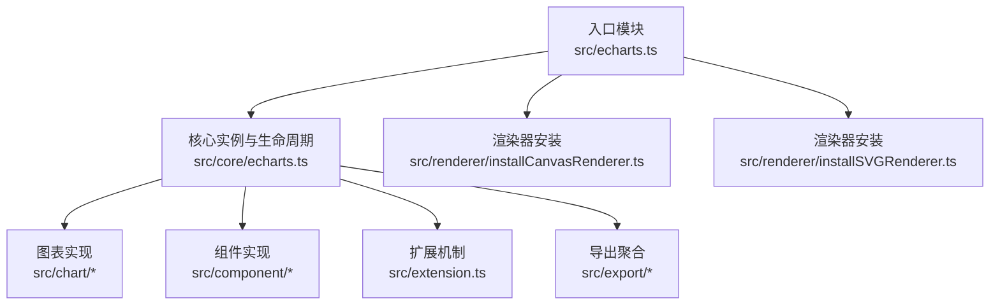
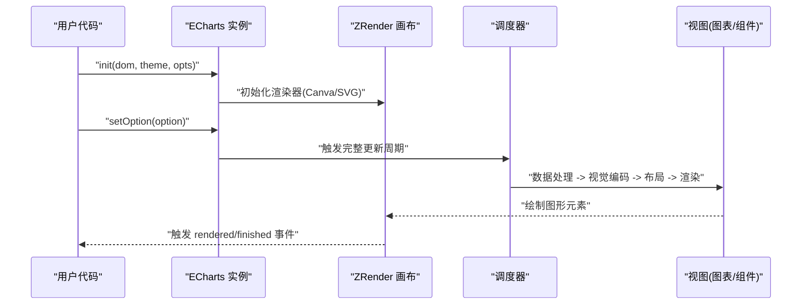
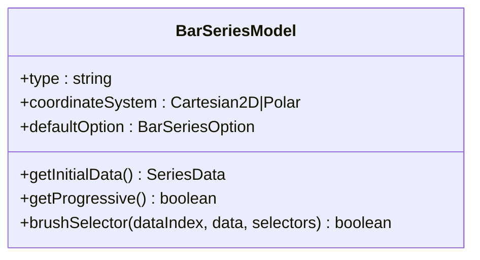
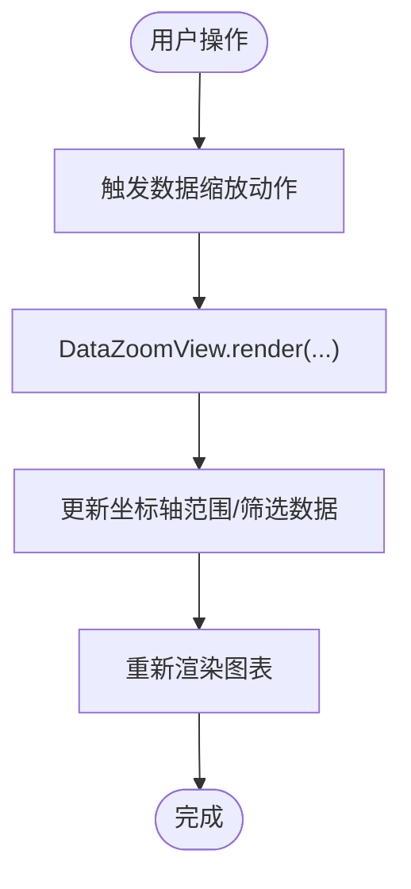
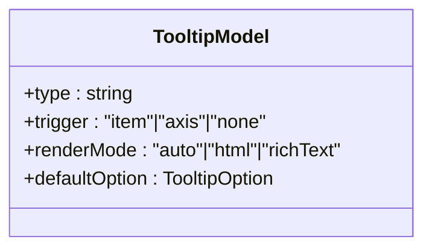
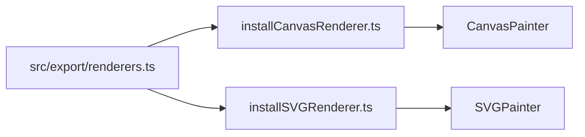
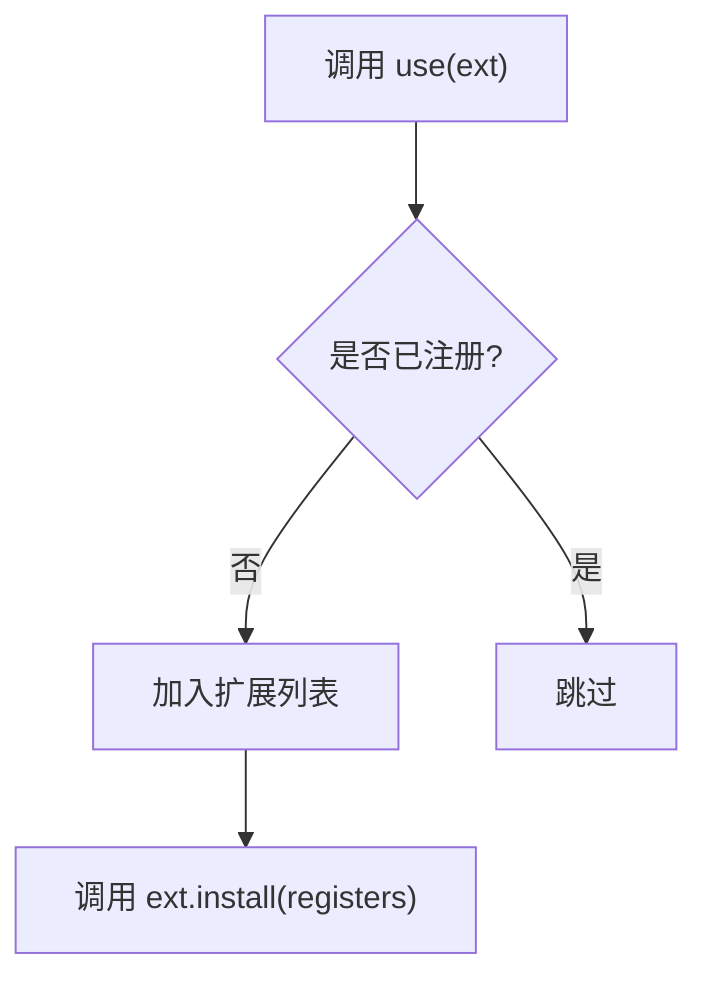
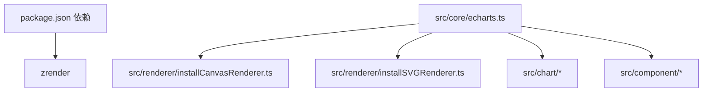

# 项目概述

<cite>
**本文引用的文件**
- [README.md](file://README.md)
- [package.json](file://package.json)
- [src/echarts.ts](file://src/echarts.ts)
- [src/core/echarts.ts](file://src/core/echarts.ts)
- [src/renderer/installCanvasRenderer.ts](file://src/renderer/installCanvasRenderer.ts)
- [src/renderer/installSVGRenderer.ts](file://src/renderer/installSVGRenderer.ts)
- [src/export/renderers.ts](file://src/export/renderers.ts)
- [src/chart/bar/BarSeries.ts](file://src/chart/bar/BarSeries.ts)
- [src/component/dataZoom/DataZoomView.ts](file://src/component/dataZoom/DataZoomView.ts)
- [src/component/toolbox/feature/DataZoom.ts](file://src/component/toolbox/feature/DataZoom.ts)
- [src/component/tooltip/TooltipModel.ts](file://src/component/tooltip/TooltipModel.ts)
- [src/extension.ts](file://src/extension.ts)
</cite>

## 目录
1. [简介](#简介)
2. [项目结构](#项目结构)
3. [核心组件](#核心组件)
4. [架构总览](#架构总览)
5. [详细组件分析](#详细组件分析)
6. [依赖关系分析](#依赖关系分析)
7. [性能考量](#性能考量)
8. [故障排查指南](#故障排查指南)
9. [结论](#结论)
10. [附录：快速开始与基础使用](#附录快速开始与基础使用)

## 简介
Apache ECharts 是 Apache 基金会开源的免费、强大且高度可定制的图表与数据可视化库，基于 zrender（轻量级 Canvas/SVG 渲染层）构建。它提供丰富的图表类型、强大的交互能力与灵活的配置体系，适用于浏览器与 Node.js 环境，支持服务端渲染（SSR）。ECharts 以声明式配置为核心，通过“实例-配置-系列-数据”的清晰模型，帮助开发者快速构建高质量的数据可视化应用。

- 定位与生态：Apache 开源项目，社区活跃，配套文档、示例与扩展丰富。
- 技术优势：模块化与插件化、双渲染器（Canvas/SVG）、可扩展的数据处理与视觉映射、完善的交互组件与主题系统。
- 适用场景：报表大屏、数据分析平台、业务监控、交互式报告等。

**章节来源**
- [README.md:1-99](file://README.md#L1-L99)

## 项目结构
仓库采用按功能域划分的模块化组织方式，核心入口位于 src 目录，包含：
- 核心运行时：core（实例生命周期、调度器、坐标系统管理、事件与状态）
- 图表实现：chart（柱状图、折线图、饼图、散点图等）
- 组件：component（坐标轴、提示框、工具栏、数据缩放、刷选、视觉映射等）
- 渲染器：renderer（Canvas/SVG 安装与注册）
- 数据与处理：data、processor、preprocessor、scale、layout
- 可视化与样式：visual、label、theme
- 扩展机制：extension（统一 use 注册机制）
- 导出与打包：export（按需导出 core/charts/components/features/renderers）

**图示来源**
- [src/echarts.ts:20-28](file://src/echarts.ts#L20-L28)
- [src/core/echarts.ts:454-618](file://src/core/echarts.ts#L454-L618)
- [src/renderer/installCanvasRenderer.ts:20-25](file://src/renderer/installCanvasRenderer.ts#L20-L25)
- [src/renderer/installSVGRenderer.ts:20-25](file://src/renderer/installSVGRenderer.ts#L20-L25)
- [src/extension.ts:107-128](file://src/extension.ts#L107-L128)

**章节来源**
- [src/echarts.ts:20-28](file://src/echarts.ts#L20-L28)
- [src/core/echarts.ts:454-618](file://src/core/echarts.ts#L454-L618)
- [src/export/renderers.ts:20-21](file://src/export/renderers.ts#L20-L21)

## 核心组件
- 实例与生命周期：ECharts 类封装了 DOM、zrender 实例、主题、坐标系管理器、调度器、消息中心等；提供 setOption、resize、dispose、事件绑定等 API。
- 渲染器：默认启用 Canvas 渲染器，同时支持 SVG；可通过选项或扩展切换。
- 图表与组件：图表负责数据到图形元素的映射与布局；组件提供通用交互与展示能力（如 tooltip、toolbox、dataZoom、legend、axis 等）。
- 扩展机制：通过 use 注册渲染器、图表、组件、主题、国际化等，支持按需加载与组合。

关键职责与关系：
- 入口模块在初始化时默认安装 Canvas 渲染器与 dataset 组件，并启用标签布局。
- 核心实例创建 zrender 画布，绑定动画帧与事件，驱动调度器执行数据处理、视觉编码、布局与渲染。
- 图表与组件通过 Model/View 模式解耦配置与渲染，便于扩展与维护。

**章节来源**
- [src/echarts.ts:20-46](file://src/echarts.ts#L20-L46)
- [src/core/echarts.ts:454-618](file://src/core/echarts.ts#L454-L618)
- [src/renderer/installCanvasRenderer.ts:20-25](file://src/renderer/installCanvasRenderer.ts#L20-L25)
- [src/renderer/installSVGRenderer.ts:20-25](file://src/renderer/installSVGRenderer.ts#L20-L25)
- [src/extension.ts:107-128](file://src/extension.ts#L107-L128)

## 架构总览
ECharts 采用“实例-模型-视图-调度器”的分层架构：
- 实例层：对外暴露 init/setOption/resize 等 API，管理生命周期与事件。
- 模型层：GlobalModel/SeriesModel/ComponentModel 描述配置与状态。
- 视图层：ChartView/ComponentView 负责将模型转换为图形元素。
- 调度器：协调数据预处理、视觉映射、布局与渲染阶段，支持增量更新与渐进渲染。

**图示来源**
- [src/core/echarts.ts:570-618](file://src/core/echarts.ts#L570-L618)
- [src/core/echarts.ts:620-704](file://src/core/echarts.ts#L620-L704)
- [src/core/echarts.ts:738-800](file://src/core/echarts.ts#L738-L800)

## 详细组件分析

### 柱状图（Bar）系列
- 角色：定义柱状图的配置项、默认样式、数据结构与布局策略。
- 关键点：
  - 支持直角坐标系与极坐标系，支持堆叠、背景、圆角端帽等特性。
  - 大数据量下支持渐进渲染与采样。
  - 与刷选组件联动，提供矩形选择过滤。

**图示来源**
- [src/chart/bar/BarSeries.ts:100-178](file://src/chart/bar/BarSeries.ts#L100-L178)

**章节来源**
- [src/chart/bar/BarSeries.ts:100-178](file://src/chart/bar/BarSeries.ts#L100-L178)

### 数据缩放（DataZoom）组件
- 角色：提供区域缩放、滑动条缩放、内部缩放等交互能力，常与工具箱集成。
- 关键点：
  - DataZoomView 负责渲染与交互逻辑。
  - 工具箱内置 DataZoom 功能，可按轴动态生成内部配置。

**图示来源**
- [src/component/dataZoom/DataZoomView.ts:26-38](file://src/component/dataZoom/DataZoomView.ts#L26-L38)
- [src/component/toolbox/feature/DataZoom.ts:330-365](file://src/component/toolbox/feature/DataZoom.ts#L330-L365)

**章节来源**
- [src/component/dataZoom/DataZoomView.ts:26-38](file://src/component/dataZoom/DataZoomView.ts#L26-L38)
- [src/component/toolbox/feature/DataZoom.ts:330-365](file://src/component/toolbox/feature/DataZoom.ts#L330-L365)

### 提示框（Tooltip）组件
- 角色：在鼠标悬停或点击时显示数据详情，支持多种触发方式与渲染模式。
- 关键点：
  - 支持 item/axis/none 触发，支持 HTML 与富文本渲染。
  - 默认样式与行为由 TooltipModel 管理。

**图示来源**
- [src/component/tooltip/TooltipModel.ts:88-191](file://src/component/tooltip/TooltipModel.ts#L88-L191)

**章节来源**
- [src/component/tooltip/TooltipModel.ts:88-191](file://src/component/tooltip/TooltipModel.ts#L88-L191)

### 渲染器（Canvas/SVG）
- 角色：底层图形绘制抽象，ECharts 默认启用 Canvas，同时支持 SVG。
- 关键点：
  - 通过 installCanvasRenderer/installSVGRenderer 注册 Painter。
  - 导出模块提供统一的渲染器注册入口。

**图示来源**
- [src/export/renderers.ts:20-21](file://src/export/renderers.ts#L20-L21)
- [src/renderer/installCanvasRenderer.ts:20-25](file://src/renderer/installCanvasRenderer.ts#L20-L25)
- [src/renderer/installSVGRenderer.ts:20-25](file://src/renderer/installSVGRenderer.ts#L20-L25)

**章节来源**
- [src/export/renderers.ts:20-21](file://src/export/renderers.ts#L20-L21)
- [src/renderer/installCanvasRenderer.ts:20-25](file://src/renderer/installCanvasRenderer.ts#L20-L25)
- [src/renderer/installSVGRenderer.ts:20-25](file://src/renderer/installSVGRenderer.ts#L20-L25)

### 扩展机制（use）
- 角色：统一注册渲染器、图表、组件、主题、国际化等扩展。
- 关键点：
  - 支持函数式或对象式扩展，重复注册会被忽略。
  - 入口模块默认安装 Canvas 渲染器与 dataset 组件。

**图示来源**
- [src/extension.ts:107-128](file://src/extension.ts#L107-L128)
- [src/echarts.ts:20-28](file://src/echarts.ts#L20-L28)

**章节来源**
- [src/extension.ts:107-128](file://src/extension.ts#L107-L128)
- [src/echarts.ts:20-28](file://src/echarts.ts#L20-L28)

## 依赖关系分析
- 外部依赖：zrender（渲染引擎），tslib（TS 辅助库）。
- 内部依赖：
  - 核心实例依赖调度器、坐标系管理、全局模型与主题。
  - 图表与组件通过 Model/View 解耦，依赖坐标系统与视觉映射。
  - 渲染器通过 Painter 抽象对接 zrender。

**图示来源**
- [package.json:75-78](file://package.json#L75-L78)
- [src/core/echarts.ts:570-618](file://src/core/echarts.ts#L570-L618)
- [src/renderer/installCanvasRenderer.ts:20-25](file://src/renderer/installCanvasRenderer.ts#L20-L25)
- [src/renderer/installSVGRenderer.ts:20-25](file://src/renderer/installSVGRenderer.ts#L20-L25)

**章节来源**
- [package.json:75-78](file://package.json#L75-L78)
- [src/core/echarts.ts:570-618](file://src/core/echarts.ts#L570-L618)

## 性能考量
- 渐进渲染与大数据优化：图表支持 large/progressive 模式，结合采样与分片渲染提升性能。
- 增量更新：调度器支持部分更新（transform/layout/visual/view），减少重绘开销。
- 渲染器选择：Canvas 适合大量图形与复杂动画；SVG 更适合矢量导出与可访问性。
- 懒更新：setOption 支持 lazyUpdate，避免频繁更新导致的抖动。
- 动画节流：zrender 帧回调中节流 flush，降低主线程压力。

[本节为通用性能建议，不直接分析具体文件]

## 故障排查指南
- 渲染器限制：
  - renderToCanvas 仅在 Canvas 渲染器可用；renderToSVGString 仅在 SVG 渲染器可用。
- 常见错误：
  - 在非主流程中调用 setOption 会报错；应在事件回调或异步任务中调用。
  - 重复或冲突的组件 ID 可能导致合并异常，建议使用 replaceMerge 或唯一 id。
- 调试建议：
  - 使用 dev 模式查看控制台警告与日志。
  - 通过 getOption 获取当前配置，检查 series、component 是否正确注册。

**章节来源**
- [src/core/echarts.ts:923-953](file://src/core/echarts.ts#L923-L953)
- [src/core/echarts.ts:741-747](file://src/core/echarts.ts#L741-L747)

## 结论
ECharts 以清晰的实例-模型-视图分层、强大的渲染器抽象与灵活的扩展机制，提供了企业级数据可视化的完整解决方案。其模块化设计使得按需引入成为可能，配合丰富的图表与组件生态，能够快速构建高性能、高可用的可视化应用。对于初学者，掌握“实例-配置-系列-数据”的核心概念，即可高效上手；对于高级用户，可通过扩展机制定制图表、组件与渲染流程。

[本节为总结性内容，不直接分析具体文件]

## 附录：快速开始与基础使用
- 安装方式
  - CDN：从官方站点或 jsDelivr 引入 dist 包。
  - npm：npm install echarts --save。
  - 源码构建：参考 README 中的构建脚本，执行开发/发布构建命令。
- 基本步骤
  - 初始化实例：在 DOM 节点上创建 ECharts 实例。
  - 配置 option：设置 title、legend、xAxis/yAxis、series 等。
  - 绑定数据：通过 series.data 或 dataset 提供数据。
  - 渲染与更新：调用 setOption 进行首次渲染与后续更新。
- 核心概念
  - 图表实例：代表一个独立的可视化容器，管理生命周期与事件。
  - 配置对象（option）：声明式描述图表外观与行为。
  - 系列（series）：描述一组数据的可视化形式（如 bar、line、pie、scatter）。
  - 数据（data/dataset）：序列化的数值或结构化数据，经编码器映射到维度。

**章节来源**
- [README.md:15-58](file://README.md#L15-L58)
- [src/echarts.ts:20-46](file://src/echarts.ts#L20-L46)
- [src/core/echarts.ts:738-800](file://src/core/echarts.ts#L738-L800)